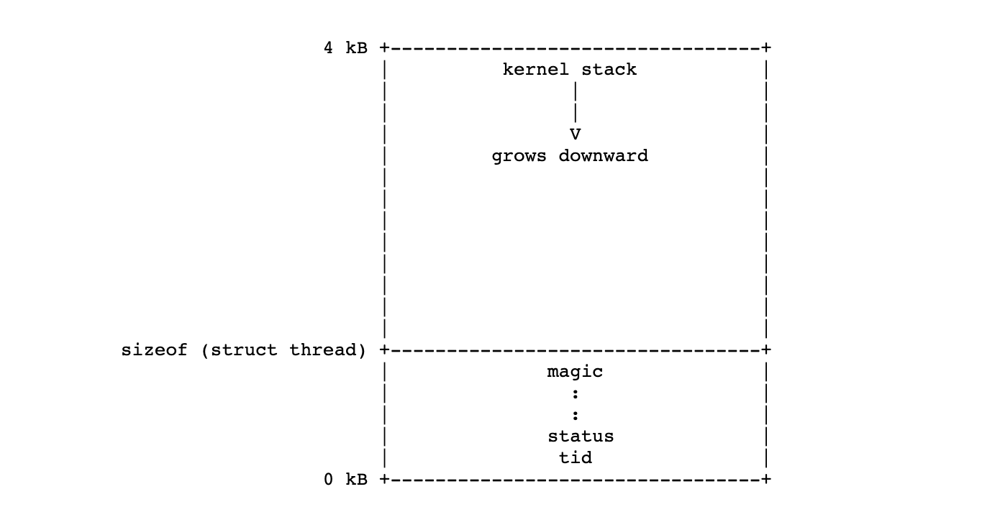
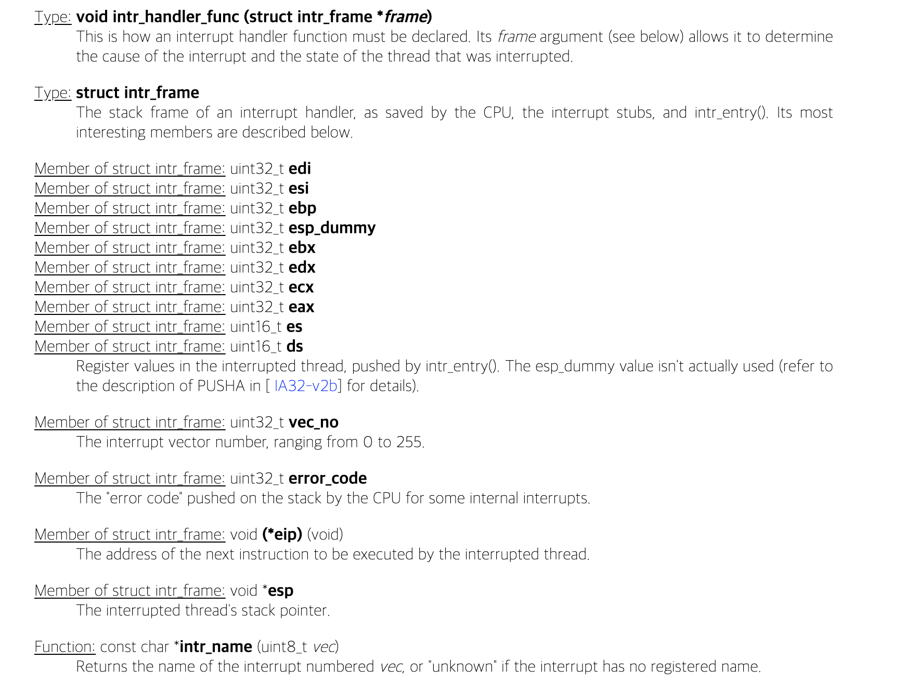
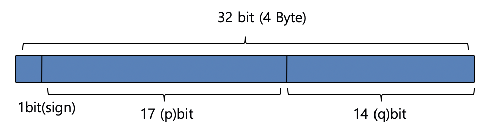

# Project0: Introduction & Appendix


### 목차

- **Introdcution**
  - Getting Started
  - Source Tree Overview
  - Building Pintos
  - Running Pintos
  - Debugging versus Testing
  - Testing
  - Design Document
  - Source Code
- **Appendix** 
  - A.Reference Guide
    - Loading
    - Threads
    - Synchronization
    - Memory Allocation
  - B. 4.4BSD Scheduler
    - Niceness
    - Calculating Priority
    - Caculating *recent_cpu*
    - Caculating *load_avg*
    - Summary
    - Fixed-point Real Arithematic
  - C. Coding Standards
    - C99
    - Unsafe String Functions
  - E. Debugging Tools


### Introduction

 Pintos는 80x86 아키텍처를 위한 simple operating system framework 입니다. 

 Pintos는 이론적으로 일반적인 IBM 호환 PC에서 실행할 수 있지만, 모든 학생들에게 전용 PC를 제공하는 것은 불가능하기 때문에 system simulator에서 Pintos 프로젝트를 실행할 것입니다. 

 80x86 CPU와 그 주변 장치를 unmodified operating systems and software가 실행될 수 있을 정도로 정확하게 시뮬레이션하는 **Bochs**와 **QEMU** 시뮬레이터 프로그램을 사용할 것입니다. Pintos는 VMware Player에서도 테스트를 거쳤습니다.

- **Getting Started**

 핀토스 개발 기계는 ITSS 웹 페이지에 설명된 바와 같이 ITSS 유닉스 시스템입니다. 우리는 이 기계들에서 당신의 코드를 시험할 것이고, 여기에 주어진 지침은 이 환경을 가정합니다. (유니스트의 경우에는 유니스트 서버 uni06을 참고해야 할 것입니다.)

 로컬 또는 원격으로 이러한 시스템 중 하나에 로그인한 후에는 PATH 환경에 당사의 binaries directory를 추가하는 것을 추천합니다. Stanford의 로그인 셸은 **csh**인데, csh에선 다음과 같은 명령을 사용하여 수행할 수 있습니다. (유니스트의 경우에는 유니스트 서버에 맞는 셸 방식을 적용합니다. 아마 같을 것으로 예상됩니다.)

 set path = ( /usr/class/cs140/"uname -m"/bin $path )

 두 '은 모두 backtick이며, 아포스트로피(')가 아니라는 점에 주의해야 합니다. 이 줄을 홈 디렉토리의 **.cshrc** 파일(c쉘의 리소스파일)에 추가하는 것을 강력히 추천합니다. 그렇지 않으면 로그인할 때마다 타이핑을 해야 합니다.

- **Source Tree Overview**

 zcat /usr/class/cs140/pintos.tar.gz | tar x

 위 명령의 실행으로 Pintos의 소스를 pintos/src라는 디렉토리에 추출할 수 있습니다. 또는 http://www.stanford.edu/class/cs140/projects/pintos/pintos.tar.gz을 가져와 비슷한 방법으로 추출하면 됩니다.

- **Building Pintos**

 다음 단계로 가기 위해서 1번 과제에 대해 제공된 소스 코드를 빌드합니다. 'threads' 디렉토리로 cd 해서 **make** 커맨드를 입력합니다. 그러면 'threads' 아래에 'build' 디렉토리가 생성되며 Makefile과 몇 개의 하위 디렉토리로 채워져, 내부에 kernel을 빌드할 수 있습니다. 전체 제작에는 30초 미만이 소요됩니다. 

 빌드하는 동안 실행되는 명령을 확인합니다. 리눅스 시스템에서는 ordinary system tools가 사용됩니다. 그리고 빌드 이후에 생성되는 'build' 디렉토리에 있는 파일 내용은 다음과 같습니다.

1. 'Makefile': pintos/src/Makefile.build의 사본. kernel을 빌드하는 방법을 설명합니다. 

     자세한 내용은 '2.3 FAQ의 두 번째 질문'을 참고하시길 바랍니다.

2. 'kernel.o': 전체 kernel에 대한 object 파일. 각 개별 kernel 소스 파일에서 컴파일된 object 파일을 단일 object 파일로 링크한 결과입니다. 

    Debug 정보가 포함되어 있으므로 GDB(섹션 E.5 GDB 참조) 또는 Backtrace(섹션 E.4 Backtrace 참조)을 실행할 수 있습니다. 

3. 'kernel.bin': kernel의 메모리 이미지, 즉 핀토스 커널을 실행하기 위해 메모리에 로드된 정확한 bytes를 의미합니다. 

    이것은 디버그 정보가 제거된 kernel.o일 뿐이며, 많은 공간을 절약하며, 커널 로더의 설계에 의해 부과되는 512 kB 크기 제한에 부딪히지 않게 합니다.

4. 'loader.bin': kernel loader의 메모리 이미지. 디스크에서 메모리로 커널을 읽고 그것을 시작하는 어셈블리어로 쓰여진 작은 코드 덩어리입니다. 정확히 512바이트로, PC BIOS에 의해 고정된 크기 입니다.

 'build'의 하위 디렉토리는 모두 컴파일러에서 생성된 object 파일(.o)과 dependency 파일(.d)을 포함합니다. dependency 파일은 다른 원본 또는 헤더 파일이 변경될 때 다시 컴파일해야 하는 원본 파일을 표시합니다.

- **Running Pintos**

 우리는 Pintos라고 불리는 시뮬레이터에서 Pintos를 편리하게 실행할 수 있는 프로그램을 제공합니다. 가장 간단한 예시로, 당신은 핀토스를 핀토스 argument로 호출할 수 있습니다. 각 argument는 핀토스 커널에 전달되어 그것이 작동하게 됩니다. 

 새롭게 생성된 build 디렉토리에 cd 해서, pintos run alarm-multiple 명령을 실행하여 arguments run alarm-multiple을 Pintos 커널로 전달해봅시다. 이 arguments에서 run은 커널에게 테스트를 실행하도록 지시하고 alarm-multiple은 실행할 테스트입니다.

 이 명령은 Bochs를 실행하는 데 필요한 'bochsrc.txt' 파일을 생성한 다음 Bochs를 호출합니다. Bochs는 시뮬레이션된 시스템 디스플레이를 나타내는 새 창을 열고, BIOS 메시지가 잠깐 깜박입니다. 그런 다음 핀토스가 부팅하여 텍스트 스크린을 몇 개 출력하는 alarm-multiple test 프로그램을 실행합니다. 완료되면 창의 오른쪽 상단 모서리에 있는 'Power' 버튼을 클릭하여 Boch를 닫거나 왼쪽에 있는 'Reset' 버튼을 클릭하여 전체 프로세스를 다시 실행할 수 있습니다. 다른 버튼들은 우리의 목적에 그다지 유용하지 않습니다. (새 창이 나타나지 않으면, 당신은 아마 원격으로 로그인하고 X forwarding이 적절하게 설정되지 않은 상태일 것입니다. 이 경우에는 X setup을 올바르게 수정하거나 -v 옵션을 사용하여 X output을 비활성화 할 수 있습니다: `pintos -v --run alarm-multiple`)

 Bochs 안에 있는 Pintos에 의해 프린트된 텍스트는 아마도 너무 빨리 지나쳐서 읽을 수 없을 것입니다. 하지만, 여러분은 아마 지금쯤이면 핀토스를 실행할 때 사용했던 터미널에 같은 텍스트가 표시되었다는 것을 알아차렸을 것입니다. 이는 핀토스가 모든 출력을 VGA 디스플레이와 첫 번째 직렬 포트로 보내고, 기본적으로 직렬 포트는 Bochs의 stdin과 stdout에 연결되기 때문입니다. 명령줄에서 리다이렉션하여 직렬 출력을 파일에 기록할 수 있습니다. (ex: `Pintos run alarm-multiple > logfile`)

 핀토스 프로그램은 여러 **옵션**을 제공합니다. 옵션을 적용할 때는 핀토스 커널에 전달된 명령어 이전에 옵션을 적어야 하며, '*--*'에 의해 분리되어야 합니다. 사용 가능한 옵션 목록을 보려면 argument 없이 pintos를 호출하면됩니다. 

1. 기본값은 **Bochs**이지만 **--qemu는 QEMU**를 선택합니다.
2. **GDB디버거**로 시뮬레이터를 실행할 수 있습니다 (E.5 GDB 참조)
3. VM에 제공할 메모리 양을 설정하고, VM 출력을 표시하는 방법을 선택할 수도 있습니다
4. **-v**를 사용하여 VGA 디스플레이를 끄기가 가능합니다 
5. **-t**를 사용하여 새 창을 여는 대신 VGA 디스플레이로 터미널 창을 사용할 수 있습니다 (Bochs 한정)
6. stdin 인풋과 stdout 아웃풋 억제는 **-s** 로 할 수 있습니다
7. 자주 사용되지는 않지만, **-h** 를 사용해서 목록을 볼 수 있습니다 (e.g. pintos -h)

- **Debugging versus Testing**

 코드를 디버깅할 때 프로그램을 두 번 실행하고 정확히 같은 작업을 수행하도록 하는 것이 유용합니다. 두 번째 및 이후 실행에서는 이전 관찰을 삭제하거나 확인할 필요 없이 새 관찰을 수행할 수 있는데, 이를 **'reproducibility'**라 부릅니다.

 우리가 하는 것처럼 컴퓨터 전체를 시뮬레이션하는 것은 컴퓨터의 모든 부분이 동일해야 한다는 것을 의미기에, 동일한 명령줄 인수, 동일한 디스크, 동일한 버전의 Bochs를 사용해야 하며, 실행 중 키보드의 어떤 키도 치지 말아야 합니다.

 reproducibility는 디버깅에는 유용하지만, 대부분의 프로젝트에서 중요한 부분인 스레드 동기화를 테스트하는 데 문제가 됩니다. 특히, Bochs가 reproducibility로 설정되면 **timer interrupts**는 완벽하게 reproducible points에서 발생하며, 따라서 스레드 스위치도 작동하게 됩니다. 즉, 이런 경우에는 동일한 테스트를 여러 번 실행해도 한 번만 실행하는 것보다 코드의 정확성에 대해 더 큰 신뢰감을 주지 않습니다.

 그래서 코드를 더 쉽게 테스트하기 위해, Bochs에 **'jitter'**라고 불리는 기능을 추가했는데, 그것은 timer interrupts를 무작위적인 간격으로 오도록 하지만, 완벽하게 예측 가능한 방법으로 만들어줍니다. 특히 **-j seed** 옵션으로 핀토스를 호출하면 timer interrupt가 불규칙한 간격으로 옵니다. 단일 시드 값 내에서 실행은 여전히 reproducible 할 수 있지만, 시드가 변화함에 따라 타이머 동작이 변경될 것입니다. 그러므로 높은 신뢰도를 위해 당신은 많은 시드 값으로 당신의 코드를 시험하는 걸 권장합니다.

 반면, Bochs가 reproducible mode로 실행될 때 timing은 현실적이지 않으며, 이는 '1초' 지연이 훨씬 짧거나 심지어 1초보다 훨씬 길 수 있다는 것을 의미합니다. 다른 옵션인 **-r** 로 핀토스를 호출하여 현실적 타이밍을 위해 Boch를 설정할 수 있으며, 여기서 1초 지연은 약 1초간 실시간으로 수행되어야 합니다. 실시간 모드에서 시뮬레이션은 reducible 할 수 없으며 옵션 **-j와 -r은 상호 배타적**입니다.

 QEMU 시뮬레이터는 Bochs의 대안으로 사용할 수 있습니다. (핀토스를 호출할 때 --qemu 사용). QEMU 시뮬레이터는 Bochs보다 훨씬 빠르지만 실시간 시뮬레이션만 지원하며 reproducible mode는 없습니다.

- **Testing**

 Grading은 **test results 50%, design quality 50%** 입니다. 

 제출을 완전히 테스트하려면 프로젝트 build 디렉토리에서 **make check**를 호출합니다. 이렇게 하면 각 테스트가 실행되며 'pass' 또는 'fail' 메시지가 출력됩니다.

 1번 과제의 경우눈 Bochs에서 더 빨리 실행되며, 나머지 과제는 QEMU에서 훨씬 더 빨리 실행될 것입니다. make check는 기본적으로 더 빠른 시뮬레이터를 선택하지만, 명령줄에 SIMULATOR=--bochs 또는 SIMULATOR=--qemu를 지정하여 선택을 무시할 수 있다.

 또한 한 번에 한 번씩 개별 테스트를 실행할 수도 있습니다. 주어진 test t는 출력을 t.output에 기록한 다음, 스크립트는 출력을 'pass' 또는 'fail'로 점수화하고 t.result에 기록합니다. 단일 테스트를 실행하고 등급을 지정하려면 빌드 디렉토리에서 .result 파일을 명시적으로 만들어야 합니다. (예: make tests/threads/alarm-multiple.result). **make**가 테스트 결과가 최신 버전이라고 말하지만, 어쨌든 다시 실행하려면 make clean 또는 .output 파일을 수동으로 삭제해야 합니다.

 기본적으로 각 테스트는 실행 중이 아니라 완료 시에만 피드백을 제공합니다. 원하는 경우 VERBOSE=1을 확인하는 것과 같이 make 명령줄에 VERBOSE=1을 지정하여 각 테스트의 진행률을 관찰할 수 있으며, 또한 PINTOSOPTS='...', 예를 들어 PINTOSOPTS='-j 1'을 선택하여 지터 값을 1로 선택할 수도 있습니다. (1.1.4 Debugging versus Testing 참조)

- **Design Document**

 우리는 각 프로젝트에 대한 design documnet template을 제공합니다. 프로젝트의 각 중요한 부분에 대해 template은 다음 네 가지 영역에서 질문을 합니다.

1. Data Structure: struct or struct member, global or static variable, typedef, or enumeration 에 대한 declaration을 여기에 복사합니다. 그리고 목적을 25단어 이하로 명시합니다.

    design document에 new or modified declarations을 복사하여 data structures의 실제 변경 사항을 강조하시길 바랍니다. 각 delaration은 소스 코드에 첨부해야 하는 코멘트를 포함해야 합니다. 목적 또한 간략히 설명해야 합니다.

2. Algorithms: 당신의 답변은 과제에서 주어진 요건에 대한 높은 수준의 설명보다 낮은 수준에 있어야 합니다. 우리도 과제를 읽었기 때문에 거기에 적힌 것을 반복하거나 다시 말하는 것은 불필요합니다. 반면에, 당신의 대답은 코드 자체보다는 그 이상이어야 합니다. 당신의 코드가 하는 일을 일렬로 나열하지 말고, 대신 답변을 사용하여 코드를 사용하여 요구 사항을 구현하는 방법을 설명하시길 바랍니다.

3. Synchronizaton: OS kernel 은 여러 개의 스레드를 동기화하는 것이 어려울 수 있는 복잡한 멀티스레드 프로그램입니다. 이 섹션에서는 특정 유형의 활동을 동기화하도록 선택한 **방법**에 대해 질문합니다. 

4. Rationale: 다른 섹션은 주로 'what'와 'how'를 묻는 반면, Rationale 섹션은 **'why'**에 집중합니다. 여기서 우리는 당신이 한 선택이 대안보다 더 나은 이유를 설명함으로써 당신에게 몇몇 디자인 결정을 정당화하도록 요청합니다. 당신은 이러한 것들을 시간과 공간의 복잡성 측면에서 진술할 수 있을 것이고, 이것은 rough 하거나 informal 한 주장이 되어도 됩니다. (형식적인 언어나 증명은 불필요합니다).

 타당한 이유 없이 template이 변형 된다면 불이익을 받을 수 있습니다. (Project Documentation, for a sample design document for a fictitious project 에 대한 section D 참조)

- **Source Code**

 design에 대한 평가 또한 당신의 소스 코드를 보고 판단될 것입니다. diff -purb pintos.origin pintos와 같은 명령의 출력에 근거하여 원래의 핀토스 소스 트리와 당신의 제출물 사이의 차이점을 살펴볼 것입니다.

 소스 코드 설계의 가장 중요한 측면은 프로젝트에 걸려 있는 운영 체제 문제와 구체적으로 관련된 것들 입니다. 예를 들어, **inode**의 구성은 file system 설계의 중요한 부분이기 때문에 file system 프로젝트에서 잘못 설계된 inode는 포인트를 잃게 됩니다.

 다른 문제들은 훨씬 덜 중요합니다. multiple Pintos 설계 문제는 'Priority queue', 즉 최소(또는 최대) 항목을 신속하게 추출할 수 있는 dynamic collection을 요구합니다. Priority queue는 여러 가지 방법으로 구현될 수 있지만, 성능이 향상될 수 있더라도 멋진 데이터 구조를 구축할 것으로 기대하지는 않기에, Linked-list 를 사용하는 것도 환영합니다. (그리고 Pintos는 최소값과 최대값을 분류하고 찾기 위한 편리한 function을 제공합니다.)

 모든 **structure**, structure member, global 또는 static 변수, **typedef**, enumeration, function definition에 대한 간단한 설명을 추가해야 합니다. 코드를 수정할 때 기존 주석을 업데이트 해야 합니다. 코드의 블록을 무시하기 위해 프리프로세서를 이용하거나 코드의 블록을 무시하면 안됩니다. (대신, 완전히 제거하시길 바랍니다).


###Appendix

#### A.Reference Guide

- **Loading**

1. **The Loader **

 핀토스의 첫 번째 부분은 로더로, **threads/loader.S** 에 있습니다. PC BIOS는 로더를 메모리에 로드합니다. 로더는 차례로 디스크에서 커널을 찾아 메모리에 로드한 다음 시작 부분으로 점프하는 일을 담당합니다. 로더가 어떻게 작동하는지 정확히 이해하는 것은 중요하지 않습니다.

 PC BIOS는 MBR(master boot record)로 불리는 첫 번째 하드 디스크의 첫 번째 섹터에서 로더를 로드합니다. PC 규약은 partition table의 MBR 64 bytes를 예약하고, 핀토스는 커널 command-line arguments에 약 128 bytes의 추가 바이트를 사용합니다. 이것은 로더 자신의 코드에 300바이트가 조금 넘는 양을 남깁니다. 이것은 사실상 로더를 어셈블리어로 작성해야 한다는 것을 의미하는 심각한 제한입니다.

 핀토스 로더와 커널이 같은 디스크에 있을 필요도 없고, 커널이 특정 디스크의 특정 위치에 있을 필요도 없습니다. 그러면 로더의 첫 번째 일은 각 하드 디스크의 파티션 테이블을 읽어서 핀토스 커널에 사용되는 유형의 bootable partition을 찾아 커널을 찾는 것입니다. 로더는 bootable kernel partition을 찾을 때, physical address 128 kB에서 partition의 내용을 메모리로 읽습니다. 커널은 partition boundary alignment 규약에 의해 필요 이상으로 클 수 있는 partition 시작 부분에 있으므로, 로더는 512 kB를 넘지 않습니다(그리고 핀토스 빌드 프로세스는 그것보다 큰 커널을 생산하는 것을 거부합니다). 이보다 더 많은 데이터를 읽으면 PC 아키텍처가 하드웨어와 BIOS를 위해 보유하는 640kB에서 1MB까지 해당 region을 cross 할 수 있으며, 표준 PC BIOS는 1MB 이상의 커널을 로드할 수 있는 수단을 제공하지 않습니다. 

 로더의 최종 작업은 로드된 커널 이미지에서 entry point을 추출하여 로더에 제어장치를 전송하는 것입니다. Entry point(진입점)은 예측 가능한 위치에 있지 않지만, 커널의 **ELF 헤더**에는 그것에 대한 포인터가 포함되어 있습니다. 로더는 포인터를 추출하여 자신이 가리키는 위치로 점프합니다.

 Pintos kernel command line은 boot loader에 저장됩니다. 핀토스 프로그램은 커널을 실행할 때마다 디스크의 부트 로더 사본을 실제로 수정하여 사용자가 커널에 제공하는 command-line arguments를 삽입한 다음 부팅 시 커널은 메모리에 있는 부트 로더에서 해당 arguments를 읽습니다. 이것은 우아한 해결책은 아니지만 간단하고 효과적입니다.

2. **Low-level kernel initialization**

 로더의 마지막 동작은 **thread/start.S** 의 **start()** 인 커널의 entry point(진입점)으로 control을 전송하는 것입니다. 이 코드의 역할은 CPU를 기존의 16비트 "real mode"에서 현대의 모든 80x86 운영 체제에서 사용되는 32비트 "protected mode"로 전환하는 것입니다.

 시작 코드의 첫 번째 task는 실제로 컴퓨터의 메모리 크기를 BIOS에 요청하여 컴퓨터의 메모리 크기를 얻는 것입니다. 이를 위한 가장 간단한 BIOS 기능은 최대 64MB의 RAM만 감지할 수 있기 때문에, 이것은 Pintos가 지원할 수 있는 실질적인 한계입니다. 이 함수는 **init_ram_page** 에 global variable 안의  pages 안의 memory size를 저장합니다.

 CPU 초기화의 첫 번째 파트는 A20 라인, 즉 CPU의 주소 라인 번호 20을 활성화하는 것입니다. 과거의 이유로 PC는 이 주소 라인이 0으로 고정된 상태에서 부팅되는데, 이는 첫 번째 1MB(20번째 전력으로 상승)를 넘어 메모리에 액세스하려는 시도가 실패한다는 것을 의미합니다. 핀토스는 이것보다 더 많은 메모리에 접근하길 원하기 때문에 우리는 그것을 활성화시켜야 합니다.

 다음으로, 로더는 기본 page table을 만듭니다. 이 page table은 가상 메모리 기반(가상 주소 0에서 시작)의 64MB를 동일한 물리적 주소에 직접 매핑합니다. 또한 가상 주소 LOADER_PHYS_BASE에서 시작하는 동일한 물리적 메모리를 매핑하여 0xc0000000(3GB)으로 기본 설정합니다. 핀토스 커널은 후자의 매핑만 원하지만, 전자를 포함하지 않으면 chicken-and-egg problem 입니다. 우리의 현재 가상 주소는 대략 0x20000 이고, page table을 켜기 전까지는 0xc0020000으로 점프를 할 수 없지만, 거기서 점프하지 않고 페이지 테이블을 켜면 우리 자신 밑에서 양탄자를 꺼냈을 뿐입니다.

 page table 초기화 후 CPU의 제어 레지스터를 로드하여 보호 모드(protected mode)와 페이징을 켜고 세그먼트 레지스터를 설정합니다. 우리는 아직 보호 모드에서 인터럽트를 처리할 준비가 되어 있지 않아서 인터럽트를 비활성화합니다. 마지막 단계는 main()을 호출하는 것입니다.

3. **High-level kernel initialzation**

 커널은 main() 함수에서 시작합니다. main() 함수 또한 C언어로 작성됩니다. main()이 시작되면 시스템은 상당히 원시적인 상태에 있는 것입니다. 우리는 호출이 활성화된 32비트 보호 모드(protected mode)에 있지만, 다른 것은 거의 준비되지 않았습니다. 따라서 main() 함수는 주로 다른 핀토스 모듈의 초기화 함수에 대한 호출로 구성됩니다. 이러한 이름은 일반적으로 **module_init()**이며, 여기서 module은 모듈의 이름, module.c는 모듈의 소스 코드, module.h는 모듈의 헤더입니다.

 main()의 첫번째 단계는 모두 0으로 초기화해야 하는 세그먼트의 전통적인 이름인 **bss_init()** 을 지우는 것입니다. 대부분의 C 구현에서 초기화를 제공하지 않고 함수 외부에 변수를 선언할 때마다 해당 변수는 BSS로 이동합니다. 모두 0이기 때문에 BSS는 로더가 메모리에 가져온 이미지에 저장되지 않습니다. 우리는 단지 그것을 0으로 만들기 위해 **memset()**을 사용합니다.

 다음으로 main()는 **read_command_line()**을 호출하여 kernel command line을 arguments로 분할한 다음, command line 시작 부분에 있는 옵션을 읽도록 **parse_options()**를 호출합니다. (명령줄에 지정된 동작은 나중에 실행)

 **thread_init()**는 스레드 시스템을 초기화합니다. 이는 매우 초기에 호출되기 때문에 유효한 Threads 구조가 **lock** 을 획득하기 위한 전제조건이며, 차례로 lock 획득하는 것이 다른 핀토스 서브시스템에 중요합니다. 그런 다음 콘솔을 초기화하고 콘솔에 시작 메시지를 print 하십시오.

 다음에 호출하는 block of functions 들은 메모리 시스템을 초기화합니다. **palloc_init()**는 kernel page allocator를 설정하여 한 번에 하나 이상의 페이지를 메모리에 저장한다 (A.5.1 page allocator참조). **malloc_init()**는 임의 크기 메모리 블록의 할당을 처리하는 할당자를 설정합니다(A.5.2 Block Allocator 참조). **paging_init()**는 커널에 대한 페이지 테이블을 설정합니다(A.7 Page Table 참조).

 프로젝트2 이후에서 main()은 **tss_init()**과 **gdt_init()**도 호출합니다. 다음 세트의 호출은 인터럽트 시스템을 초기화합니다. **intr_init()** 은 CPU의 인터럽트 descriptor table(IDT)을 설정하여 인터럽트 처리를 준비합니다(A.4.1 Interrupt Infrastructure 참조), **timer_init()와 kbd_init()**는 각각 타이머 인터럽트 및 키보드 인터럽트 처리를 준비합니다. **input_init()**는 직렬 및 키보드 입력을 하나의 스트림에 병합하도록 설정합니다. 프로젝트 2 이후에서는 **exception_init()**와 **syscall_init()**를 이용한 user program에 의한 인터럽트 처리도 준비합니다.

 인터럽트가 설정되었으므로 이제 idle threads를 생성하고 인터럽트를 활성화하는 **thread_start()**로 스케줄러를 시작할 수 있습니다. 인터럽트가 활성화되면 인터럽트 기반 직렬 포트 I/O가 가능해지므로 **serial_init_queue()**를 사용하여 해당 모드로 전환합니다. 마지막으로 **timer_calibrate()**는 정확한 짧은 지연을 위해 타이머를 보정합니다. 

 프로젝트2 에서 시작하는 것처럼, file system을 컴파일하면 **ide_init()**로 IDE 디스크를 초기화한 다음 **filesys_init()**로 파일 시스템을 초기화합니다. 

 Boot 가 완료되었으니 message를 print 합니다.

 함수 **run_actions()**는  테스트 실행(프로젝트 1) 또는 user program(이후 프로젝트)과 같은 kernel command line에 지정된 작업을 구문 분석 및 실행합니다. 마지막으로 kernel command line에 -q가 지정되면 셧다운**_power_off()**를 호출하여 기계 시뮬레이터를 종료합니다. 그렇지 않으면 main()는 **thread_exit()**를 호출하여 다른 실행 중인 스레드가 계속 실행되도록 합니다.

4. **Physical memory map**

| Owner                  | Contents |                                                              |
| ---------------------- | -------- | ------------------------------------------------------------ |
| `00000000`--`000003ff` | CPU      | Real mode interrupt table.                                   |
| `00000400`--`000005ff` | BIOS     | Miscellaneous data area.                                     |
| `00000600`--`00007bff` | --       | ---                                                          |
| `00007c00`--`00007dff` | Pintos   | Loader.                                                      |
| `0000e000`--`0000efff` | Pintos   | Stack for loader; kernel stack and `struct thread` for initial kernel thread. |
| `0000f000`--`0000ffff` | Pintos   | Page directory for startup code.                             |
| `00010000`--`00020000` | Pintos   | Page tables for startup code.                                |
| `00020000`--`0009ffff` | Pintos   | Kernel code, data, and uninitialized data segments.          |
| `000a0000`--`000bffff` | Video    | VGA display memory.                                          |
| `000c0000`--`000effff` | Hardware | Reserved for expansion card RAM and ROM.                     |
| `000f0000`--`000fffff` | BIOS     | ROM BIOS.                                                    |
| `00100000`--`03ffffff` | Pintos   | Dynamic memory allocation.                                   |

- **Thread**

1. **struct thread**

 Thread에 대한 주된 핀토스 데이터 구조는 **threads/thread.h** 선언된 **struct thread** 입니다.

*[Structure: **struct thread**]*

 thread 혹은 user process를 나타냅니다. 프로젝트에서 당신은 당신의 **own members 를 struct thread 에 추가**해야 할 것입니다. 기존 멤버들의 정의를 변경하거나 삭제할 수도 있습니다. 모든  struct thread는 그 자신의 beginning of its own page of memory 를 차지합니다. page의 나머지 부분은 page 끝에서 아래로 자라는 thread's stack에 사용됩니다. 이는 아래 그림처럼 표현됩니다.



 이것은 두 가지 consequences가 있습니다. 첫째, struct thread가 너무 크게 자라도록 해서는 안 됩니다. 만약 그렇다면 커널 스택을 위한 충분한 공간이 없을 것입니다. base struct thread는 크기가 몇 바이트에 불과합니다. 그것은 아마도 1 kB 미만으로 잘 유지될 것입니다. 둘째로, 커널 스택이 너무 커지게 해서는 안 된다. 스택이 오버플로우되면 thread state가 손상됩니다. 따라서 커널 함수는 큰 structures나 arrays 을 정적 로컬 변수로 할당하지 않아야 합니다. 대신 malloc() 또는 palloc_get_page()로 동적 할당을 사용하시길 바랍니다(A.5 Memory Allocation 참조).

 *[Member of `struct thread`: tid_t **tid**]*

 Thread의 thread identifier 혹은 tid 를 의미합니다. 모든 threads에는 커널의 전체 수명 동안 고유한 tid가 있어야 합니다. 기본적으로 **tid_t** 는 **int에 대한 typedef** 이며, 각 새 thread는 initial process의 1부터 시작하여 numerically next higher 한 tid를 받습니다. 원한다면 type과 번호 매기기 방식(numbering scheme)을 변경할 수 있습니다.

 *[Member of `struct thread`: enum thread_status **status**]*

 Tread의 state를 나타내며 다음 중 하나입니다. 

\* Thread State: **THREAD_RUNNING**: thread is running

 특정 시간에 정확히 하나의 thread가 실행되고 있습니다. **thread_current()** 가 running thread를 리턴합니다.

\* Thread State: **THREAD_READY**: thread is ready to run, but it's not running right now

 다음에 스케줄러가 호출될 때 실행되도록 thread를 선택할 수 있습니다. Ready threads는 **ready_list**라고 하는 doubly linked list에 보관됩니다.

\* Thread State: **THREAD_BLOCKED**: thread is waiting for something , e.g. a lock to become available, an interrupt to be invoked

 **thread_unblock()** 을 호출하여 THREAD_READY 상태가 될 때까지 thread가 스케줄되지 않습니다.  이것은 자동으로 thread를 block / unblock 하는 Pintos synchronization primitives 중 하나를 사용하여 간접적으로 가장 편리하게 수행됩니다(A.3 Synchronization참조). blocked thread가 무엇을 기다리고 있는지 알 수 있는 선행 방법은 없지만 **역추적(backtraces)**이 도움이 될 수 있습니다(E.4 Backtraces 참조).

\* Thread State: **THREAD_DYING**: thread will be destroyed by the scheduler after switching to the next thread.

 *[Member of `struct thread`: char **name[16]**]*

 String 혹은 the first few characters 인  thread의 이름을 나타냅니다.

 *[Member of `struct thread`: uint8_t ***stack**]*

 모든 thread에는 state를 추적할 수 있는 stack이 있습니다. Thread가 running 중일 때, CPU의 스택 포인터 레지스터가 stack의 상단을 추적하고 이 멤버는 사용되지 않습니다. 그러나 CPU가 다른 thread로 전환되면 이 멤버는 **thread의 스택 포인터를 저장**합니다. 저장해야 하는 다른 레지스터는 스택에 저장되기 때문에 thread의 레지스터를 저장하는 데 다른 멤버가 필요하지 않습니다.

 커널이든 user program이든, 인터럽트가 발생하면 **struct intr_frame**이 스택으로 푸시됩니다. user program에서 인터럽트가 발생할 때, struct intr_frame은 항상 페이지의 맨 위에 있습니다. 자세한 내용은 섹션 A.4 Interrupt Handling를 참조하시길 바랍니다.

 *[Member of `struct thread`: int **priority**]*

 Thread 우선 순위(PRI_MIN(0) ~ PRI_MAX(63))를 나타냅니다.  제공된 핀토스는 Thread 우선순위를 무시하지만, 프로젝트 1에서 우선순위 스케줄링을 구현할 것입니다(2.2.3 Priority Scheduling 참조).

 *[Member of `struct thread`: `struct list_elem` **allelem**]*

 이 "list element"는 thread를 the list of all threads에 연결하는 데 사용됩니다. 각 thread는 생성될 때 이 목록에 삽입되고 종료될 때 제거됩니다. **thread_foreach()** 함수를 사용하여 모든 스레드에 대해 iterate 해야 합니다.

 *[Member of `struct thread`: `struct list_elem` **elem**]*

 **ready_list** (the list of threads ready to run) 또는 **sema_down()**의 list of threads waiting on a semaphore를 doubly linked lists 에 넣는 데 사용되는 "list element" 입니다.

 *[Member of `struct thread`: uint32_t ***pagedir**]*

 ..Only present in project 2 and later

 *[Member of `struct thread`: unsigned **magic**]*

 항상 THREAD_MAGIC로 설정하시길 바랍니다. 이것은 threads/thread.c에 정의되어 스택 오버플로를 감지하는 데 사용되는 임의의 번호일 뿐입니다. thread_current()는 running thread의 struct thread의 magic member가 THREAD_MAGIC 인지 체크합니다.

2. **Thread functions**

 *[Function: void **thread_init** (void)]*

 Thread system을 초기화 하기 위해 main()에 의해 호출됩니다. 이 함수의 주된 목적은 핀토스 초기 thread를 위해 struct thread 를 생성하는 것입니다. 이것은 핀토스 로더가 초기 thread's stack을 다른 핀토스 thread들과 같은 위치에 페이지 상단에 놓기 때문에 가능합니다.

 thread\_init()가 실행되기 전에는 running thread의 magic value가 잘못되어 thread_current()가 실패합니다. locking a lock을 위한 lock\_acquire()를 포함하여, thread\_current()를 직간접적으로 호출하는 기능이 많으므로, thread_init()는 핀토스 초기화에 일찍 호출됩니다.

 *[Function: void **thread_start** (void)]*

 스케줄러를 시작하기 위해 main()에 의해 호출됩니다. no other thread is ready 인 경우, 스케줄링된 idle thread를 생성하기 바랍니다. 그런 다음 인터럽트를 활성화하며, 이는 side effect를 발생시켜, 스케줄러가 timer interrupt에서 반환 시 **intr_yield_on_return()**을 사용하여 실행되기 때문에 스케줄러가 활성화됩니다. (A.4.3 External Interrupt Handling 참고)

 *[Function: void **thread_tick** (void)]*

 timer tick 마다 timer interrupt에 의해 호출됩니다. thread 통계를 추적하고 time slice가 만료되면 스케줄러를 트리거합니다.

 *[Function: void **thread_print_stats** (void)]*

 thread 통계를 print하기 위해 핀토스를 종료하는 동안 호출됩니다. 

 *[Function: tid_t **thread_create** (const char \*name, int priority, thread_func \*func, void \*aux)]*

 지정된 우선순위로 이름 지정된 새 thread를 작성하고 시작하여, new thread의 tid를 반환합니다. thread는 func를 실행하고, aux를 함수의 단일 argumnet로서 전달합니다.

 thread_create()는 thread의 struct thread와 stack을 위해 페이지를 할당하고, 그 members를 초기화한 다음, thread의 fake stack frames을 설정합니다. thread는 blocked state에서 초기화되어, 리턴되기 직전에 unblocked되어 new thread를 스케줄링할 수 있게됩니다. 

\*  *[Type: **void thread_func (void \*aux)**]*

 이것은 thread_create()에 전달된 함수의 type이며, 여기서 aux는 함수의 argument로서 전달됩니다.

 *[Function: void **thread_block** (void)]*

 running thread의 상태를 running state에서 blocked state로 전환합니다. thread_unblock()이 호출되기 전까지 thread는 다시 실행되지 않기에, 그 일이 일어나도록 어떤 방법을 취해놓는 것이 좋습니다. thread_block()이 매우 low-level 이기 때문에, 대신 synchronization primitives를 사용하길 바랍니다. (A.3 synchronization 참조).

 *[Function: void **thread_unblock** (struct thread \*thread)]*

 blocked state에 있어야 하는 thread를 ready state로 전환하여 running 될 수 있도록 합니다. 이는 thread가 대기중인 이벤트가 발생할 때 (예를 들어 thread가 대기중인 lock을 사용가능하게 될 때) 호출됩니다.

 *[Function: struct thread ***thread_current** (void)]*

 Returns the running thread.

 *[Function: tid_t **thread_tid** (void)]*

 Returns the running thread's thread id.  `thread_current ()->tid` 와 동일합니다. 

 *[Function: const char ***thread_name** (void)]*

 Returns the running thread's name.  `thread_current ()->name` 와 동일합니다.

 *[Function: void **thread_exit** (void) `NO_RETURN`]*

 current thread를 exit합니다. NO_RETURN 함수입니다. 

 *[Function: void **thread_yield** (void)]*

 new thread to run을 선택하는 스케줄러에게 CPU를 양보합니다. new thread가 current thread일 수 있으므로, 이 thread가 특정 시간 동안 실행되지 않도록 하는것은 이 함수에 의존할 수 없습니다.

 *[Function: void **thread_foreach** (thread_action_func \*action, void \*aux)]*

 모든 threads *t* 에 대해 iterate 하면서 **action(t, aux)**을 호출합니다. action은 반드시 thread_action_func() 로 주어진 signature와 일치하는 함수를 참조해야 합니다.

\*  *[Type: **void thread_action_func (struct thread \*thread, void \*aux)**]*

 thread에서 주어진 aux에 대한 some action을 실행합니다.

 *[Function: int **thread_get_priority** (void)]*

 *[Function: void **thread_set_priority** (int new_priority)]*

 *[Function: int **thread_get_nice** (void)]*

 *[Function: void **thread_set_nice** (int new_nice)]*

 *[Function: int **thread_get_recent_cpu** (void)]*

 *[Function: int **thread_get_load_avg** (void)]*

3. **Thread switching**

 **schedule()** 은 thread switching을 담당합니다. **threads/thread.c** 에 위치하며 thread switching이 필요한 오직 three public thread functions에서만 호출됩니다: **thread_block(), thread_exit(), and thread_yield()**. 이러한 함수들은 schedule() 을 호출하기 전에 인터럽트를 비활성화한 다음(또는 인터럽트가 이미 비활성화되었는지 확인), running thread's state를 running 이외의 다른것으로 변경합니다.

 schedule() 은 짧지만 까다롭습니다. current thread를 local variable **cur** 에 기록하고, local variable **next** 로써 실행할 next thread를 결정(by calling **next_thread_to_run()**)하고, **switch_threads()** 를 호출하여 실제 thread switch를 수행합니다. 우리가 switch 한 thread는 현재 실행되고 있지 않는 모든 threads가 그렇듯이 switch_threads() 내부에서도 실행되고 있었기 때문에, new thread는 이제 switch_threads() 에서 나와 이전 running thread를 리턴합니다. 

 switch_thread()는 **threads/switch.S** 내의 어셈블리어 루틴입니다. 스택에 레지스터를 저장하고, current struct thread의 스택 멤버에 CPU의 현재 스택 포인터를 저장하고, new treahd의 스택을 CPU의 스택 포인터로 복원하고, 스택에서 레지스터를 복원하고, 반환합니다.

 rest of the scheduler는 **thread_schedule_tail()**로 구현됩니다. 그것은 new thread을 running시킨 것으로 표시합니다. 만약 우리가 방금 바꾼 thread가 dying state라면, 그것은 또한 dying thread's struct thread와 스택이 들어 있는 페이지를 free 합니다. thread switch  이전에 해제할 수 없었던 이유는 switch를 사용해야 했기 때문입니다.

 첫번째 running a thread는 special case입니다. thread_create()가 new thread를 만들때, 제대로 시작하려면 상당한 수고를 겪습니다. 특히 새 스레드는 아직 실행되기 시작하지 않았으므로 스케줄러가 예상한 switch_threads() 내에서 실행될 수 있는 방법이 없습니다. 문제를 해결하기 위해 thread_create()는 새 스레드 스택에 일부 가짜 스택 프레임을 생성합니다. 이는 다음과 같습니다. (필요할 때 번역하기)

1. The topmost fake stack frame is for switch_threads(), represented by struct switch_threads_frame. The important part of this frame is its eip member, the return address. We point eip to switch_entry(), indicating it to be the function that called switch_entry().
2. The next fake stack frame is for switch_entry(), an assembly language routine in threads/switch.S that adjusts the stack pointer,(5) calls thread_schedule_tail() (this special case is why thread_schedule_tail() is separate from schedule()), and returns. We fill in its stack frame so that it returns into kernel_thread(), a function in threads/thread.c.
3. The final stack frame is for kernel_thread(), which enables interrupts and calls the thread's function (the function passed to thread_create()). If the thread's function returns, it calls thread_exit() to terminate the thread.

- **Synchronization**

 threads간 resource 공유가 신중하고 통제된 방식으로 처리되지 않으면 그 결과는 대개 큰 난장판이 됩니다. 특히 잘못된 공유가 기계 전체를 충돌시킬 수 있는 운영 체제 커널의 경우가 그러합니다. Pintos는 도움을 주기 위해 몇 가지 synchronization primitives를 제공합니다.

1. **Disabling interrupt**

 가장 형편없는 동기화(synchronization) 방법은 인터럽트를 비활성화(disable interrupts)하는 것, 즉 CPU가 인터럽트에 반응하는 것을 일시적으로 막는 것입니다. 인터럽트가 꺼져 있으면 다른 thread가 running thread를 선점하지 않는데, 이는 timer 인터럽트에 의한 thread preemption(스레드 선점)이기 때문이다. 인터럽트가 정상적으로 켜져 있는 경우, running thread는 두 개의 C statements 사이 또는 심지어 하나의 실행 범위 내에서 언제든지 다른 것에 의해 선점될 수 있습니다.

 즉, 이것은 핀토스가 **"preemptible kernel"** 이라는 것 즉, kernel threads는 언제든지 선점될 수 있다는 것을 의미합니다. 기존의 Unix 시스템은 "nonpreemptible"이기에 kernel threads는 스케줄러에 명시적으로 호출되는 지점에서만 선점될 수 있습니다.(user program은 두 모델 모두에서 언제든지 선점될 수 있습니다.) 당신이 상상할 수 있듯이, 선점 가능한 커널은 더 명확한 동기화(explicit synchronization)가 필요합니다.

 인터럽트 상태를 직접 설정할 필요가 거의 없습니다. 대부분의 경우 다음 section에 설명된 다른 동기화 기본값을 사용하십시길 바랍니다. 인터럽트를 비활성화하는 주된 이유는 kernel threads를 외부 인터럽트 핸들러와 동기화하기 위함이며, 따라서 대부분의 다른 형태의 동기화를 사용할 수 없습니다( A.4.3 External Interrupt Handling 참조).

 일부 외부 인터럽트는 인터럽트를 비활성화해도 미룰 수 없습니다. NMI(Non-Maskable Intervestment)라고 불리는 이러한 인터럽트는 컴퓨터가 fire 되는 경우와 같이 비상시에만 사용되도록 되어 있습니다. Pintos는 마스킹할 수 없는(non-maskable) 인터럽트를 처리하지 않습니다.

 인터럽트를 비활성화 및 활성화하기 위한 type과 function은 threads/interrupt.h 에 있습니다. 

 *[Type: **enum intr_level**]*

 One of `INTR_OFF` or `INTR_ON`. 인터럽트가 각각 비활성화 또는 활성화됨을 나타냅니다.

 *[Function: enum intr_level **intr_get_level** (void)]*

 current interrupt state를 리턴합니다. 

 *[Function: enum intr_level **intr_set_level** (enum intr_level level)]*

 **level** 에 따라 인터럽트를 끄거나 켭니다. previous interrupt state를 리턴합니다. 

 *[Function: enum intr_level **intr_enable** (void)]*

 인터럽트를 켭니다. previous interrupt state를 리턴합니다. 

 *[Function: enum intr_level **intr_disable** (void)]*

 인터럽트를 끕니다. previous interrupt state를 리턴합니다. 

2. **Semaphores**

 세마포어는 그것을 원자적으로 조작하는 두 연산자와 함께하는 음이 아닌 정수로서, 다음과 같습니다.

**"Down" 또는 "P"**: 값이 양으로 될 때까지 기다렸다가 값을 줄임
**"Up" 또는 "V"**: 값을 증가시킴 (그리고 대기 중인 thread가 있는 경우, 1개를 깨움)

 **0으로 초기화한 세마포어**를 사용하여 정확히 한 번 발생할 이벤트를 기다릴 수 있습니다. 예를 들어, thread A가 다른 thread B를 시작하고, B가 일부 활동이 완료되었음을 신호할 때까지 기다린다(wait)고 가정합시다. A는 0으로 초기화 된 세마포어를 만든 다음, 시작할 때 B에게 전달하고, 세마포어를 "down"할 수 있습니다. B는 활동을 마치면 세마포어를 "ups"고 한다. 이것은 A가 세마포어를 "down"하든 B가 먼저 "ups"하든 상관없이 효과가 있다.

 **1로 초기화된 세마포어**는 일반적으로 resource에 대한 액세스를 제어하는 데 사용됩니다. 한 블록의 코드가 자원을 사용하기 전에, 그것은 세마포어를 "down"한 다음, 그 후 resource을 "ups"합니다. 이러한 경우 아래에 기술된 lock이 더 적합할 수 있습니다.

 세마포어를 1보다 큰 값으로 초기화할 수도 있으나 이것들은 거의 **사용되지 않습니다**. 세마포어는 Edsger Dijkstra에 의해 발명되었고 운영체제([Dijkstra])에서 처음 사용되었습니다. 핀토스의 세마포어 type과 function은 threads/synch.h로 선언됩니다.

 *[Type: **struct semaphore**]*

 Represents a semaphore.

 *[Function: void **sema_init** (struct semaphore \*sema, unsigned value)]*

 주어진 초기값을 가지고 sema를 새로운 세마포어로 초기화합니다.

 *[Function: void **sema_down** (struct semaphore \*sema)]*

 sema에 대해 "down" 또는 "P" 작업을 실행하고, sema의 값이 양으로 될 때까지 기다렸다가 하나씩 감소시킵니다.

 *[Function: bool **sema_try_down** (struct semaphore \*sema)]*

 기다리지 않고 sema에서 "down" 또는 "P" 작업을 실행하려고 시도합니다. sema가 성공적으로 감소에 성공하면 true를 반환하고, 이미 0이 되어 있어 기다리지 않고는 감소를 할 수 없는 경우에는 false를 반환합니다. 이 기능을 tight loop에서 호출하면 CPU 시간이 낭비되므로 sema_down()을 사용하거나 대신 다른 접근 방식을 찾으십시길 바랍니다.

 *[Function: void **sema_up** (struct semaphore \*sema)]*

sema에서 "up" 또는 "V" 작업을 실행하여 값을 증가시킵니다. sema에서 thread are waiting이 있다면 그 중 하나를 깨웁니다. 대부분의 synchronization primitives와 달리 외부 인터럽트 핸들러 내부에서 sema_up()을 호출할 수 있습니다. 

 세마포어는 인터럽트를 비활성화하여 내부적으로 구축됩니다(섹션 A.3.1 인터럽트 비활성화 참조). (thread_block() and thread_unblock()). 각 세마포어는 lib/kernel/list.c의 linked list 구현을 사용하여 list of waiting threads을 유지 관리합니다.

3. **Locks**

 **Locks는 초기값이 1인 세마포어**와 같습니다. **lock의 "up"과 동등한 것을 "release(해제)"라고 하며, "down" 작동을 "acquire(획득)"**이라고 합니다.

 세마포어에 비해 lock에는 한 가지 추가적인 제한이 있는데, 그것은 lock의 **"owner(소유주)"라고 불리는 thread that acquires a lock** 만이 그것을 풀어주는 것이 허용된다는 것입니다. 이 제한이 문제라면 lock 대신 세마포어를 써야 한다는 것은 괜찮습니다.

 핀토스의 locks는 "recursive(회귀적)"이 아니며, 즉 현재 lock를 잡고 있는 thread가 그 lock를 얻으려고 시도하는 것은 에러입니다. 

 Lock의 types과 functions은 threads/synch.h에 선언되어 있습니다. 

 *[Type: **struct lock**]*

 Represents a lock.

 *[Function: void **lock_init** (struct lock \*lock)]*

 lock을 new lock으로 초기화합니다. lock는 처음에 어떤 thread에 의해서도 소유되지 않습니다.

 *[Function: void **lock_acquire** (struct lock \*lock)]*

 필요한 경우 먼저 현재 owner가 release 할 때까지 대기하면서 current thread에 대한 lock을 acquire(획득)합니다.

 *[Function: bool **lock_try_acquire** (struct lock \*lock)]*

 대기 없이 current thread에서 사용할 수 있는 lock 획득(acquire)을 시도합니다. 성공하면 true를 반환하고, lock이 이미 소유된 경우 false를 반환합니다. CPU 시간을 낭비하기 때문에 이 기능을 tight loop에서 콜 하는 것은 좋지 않은 생각이므로, 대신 lock_acquire()를 사용하시길 바랍니다. 

 *[Function: void **lock_release** (struct lock \*lock)]*

 current thread가 own 해야만 하는 lock을 release 합니다. 

 *[Function: bool **lock_held_by_current_thread** (const struct lock \*lock)]*

 running thread에 lock이 있으면 true를 반환하고 그렇지 않으면 false를 반환합니다. **임의의 thread가 lock를 소유하고 있는지 테스트하는 기능은 없습니다.** 왜냐하면 caller가 lock를 작동하기 전에 답이 바뀔 수 있기 때문입니다.

4. **Monitors** 

 모니터는 세마포어 또는 lock보다 더 높은 수준의 동기화 형태입니다. 모니터는 동기화되고 있는 데이터(data being synchronized)와 monitor lock이라고 불리는 잠금 및 하나 이상의 조건 변수로 구성됩니다. 보호되는 데이터에 접근하기 전에 thread가 먼저 monitor lock을 획득(acquire)합니다. 그리고 나서 그것은 "in the monitor"라고 말합니다. in the monitor에서, thread는 모든 보호된 데이터를 자유롭게 검사하거나 수정할 수 있습니다. 보호된 데이터에 대한 액세스가 완료되면 monitor lock이 해제(release)됩니다.

 **Condition variables(조건변수)**는 모니터의 코드가 조건이 참이 될 때까지 기다리게 합니다. 각 condition variables는 추상적인 조건(예: "일부 데이터가 처리를 위해 도착함" 또는 "사용자의 마지막 키 스트로크 이후 10초 이상 경과됨)"과 연관됩니다. 모니터의 코드가 참이 될 때까지 기다려야 할 때, 관련 condition variables에 "waits"하여 lock을 해제(release)하고 조건이 신호되기를 기다립니다. 반면에, 만약 그것이 이러한 조건들 중 하나가 실현되게 했다면, 그것은 waiter **한 명을 깨우는 조건을 "signals"**하거나, 그들 **모두를 깨우는 조건을 "broadcasts"**합니다.

 Condition variable types, functions은 threads/synch.h 에 선언되어 있습니다.

 *[Type: **struct condition**]*

 Represents a condition variable.

 *[Function: void **cond_init** (struct condition \*cond)]*

 cond 를 새로운 condition variable(조건변수)로 초기화 합니다. 

 *[Function: void **cond_wait** (struct condition \*cond, struct lock \*lock)]*

 비정상적으로 lock (the monitor lock) 를 release(해제)하고 다른 코드 조각에 의해 cond가 신호를 받을 때까지 기다립니다. cond가 신호를 받은 후 다시 lock을 reacquire(재획득)한 후 돌아간다. 이 함수를 호출하기 전에 lock을 유지해야 합니다.
 신호를 보내고 기다림에서 깨어나는 것은 atomic operation이 아닙니다. 따라서 일반적으로 cond_wait()의 caller는 대기 완료 후 상태를 다시 확인하고 필요한 경우 다시 기다려야 합니다. 예는 다음 섹션을 참조하시길 바랍니다.

 *[Function: void **cond_signal** (struct condition \*cond, struct lock \*lock)]*

 cond에서 대기 중인 thread가 있으면(protected by monitor lock *lock*), 이 기능은 thread 중 하나를 깨웁니다. 대기 중인 thread가 없으면 작업을 수행하지 않고 리턴합니다. 이 함수를 호출하기 전에 lock을 유지해야 합니다.

 *[Function: void **cond_broadcast** (struct condition \*cond, struct lock \*lock)]*

 cond에서 대기 중인 모든 threads을 깨웁니다(protected by monitor lock *lock*) 이 함수를 호출하기 전에 lock을 유지해야 합니다.

*[Monitor Example]*

 The classical example of a monitor is handling a buffer into which one or more "producer" threads write characters and out of which one or more "consumer" threads read characters. To implement this we need, besides the monitor lock, two condition variables which we will call not_full and not_empty:

```
char buf[BUF_SIZE];     /* Buffer. */
size_t n = 0;           /* 0 <= n <= BUF_SIZE: # of characters in buffer. */
size_t head = 0;        /* buf index of next char to write (mod BUF_SIZE). */
size_t tail = 0;        /* buf index of next char to read (mod BUF_SIZE). */
struct lock lock;       /* Monitor lock. */
struct condition not_empty; /* Signaled when the buffer is not empty. */
struct condition not_full; /* Signaled when the buffer is not full. */

...initialize the locks and condition variables...

void put (char ch) {
  lock_acquire (&lock);
  while (n == BUF_SIZE)            /* Can't add to buf as long as it's full. */
    cond_wait (&not_full, &lock);
  buf[head++ % BUF_SIZE] = ch;     /* Add ch to buf. */
  n++;
  cond_signal (&not_empty, &lock); /* buf can't be empty anymore. */
  lock_release (&lock);
}

char get (void) {
  char ch;
  lock_acquire (&lock);
  while (n == 0)                  /* Can't read buf as long as it's empty. */
    cond_wait (&not_empty, &lock);
  ch = buf[tail++ % BUF_SIZE];    /* Get ch from buf. */
  n--;
  cond_signal (&not_full, &lock); /* buf can't be full anymore. */
  lock_release (&lock);
}
```

 Note that `BUF_SIZE` must divide evenly into `SIZE_MAX + 1` for the above code to be completely correct. Otherwise, it will fail the first time `head` wraps around to 0. In practice, `BUF_SIZE` would ordinarily be a power of 2.

5. **Optimization Barriers**

 optimization barrier(최적화 장벽)은 컴파일러가 barrier 전체의 메모리 상태에 대해 가정하는 것을 막는 특수문입니다. 컴파일러는 barrier를 가로지르는 변수의 읽기 또는 쓰기의 순서를 바꾸거나, 주소를 가져가지 않는 로컬 변수를 제외하고 변수의 값이 barrier 전체에서 수정되지 않았다고 가정하지 않습니다. 핀토스에서 threads/synch.h는  barrier() macro를 최적화 장벽으로 정의합니다.

최적화 장벽을 사용하는 한 가지 이유는 컴파일러의 지식 없이, 예를 들어 다른 thread나 인터럽트 핸들러에 의해 데이터가 비동기적으로 변경될 수 있는 경우에 있습니다. **devices/timer.c의 too_many_loops() 함수**가 그 예 입니다. 이 함수는 timer tick이 발생할 때까지 루프에서 busy-waiting하는 것으로 시작합니다.

~~~
/* Wait for a timer tick. */
int64_t start = ticks;
while (ticks == start)
  barrier ();
~~~

루프에 최적화 장벽이 없다면, 시작과 체크가 동일하게 시작되고 루프 자체가 루프를 변경하지 않기 때문에, 컴파일러는 루프가 결코 종료되지 않는다고 결론 내릴 수 있습니다. 그런 다음 기능을 "최적화"하여 무한 루프로 만들 수 있는데, 이는 분명 바람직하지 않을 것입니다.

최적화 장벽은 다른 컴파일러 최적화를 방지하기 위해 사용할 수 있습니다. **devices/timer.c에서도 busy_wait()** 함수를 예로 들 수 있습니다. 이 루프는 다음과 같은 루프를 포함하고 있습니다.

```
while (loops-- > 0)
  barrier ();
```

 이 루프의 목표는 루프를 원래 값에서 0으로 카운트하여 busy-wait하는 것입니다. 장벽이 없다면, 컴파일러는 루프를 완전히 삭제할 수 있는데, 왜냐하면 그것은 유용한 출력을 생성하지 않고 side effects도 없기 때문입니다. 장벽은 루프 본체가 중요한 효과를 가지고 있는 척하도록 컴파일러에게 강요합니다.

마지막으로, 최적화 장벽은 메모리 읽기 또는 쓰기의 순서를 강제하는 데 사용될 수 있습니다. 예를 들어, 타이머가 중단될 때마다 글로벌 변수 **timer\_put\_char**의 문자가 콘솔에 프린트되지만 글로벌 bool 변수 **timer\_do\_put**이 참인 경우에만 나타나는 "feature"을 추가한다고 가정해 봅시다. 프린트할 x를 설정하는 가장 좋은 방법은 다음과 같은 최적화 장벽을 사용하는 것입니다.

~~~
timer_put_char = 'x';
barrier ();
timer_do_put = true;
~~~

장벽이 없으면, 컴파일러는 동일한 순서로 유지할 이유를 찾지 못할 때 자유롭게 작업을 다시 주문할 수 있기 때문에 코드는 버그입니다. 이 경우, 컴파일러는 할당 순서가 중요하다는 것을 알지 못하므로 최적화자는 그들의 순서를 교환할 수 있습니다. 실제로 이렇게 할지는 알 수 없으며, 다른 최적화 플래그를 전달하거나 다른 버전의 컴파일러를 사용하면 다른 동작을 만들 수 있습니다.

또 다른 해결책은 과제 주변의 인터럽트를 비활성화(disable interrupts)하는 것입니다. 이것은 순서를 바꾸는 것을 방해하지는 않지만, 인터럽트 핸들러가 과제들 사이에 개입하는 것을 방해합니다. 또한 인터럽트를 비활성화 및 재실행하는 런타임 비용이 추가로 듭니다.

~~~
enum intr_level old_level = intr_disable ();
timer_put_char = 'x';
timer_do_put = true;
intr_set_level (old_level);
~~~

두 번째 해결책은 timer_put_char와 timer_do_put의 선언을 'volatile(휘발성)'으로 표시하는 것입니다. 이 키워드는 변수가 외부에서 관측할 수 있으며 최적화를 위해 그 위도를 제한한다는 것을 컴파일러에게 알려줍니다. 그러나 휘발성의 의미론들은 잘 정의되어 있지 않기 때문에 좋은 일반적인 해결책은 아니다. 기본 Pintos 코드는 휘발성을 전혀 사용하지 않습니다.

다음코드는 해결책이 아닙니다! 왜냐하면 lock이 인터럽트를 방지하거나 컴파일러가 lock이 있는 지역 내에서 코드를 다시 정렬하는 것을 막지는 않기 때문입니다.

~~~
lock_acquire (&timer_lock);     /* INCORRECT CODE */
timer_put_char = 'x';
timer_do_put = true;
lock_release (&timer_lock);
~~~

컴파일러는 다른 소스 파일에서 제한된 형태의 최적화 장벽으로 function 발행을 처리합니다. 특히, 컴파일러는 외부적으로 정의된 모든 function이 정적 또는 동적으로 할당된 데이터 및 주소를 받는 모든 로컬 변수에 접근할 수 있다고 가정합니다. 이것은 종종 explicit barriers을 생략할 수 있다는 것을 의미합니다. 그것은 핀토스가 explicit barriers을 거의 포함하지 않는 한 가지 이유입니다.

동일한 소스 파일 또는 소스 파일에 포함된 헤더에 정의된 함수는 최적화 장벽으로 의존할 수 없습니다. 이것은 컴파일러가 최적화를 수행하기 전에 전체 소스 파일을 읽고 구문 분석할 수 있기 때문에 정의 전에 함수의 호출에도 적용됩니다.

- **Interrupt Handling**

 인터럽트는 CPU of some event를 알려줍니다. 운영체제의 업무의 대부분은 어떤 식으로든 인터럽트와 관련이 있습니다다. 우리의 목적을 위해, 우리는 인터럽트를 두 가지 광범위한 범주로 분류합니다.

**Internal 인터럽트**는 CPU instructions에 의해 직접 발생하는 인터럽트입니다. 시스템 콜, 잘못된 메모리 액세스 시도(page fault), 0으로 나누기 시도 등은 내부 인터럽트를 일으키는 예시입니다. 그것들은 CPU 명령으로 인해 발생하기 때문에, 내부 인터럽트는 동기적이거나 CPU 명령과 동기화됩니다. **intr_disable()은 internal 인터럽트를 비활성화하지 않습니다.**

**External 인터럽트**는 CPU 외부에서 시작된 인터럽트입니다. 이러한 인터럽트는 **시스템 타이머**, 키보드, 직렬 포트, 디스크와 같은 **하드웨어 장치**에서 발생합니다. 외부 인터럽트는 비동기적이며, 이는 전달이 명령 실행과 동기화되지 않는다는 것을 의미합니다. **외부 인터럽트 처리는 in_disable() 및 관련 기능**으로 연기할 수 있습니다 (Disabling Interrupts 참조).

CPU는 두 종류의 인터럽트를 대체로 같은 방식으로 처리하므로, 핀토스는 두 클래스를 모두 처리할 수 있는 공통의 인프라를 가지고 있습니다. 다음 절에서는 이러한 공통 인프라에 대해 설명합니다. 그 후의 섹션들은 외부와 내부의 인터럽트의 세부사항을 제시합니다.

1. **Interrupt Infrastructure**

 인터럽트가 발생하면 CPU는 스택에 가장 중요한 상태를 저장하고 인터럽트 핸들러 루틴으로 점프합니다. 80x86 아키텍처는 각각 interrupt descriptor table 또는 IDT라고 하는 어레이에 정의된 독립적인 핸들러가 있는 256개의 인터럽트를 지원합니다.

Pintos에서 **thread/interrupt.c**의 intr_init()는 각 항목이 **intrNN_stub()** 이라는 thread/intr-stubs.S의 고유한 진입점을 가리키도록 IDT를 설정합니다. 여기서 NN은 16진수 단위의 인터럽트 번호입니다. CPU가 인터럽트 번호를 알아내는 다른 방법을 제공하지 않기 때문에, 이 진입점은 스택에 인터럽트 번호를 push 합니다. 그런 다음 프로세서가 이미 push 하지 않은 모든 레지스터를 push하는 inter_entry()로 점프한 다음 **intr_handler()**를 호출하여 thread/interrupt.c의 C로 다시 돌아갑니다.

intr_handler()의 주 업무는 특정 인터럽트를 처리하기 위해 등록된 기능을 호출하는 것입니다. (기능이 등록되어 있지 않으면 콘솔과 패닉에 일부 정보를 덤프합니다.) 또한 external 인터럽트를 위한 추가 처리를 수행합니다(A.4.3 External Interrupt Handling 참조).

intr_handler()가 리턴되면 thread/intr-stubs.S의 어셈블리 코드는 이전에 저장된 모든 CPU 레지스터를 복원하고 인터럽트에서 CPU를 리턴하도록 지시합니다. 아래는 모든 인터럽트와 관련된 types와 functions입니다. 하지만 과제에서 자주 사용하지 않을것 같아 번역은 하지 않았습니다. 



- **Memory Allocation**

 핀토스는 두 개의 memory allocator를 가지고 있는데, 하나는 페이지의 단위로 메모리를 할당하고 다른 하나는 어떤 크기의 블록이던 할당할 수 있습니다.

1. **Page Allocator**

thread/palloc.h로 선언된 페이지 할당자는 페이지 단위로 메모리를 할당합니다. 한 번에 한 페이지씩 메모리를 할당하는 데 가장 많이 쓰이지만, 여러 개의 연속 페이지를 한꺼번에 할당할 수도 있습니다.

페이지 할당자는 할당하는 메모리를 kernel pool과 user pool이라고 불리는 두 개의 pool(풀)로 나눕니다. 기본적으로 각 풀은 시스템 메모리의 절반을 1MB 이상 얻지만 -ul 커널 명령줄 옵션으로 분할을 변경할 수 있습니다(Why PAL_USER? 참조). 할당 요청은 한 풀 또는 다른 풀에서 끌어옵니다. 한 풀이 비어있어도 다른 풀은 여전히 free 페이지를 가질 수 있습니다. user pool은 사용자 프로세스의 메모리를 할당하고, 커널 풀은 이 외의 모든 할당에 사용해야 합니다. 이것은 프로젝트 3부터 중요해집니다. 그전까지 모든 allocation은 커널 풀에서 이루어져야 합니다.

각 풀의 용도는 풀의 페이지당 1비트인 비트맵으로 추적됩니다. n 페이지 할당 요청은 false로 설정된 n개의 연속 비트에 대한 비트맵을 스캔하여 해당 페이지가 free임을 표시한 다음 해당 비트를 true로 설정하여 used로 표시합니다. 이것은 "first fit" 할당 전략입니다(Wilson 참조).

페이지 할당자는 fragmentation 될 수 있습니다. free 페이지는 used 페이지로 구분되기 때문에 n개 이상의 페이지가 free 이더라도 n contiguous pages는 할당하지 못할 수 있습니다. 사실, pathological case에서 풀의 페이지의 절반이 free임에도 불구하고 2 contiguous pages를 할당하는 것이 불가능할 수 있습니다. Single-page 요청은 fragmentation 때문에 실패할 수 없기 때문에 multiple contiguous pages에 대한 요청은 가능한 한 제한되어야 합니다.

페이지는 인터럽트 컨텍스트에서 할당되지 않을 수 있지만, 해제될 수 있습니다.

페이지가 해제되면 디버깅 보조 장치로 모든 바이트가 0xcc로 지워집니다(섹션 E.8 팁 참조).

[Function] void ***palloc_get_page** (enum palloc_flags flags) [Function] void ***palloc_get_multiple** (enum palloc_flags flags, size_t page_cnt)

각각 한 페이지 또는 `page_cnt` 개의 연속 페이지를 가져와서 반환합니다. 페이지를 할당할 수 없는 경우 null 포인터를 반환합니다. Flag argument는 다음의 flag들의 어떠한 조합이든 될 수 있습니다.

[Page Allocator Flag] **PAL_ASSERT**

페이지를 할당할 수 없는 경우 커널을 패닉 상태로 만듭니다. 이 방법은 커널 초기화 중에만 적합합니다. 어떤 경우에라도 사용자 프로세스가 커널 패닉을 할 수 있도록 허용해서는 안됩니다.

[Page Allocator Flag] **PAL_ZERO**

할당된 페이지의 모든 바이트를 반환하기 전에 0으로 만듭니다. 이 플래그가 설정되어 있지 않으면 새로 할당된 페이지의 내용을 예측할 수 없습니다.

[Page Allocator Flag] **PAL_USER**

사용자 풀에서 페이지를 가져옵니다. 이 플래그가 설정되어 있지 않으면 커널 풀에서 페이지가 할당됩니다.

[Function] void **palloc_free_page** (void *page) [Function] void **palloc_free_multiple** (void *pages, size_t page_cnt)

`pages`에서 시작하여, 각각 한 페이지 또는 `page_cnt` 개의 연속 페이지를 free합니다. 모든 페이지들은 `palloc_get_page()` 또는 `palloc_get_multiple()`을 사용해 얻어야 합니다.

2. **Block Allocator**

`thread/malloc.h`로 선언된 bloack allocator는 모든 크기의 블록을 할당할 수 있습니다. 이 계층은 이전 섹션에서 설명한 페이지 할당자 위에 계층화됩니다. 블록 할당자에 의해 반환되는 블록은 커널 풀에서 얻습니다.

블록 할당자는 메모리를 할당하기 위해 두 가지 다른 전략을 사용합니다. 첫 번째 전략은 1 kB 이하(페이지 크기의 4분의 1)인 블록에서 적용됩니다. 이러한 할당량은 2바이트 또는 16바이트 중 더 큰 것으로 반올림됩니다. 그런 다음, 해당 크기의 할당에만 사용되는 페이지로 그룹화됩니다.

두 번째 전략은 1 kB보다 큰 블록에서 적용됩니다. 이러한 할당(및 적은 양의 오버헤드 포함)은 가장 가까운 페이지까지 반올림한 다음, 블록 할당자는 페이지 할당자에서 해당 number of contiguous pages를 요청합니다.

어느 경우든 요청된 할당 규모와 실제 블록 크기의 차이는 낭비가 됩니다. 실제 운영 체제는 이러한 낭비를 최소화하기 위해 할당자를 세심하게 조정하겠지만, 이것은 핀토스와 같은 교육 시스템에서는 중요하지 않습니다.

페이지 할당자에서 페이지를 얻을 수 있는 한, 작은 할당은 항상 성공합니다. 대부분의 소규모 할당은 이미 할당된 페이지의 일부를 사용하여 만족하기 때문에 페이지 할당의 새 페이지를 전혀 필요로 하지 않습니다. 그러나 '대규모 할당은 항상 페이지 할당자로 호출'해야 하며, 이전 섹션에서 이미 설명한 것처럼 두 개 이상의 연속된 페이지가 필요한 모든 할당은 fragmentation 때문에 실패할 수 있습니다. 따라서, 당신은 당신의 코드의 큰 할당량, 특히 각각 약 4 kB 이상의 할당량을 최소화해야 합니다.

블록이 해제되면 디버깅 보조 장치로 모든 바이트가 0xcc로 지워집니다(섹션 E.8 팁 참조).

블록 할당자는 인터럽트 컨텍스트에서 호출할 수 없습니다.

블록 할당기 기능은 아래에 설명되어 있으며, 이들의 인터페이스는 동일한 이름의 표준 C 라이브러리 기능과 동일합니다.

*[Function: void ***malloc** (size_t size)]*

Obtains and returns a new block, from the kernel pool, at least size bytes long. Returns a null pointer if size is zero or if memory is not available.

*[Function: void ***calloc** (size_t a, size_t b)]*

Obtains a returns a new block, from the kernel pool, at least `a * b` bytes long. The block's contents will be cleared to zeros. Returns a null pointer if a or b is zero or if insufficient memory is available.

*[Function: void ***realloc** (void \*block, size_t new_size)]*

Attempts to resize block to new_size bytes, possibly moving it in the process. If successful, returns the new block, in which case the old block must no longer be accessed. On failure, returns a null pointer, and the old block remains valid.A call with block null is equivalent to `malloc()`. A call with new_size zero is equivalent to `free()`.

*[Function: void **free** (void \*block)]*

Frees block, which must have been previously returned by `malloc()`, `calloc()`, or `realloc()` (and not yet freed).

#### B. 4.4BSD Scheduler

 general-purpose scheduler의 목표는 Thread의 서로 다른 스케줄링 요구의 균형을 맞추는 것입니다. I/O를 많이 수행하는 Thread는 입출력 디바이스를 바쁘게 유지하기 위해 빠른 응답 시간이 필요하지만 CPU 시간은 거의 필요하지 않습니다. 반면, compute-bound Threads는 작업을 완료하기 위해 많은 CPU 시간을 받아야 하지만 빠른 응답 시간을 필요로 하지는 않습니다. 또 다른 Tread 들은 계산 기간에 의해 I/O 주기가 펑크 나면서 그 사이에 놓여 있으므로, 시간이 지남에 따라 요구사항이 달라집니다. 잘 설계된 스케줄러는 이러한 모든 요구사항을 가진 Threads를 동시에 수용할 수 있습니다.

 Project1의 경우 이 부록에 설명된 스케줄러를 구현해야 합니다. 우리의 스케줄러는 **multilevel feedback queue scheduler** 의 한 예인 [McKusick](https://web.stanford.edu/class/cs140/projects/pintos/pintos_13.html#McKusick) 에 설명된 스케줄러와 유사합니다. 이 유형의 스케줄러는 ready-to-run Threads 의 여러 queues를 유지하며, 각 queue는 다른 우선순위를 가진 Thread를 보유합니다. 일정 시간마다 스케줄러는 우선순위가 가장 높은 non-empty 대기열에서 Thread를 선택합니다. 우선순위가 가장 높은 queue에 여러 개의 Thread가 포함되어 있으면 **'round robin'** 순서로 실행됩니다.

 스케줄러의 여러 측면에서 일정 수의 timer ticks 후 데이터를 업데이트해야 합니다. 모든 경우에 이러한 업데이트는 커널 스레드가 실행될 기회가 생기기 전에 발생하여 커널 스레드가 새로 증가된 timer_ticks() 값을 확인하지만 이전 스케줄러 데이터 값을 볼 수 있는 가능성이 없도록 해야 합니다. 

 4.4BSD 스케줄러는 priority donation를 포함하지 않습니다.

- **Niceness**

 Thread의 우선순위는 우선순위 공식에 따라 동적으로 결정됩니다. 하지만 각 Thread는 다른 Thread에 대해 'nice'를 결정하는 integer nice value 또한 가지고 있습니다. 

  Pintos 내 각 Thread는 -20~20범위의 *nice*값을 가집니다. nice값이 0인 경우는 우선순위에 영향을 주지 않습니다.  양수의 nice값은 우선순위를 낮추어, 다른 Thread들이 CPU를 사용할 수 있게 합니다. 반면 음수의 nice값은 다른 Thread로부터 CPU 시간을 빼앗는 경향이 있습니다. 

 Thread의 초기 nice 값은 처음 생성되는 경우는 0, 그렇지 않은 경우는 부모 Thread의 값을 상속받습니다. 과제에서 아래에 있는 Functions를 꼭 사용해야 하며 이는 thread/tread.c 파일에 스켈레톤 코드가 제공되어 있습니다. 

1. **int  thread_get_nice(void)**: 현재 Thread의 nice value를 리턴합니다.

2. **void  thread_set_nice(int  new nice)**: 현재 Thread의 nice value를 new_nice로 설정하고, 새 값을 기준으로 Thread의 우선순위를 재계산합니다. running Thread가 더이상 highest 우선순위를 가지지 않으면 yield 합니다. 

- **Calculating Priority**

 스케줄러는 64 레벨의 우선순위를 갖습니다. 낮은 숫자가 낮은 우선순위에 해당하므로 우선순위 0은 가장 낮은 우선순위, 63은 가장 높은 우선순위에 해당합니다. 일반적으로 64개 ready queue를 사용하나, 1개 ready queue를 사용하여도 무관합니다.

 Thread의 초기 우선순위는 Thread 초기화 단계에서 결정됩니다. 매 4 tick 마다 시스템 내의 모든 Thread들의 우선 순위가 '*priority*= PRI_MAX  –  (*recent_cpu*   / 4)  - (*nice*  *   2)' 식에 의해 재계산 됩니다. 결과는 가장 가까운 정수로 반올림해야 합니다. 계산된 우선순위는 항상 유효한 범위 PRI_MIN to PRI_MAX 에 있도록 조정됩니다. 

 BSD Scheduler의 우선순위 계산 방법에 의하면, 최근에 CPU를 사용한 Thread는 다음 스케줄링 결정 시 낮은 우선순위를 갖게됩니다. 이것은 starvation을 예방하기 위함입니다. 최근에 CPU 시간을 받지 못한 스레드는 0의 recent_cpu를 가지게 되는데, 높은 nice 값을 제한하면 곧 CPU 시간을 받을 수 있게 됩니다. 

- **Caculating *recent_cpu***

 *recent_cpu* 는 Thread의CPU 사용시간을 추정하는 값으로, 최근의 CPU 사용시간에 가중치를 두어 계산됩니다. (Exponentially Weighted Moving Average) 하나의 접근방식은 n개의 요소 배열을 사용하여 각 마지막 n초 동안 수신된 CPU 시간을 추적하는 것인데 ,이 접근방식은 스레드당 O(n) 공간과 새로운 가중 평균 계산당 O(n) 시간이 필요합니다. 그렇기에 대신 우리는 exponentially weighted moving average을 사용합니다. 

 Thread의 *recent_cpu*  초기값은 처음 생성되는 경우는 0, 그렇지 않은 경우는 부모의 recent_cpu값을 상속받습니다. 타임 인터럽트가 발생될 때마다, RUNNING 상태 Thread의 recent_cpu값은1 씩 증가됩니다. (Idle Thread 경우는 제외)

 매 초(1sec)마다 모든 Thread들 (**running, ready, blocked**) 의 *recent_cpu* 값은 'recent_cpu*  =  (2 * load_avg) / (2 * load_avg+ 1 ) * *recent_cpu*  + nice' 수식에 의해 재계산 됩니다. 

 일부 테스트에 의해 이루어진 가정은 시스템 체크 카운터가 1초의 배수에 도달할 때, 즉 'timer_ticks () % TIMER_FREQ == 0'일 때, 다른 시간이 아닌 정확히 recent_cpu의 재계산을 해야 합니다. recent_cpu can의 값은, 음수 nice value를 가진 스레드에 대해 음수가 될 수 있습니다. 음수의 recent_cpu를 0으로 클램프하지 마십시오.

 이 공식에서 계산 순서를 생각해 볼 필요가 있습니다. 먼저 recent_cpu 계수를 계산한 다음 곱하는 것이 좋습니다. 일부 학생들은 load_avg를 recent_cpu로 직접 곱하면 오버플로가 발생할 수 있다고 보고했습니다. 

 결론적으로 우리는 threads/thread.c의 스켈레톤 코드를 참고하여 **thread_get_recent_cpu()**를 구현해야 합니다.

1. **Int  thread_get_recent_cpu (void)**: Returns 100 times current thread의 recent_cpu 값을 100 배 하여 리턴합니다. 결과는 가장 가까운 정수에 반올림합니다.

- **Caculating *load_avg***

 system load average로 알려진 *load_avg* 는 past minute 동안 실행될 준비가 된 평균 Thread 수를 추정합니다. recent_cpu와 같이 exponentially weighted moving average 입니다. Priority와 recent_cpu와 달리, System-wide Value이며 Thread 별로 구분되지 않습니다 (not thread-specific).

 시스템 BOOT시 0으로 초기화 되며, 매 초(1sec)마다 'load_avg*   = (59/60) * *load_avg*  + (1/60) * *ready_threads*' 수식에 의해 업데이트 됩니다. 여기서 *ready_threads* 는 READY 또는 RUNNING 상태의 Thread의 개수를 의미합니다. (Idle Thread는 포함하지 않음)

 일부 테스트에 의한 가정 때문에, load_avg는 system tick counter가 1초의 배수에 도달할 때, 즉 'timer_ticks () % TIMER_FREQ == 0'일 때 정확히 업데이트되어야 하며, 다른 시간은 업데이트되지 않아야  합니다.

 결론적으로  threads/thread.c의 스켈레톤 코드를 참고하여 **thread_get_load_avg()**를 구현해야 합니다.

1. **thread_get_load_avg (void)**: current system load average의 100배를 리턴합니다. 그리고 가장 가까운 정수로 반올림합니다.

- **Summary**

1. **Niceness**: Thread가 갖는 -20~20 범위의 nice 값
2. **Priority (우선순위)**: CPU의 Thread 처리 순서를 결정하는 64 레벨의 ready queue 값
   - 범위: 0(PRI_MIN) ~ 63(PRI_MAX)
   - 매 4번째 Tick (기존의 TIME_SLICE) 마다, 다음 수식을 사용하여 우선순위 재계산
     - *priority* = PRI_MAX  –  (*recent_cpu*   / 4)  - (*nice*  *   2)
3. ***recent_cpu***: Thread의 최근 CPU 사용 시간
   - Running 상태의 Thread는 매 tick 마다 recent_cpu 값이 1씩 증가
   - 매 초 (1sec = TIMER_FREQ) 마다, 모든 Thread의 recent_cpu 값을 다음 수식을 사용하여 업데이트
     - *recent_cpu*  =  (2 * load_avg) / (2 * load_avg+ 1 ) * *recent_cpu*  + nice
4. ***load_avg***: Ready상태 Thread 수의 평균을 추정 (System-wide Value)
   - Booting시 0으로 초기화
   - 매 초 (1sec = TIMER_FREQ) 마다, *load_avg*값을 다음 수식을 사용하여 업데이트
     - *load_avg*   = (59/60) * *load_avg*  + (1/60) * *ready_threads*

- **Fixed-point Real Arithematic**

 Pintos 커널에서는 실수 연산 (Floating Point 연산)을 지원하지 않습니다. 하지만 BSD 스케줄러 구현에서는 실수 연산이 필요합니다. priority, nice, ready_threads 는 정수 값이지만 **recent_cpu, load_avg** 는 실수 값이기 때문입니다. 실수 연산을 위해 Fixed-Point 형식을 사용하며 이 장에서는 이 방법을 설명합니다.

 근본적인 생각은 정수의 가장 오른쪽 bits를 분수를 나타내는 것으로 취급하는 것입니다. 예를 들어, signed 32-bit 정수의 최하위 14 bits를 분수 bit로 지정하여 정수 x는 실제 숫자 'x/(2\*\*14)'로 나타낼 수 있으며, 여기서 \*\*는 지수화를 나타냅니다. 이 방법을 **17.14 fixed-point number representation** 라고 하는데, 소수점 앞에 17bits, 소수점 뒤에 14bits, 그리고 하나의 sign bit가 있기 때문입니다. 17.14 형식의 숫자는 최대값에서 (2*31 - 1)/(2**14) = 약 131,071.99를 나타냅니다.



 위 그림은 17.14 형식이지만, 한 번 **p.q fixed-point** 형식을 사용한다고 가정해봅시다. (p가 정수부, q가 실수부를 의미합니다) 그리고 **f = 2\*\*q** 인 f 값을 정의하겠습니다. 이 정의에 의해서 실제 정수나 실수를 p.q 형식으로 변환할 수 있습니다. 예를 들어 17.14 형식에서 위의 load_avg 계산에 사용된 분수 59/60은 59/60\*(2\*\*14) = 16,110 입니다. Fixed-point 값을 다시 정수로 변환하려면 f 로 나눠야 합니다. (C 언어의 '/' 연산자는 0을 향해 양수는 아래로, 음수는 위로 반올림합니다. 가장 가까운 곳에 반올림하려면 양수에 f / 2를 추가하거나 음수에서 빼서 나누면 됩니다.)

 대부분의 fixed-point operation은 간단합니다. **x와 y가 fixed-point, n은 정수**라고 할때: x와 y의 합은 x + y, 차이는 x - y, x와 n의 합은 x + n * f, 차이는 x - n * f, 곱은 x * n, 몫은 x / n 입니다.

 두 개의 fixed-point 값을 곱하면 두 개의 complication이 발생합니다. 첫째, 결과의 소수점은 왼쪽으로 너무 먼 q bits 입니다. (59/60)\*(59/60)는 1보다 약간 작아야 하지만, 16,111\*16,111 = 259,564,321는 2\*\*14 = 16,384보다 훨씬 큽니다. q bits를 오른쪽으로 이동한 259,564,321/(2\*\*14) = 15,842 또는 약 0.97이 정답입니다. 둘째, 곱셈은 정답을 나타낼 수 있지만 오버플로를 일으킬 수가 있습니다. 예를 들어 17.14 형식의 64는 64\*(2\*\*14) = 1,048,576 이고, 64의 제곱 64\*\*2 = 4,096 은 17.14 범위 내에 있지만, 1,048,576\*\*2 = 2\*\*40은 signed 최대 32비트 정수 값 2\*\*31 - 1 보다 큽니다. 쉬운 해결책은 64비트 연산으로서 곱셈을 하는 것입니다. x와 y의 곱은 **(int64_t) x) * y / f** 입니다.

 두 개의 fixed-point 값을 나누는 것은 반대되는 문제를 가지고 있습니다. dividend q bits를 division 전에 왼쪽으로 이동시켜 고정하여 소수점이 우측으로 너무 멀어질 것입니다. 왼쪽 이동은 top q bits of the dividend를 무시하는데, 우리는 64비트로 나누어서 이를 해결할 수 있습니다. 따라서 x를 y로 나눌 때의 몫은 **(int64_t) x) \* f / y** 입니다.

 이 section에서는 두 가지 이유로 q-bit shift 대신 f 에 의한 곱셈이나 나눗셈을 일관되게 사용해 왔습니다. 첫째, 곱셈과 나눗셈은 C shift operator의 surprising operator 우선권을 가지고 있지 않습니다. 둘째, 음의 피연산자에 대해서는 곱셈과 나눗셈이 잘 정의되어 있지만, C shift operator는 그렇지 않습니다. 구현 시 이러한 문제를 주의하십시기 바랍니다.

- **Fixed-point Real Arithematic: Summary**

 다음은 C언어에서 fixed-point arithmetic operations을 구현할 수 있는 방법을 요약한 것입니다. 표에서 x와 y는 fixed-point numbers, n은 integer, fixed-point numbers는 signed p.q 형식으로 되어 있습니다. 여기서 **p + q = 31**, **f 는 1 << q** 입니다.

| fixed-point 연산                              | 표현식                                                       |
| --------------------------------------------- | ------------------------------------------------------------ |
| Convert `n` to fixed point                    | `n * f`                                                      |
| Convert `x` to integer (rounding toward zero) | `x / f`                                                      |
| Convert `x` to integer (rounding to nearest)  | `(x + f / 2) / f` if `x >= 0`,<br /> `(x - f / 2) / f` if `x <= 0`. |
| Add `x` and `y`                               | `x + y`                                                      |
| Subtract `y` from `x`                         | `x - y`                                                      |
| Add `x` and `n`                               | `x + n * f`                                                  |
| Subtract `n` from `x`                         | `x - n * f`                                                  |
| Multiply `x` by `y`                           | `((int64_t) x) * y / f`                                      |
| Multiply `x` by `n`                           | `x * n`                                                      |
| Divide `x` by `y`                             | `((int64_t) x) * f / y`                                      |
| Divide `x` by `n`                             | `x / n`                                                      |

#### C. Coding Standards

- **C99**

 핀토스 소스 코드는 C에 대한 최초의 1989년 표준에 없던 C99 표준 라이브러리의 몇 가지 특징을 사용합니다. 많은 프로그래머들은 이러한 특징들을 알지 못하기 때문에 그것들을 설명해 드리겠습니다. 핀토스에서 사용되는 새로운 기능은 대부분 새로운 헤더에 존재합니다.

1. \<stdbool.h>: 0과 1의 값만 차지하는 1비트 유형인 macros bool 정의, 1비트로 **True, False** 정의

2. \<stdint.h>

   - n = 8, 16, 32, 64, 그리고 가능한 다른 값들에 대한2's complement signed and unsigned types의 **intn_t**와 **uintn_t** 정의
   - 포인터를 잡을 수 있을 정도로 큰 정수 형식인 **intptr_t**와 **uintptr_t** 유형을 정의
   - 시스템의 가장 넓은 범위 signed and unsigned integer types 인 **intmax_t**와 **uintmax_t** 정의
   - signed interger type_t 와 \<stddef.h>에 정의된 **ptrdiff_t** 에 대해, 타입 범위를 제공하는 **TYPE_MAX**와 **TYPE_MIN** 정의
   - unsigned integer type_t 와 \<stddef.h>에 정의된 **size_t** 에 대해, **TYPE_MAX** 정의

3. \<inttypes.h>: **stdint.h**를 pinrtf() 기능으로 직접 표현할 수 있는 방법은 없기에, 이 헤더는 이를 돕기 위한 매크로 제공

   - 모든 **intn_t**에 대해 %d 와 %i로 값을 포맷할 수 있는**PRIdn, PRIin** 매크로 제공

   - 모든 **uintn_t**에 대해 **PRIon, PRIun, PRIux, PRIuX** 제공

   - \#include <inttypes.h>

     ...
     int32_t value = ...;
     printf ("value=%08"PRId32"\n", value);

   - 위처럼 %는 PRI 매크로에서 공급되지 않으며, flags, field width 등을 따라감

4. \<stdio.h>: **printf()** 함수에 새로운 modifiers 추가, 판독하기 쉽도록 비표준 ' 플래그를 구현

   - **j** : intmax_t (e.g. "%jd"), uintmax_t (e.g. "%ju")
   - **z** : size_t (e.g. "%zu")
   - **t** : ptrdiff_t (e.g. "%td")

- **Unsafe String Functions**

 \<string.h> 과 \<stdio.h> 헤더는 unsafe한 것으로 유명합니다. 이들 내 최악의 것들은 의도적으로 핀도스 C library에 포함되지 않았습니다. 그 목록은 아래와 같습니다.

1. strcpy:  대신 strlcpy()를 사용하시면 됩니다. 자세한 내용은 lib/string.c의 소스 코드에 있는 주석을 참조하길 바랍니다. 
2. strncpy: 대신 strlcpy()를 사용하시면 됩니다.
3. strcat: 대신 strlcat()를 사용하시면 됩니다.
4. strncat: 대신 strlcat()를 사용하시면 됩니다.
5. strtok: 대신 strtok_r()를 사용하고, 자세한 내용은 lib/string.c의 소스 코드를 참조하길 바랍니다.
6. sprintf: 대신 snprintf()를 사용하시면 됩니다. 자세한 내용은 lib/stdio.h의 설명을 참조하길 바랍니다
7. vsprintf: 대신 vsnprintf()를 사용하시면 됩니다.

 이러한 기능 중 하나를 사용하려고 하면, 오류 메시지가 **dont_use_sprintf_use_snprintf**와 같은 식별자를 제공함으로써 힌트를 줄 것입니다.

#### E. Debugging Tools

- **printf(), pintos kernel PANIC, ASSERT**

 printf()나 PANIC을 통해서도 디버깅이 가능하지만 gdb를 사용하는 것을 추천합니다. 그렇기 때문에 이에 대한 더 자세한 내용을 확인하고 싶다면 [이 링크](https://web.stanford.edu/class/cs140/projects/pintos/pintos_10.html#SEC145)를 클릭하시길 바랍니다.

- **gdb**

 gdb는 이미 실행중인 프로그램도 디버깅 할 수 있게 해줍니다. 그렇기 때문에 gdb를 사용하면 디버깅 시간을 매우 많이 절약할 수 있어서 과제를 시작하기 전에 꼭 gdb 사용법을 익혀두는 것이 좋습니다. gdb는 자체적인 GUI를 포함하고 있지 않고 기본적으로는 명령형 인터페이스를 사용합니다. 이와 관련해서 구글 검색을 통해 **DDD, GDBk/Insight, Emacs** 같은 프론트엔드를 찾아서 활용하시면 좋을 것 같습니다.

 아래의 방법으로 gdb 디버거의 감독하에 핀토스를 실행할 수 있습니다. 

1. **--gdb** 옵션으로 pintos를 시작하여 mytest를 실행합니다.
2. 두 번째 터미널을 열고 **pintos-gdb**를 사용하여 **kernel.o** 에서 gdb를 호출합니다.
   - **pintos-gdb kernel.o**
3. 아래의 gdb 커맨드를 실행합니다. 
   - **target remote localhost:1234**

 이 과정을 완료하면 gdb는 로컬 네트워크 연결을 통해 시뮬레이터에 연결됩니다. 그러면 모든 일반 gdb 명령를 실행할 수 있게 됩니다. **'c' 커맨드**를 실행하면 simulated BIOS가 제어되어 핀토스를 로드한 다음, 핀토스가 usual way로 실행됩니다. Ctrl+C를 사용하여 언제든지 프로세스를 일시 중지할 수 있습니다.

- **Using gdb**

 터미널 명령 프롬프트에서 info gdb를 입력하면 gdb manual을 읽을 수 있습니다. 다음은 자주 사용되는 gdb 커맨드들입니다.

1. GDB Command: **c**

   - Ctrl+C 또는 다음 breakpoint까지 실행을 계속합니다.

2. GDB Command: **break** *function*

   GDB Command: **break** *file:line*

   GDB Command: **break** **address*

   - function, file, address에 breakpoint를 설정합니다. (address의 경우 **0x** 라는 접두사를 사용하여 16진수 주소를 지정합니다)
   - **break main**을 사용하여 Pintos가 실행되기 시작할 때 gdb를 중지합니다. 

3. GDB Command: **p** *expression*

   - 주어진 expression을 평가하고 그 값을 출력합니다. expression에 함수 호출이 포함되어 있다면, 그 함수는 실제로 실행될 것입니다.

4. GDB Command: **l** **address*

   - address 주변에 몇 줄의 코드를 나열합니다.

5. GDB Command: **bt**

   - backtrace program 과 비슷한 결과물인 stack backtrace를 출력합니다.

6. GDB Command: **p/a** *address*

   - address에 해당하는 function 또는 variable의 이름을 출력합니다. 

7. GDB Command: **diassemble** *function*

   - function을 disassemble 합니다.

 우리는 또한 Godmar Back gback@cs.vt.edu이 작성한 핀토스 디버깅에 특화된 매크로 셋을 제공합니다. 매크로의 기본 도움말을 help user-defined 을 입력해서 확인 할 수 있습니다. Godmar의 문서에 기반한 기능들은 다음과 같습니다.

1. GDB Macro: **debugpintos**

   - 디버거를 동일한 시스템에서 대기 중인 핀토스 프로세스에 연결합니다.
   - target remotre localhost: 1234의 약칭입니다.

2. GDB Macro: **dumplist** *list type element*

   GDB Macro: **btthread** *thread*

   GDB Macro: **btthreadall**

   GDB Macro: **btpagefault**

   GDB Macro: **hook-stop**

   GDB Macro: **loadusersymbols**

   - 이 매크로들에 대해 번역을 하려고 시도했으나.. 도무지 무슨말인지 모르겠어서 번역하지 못했습니다. (일단 과제를 먼저 해 보고 이 매크로들이 필요하다면 그 때 다시 정리하는걸로,,)
   - 실제 사용 예시는 [E.5.2 를 참조](https://web.stanford.edu/class/cs140/projects/pintos/pintos_10.html#SEC152)하시길 바랍니다. 

- **gdb FAQ**

1. gdb를 Bochs에 연결할 수 없는 경우
   - target remote command가 실패할 경우, 각 터미널에서 hostname을 실행하여 gdb와 핀토스가 모두 동일한 시스템에서 실행되고 있는지 확인하기 바랍니다. 출력된 이름이 다를 경우, 핀토스를 실행하는 기계에서 gdb용 새 터미널을 열어야 합니다.
2. gdb가 매크로를 전혀 인식하지 못하는 경우
   - 만약 당신이 Pintos-gdb로 gdb를 시작하면, 그것은 자동적으로 Pintos 매크로를 로드해야 합니다. gdb를 다른 방법으로 시작하면 Pintosdir/src/misc/gdb-macros 커맨드 소스를 발급해야 하며, 여기서 Pintosdir는 pintos의 루트 디렉토리를 의미합니다. 
3. DDD로 핀토스 디버깅을 할 수 있는지
   - 네, 가능합니다. DDD는 gdb를 subprocess로 호출하므로, 대신 Pintos-gdb를 호출하도록 지시해야 합니다.
   - **ddd --gdb --debugger pintos-gdb**
4. Emacs 안에서 gdb를 사용할 수 있는지
   - 네, 가능합니다. Emacs은 subprocess로 gdb를 실행하기 위한 특별한 지원을 가지고 있습니다. **M-x gdb**를 입력하고 프롬프트에 **pintos-gdb** 명령을 입력하시길 바랍니다. Emacs 설명서의 'Debuggers' 섹션에 디버깅 기능을 사용하는 방법에 대한 정보가 수록되어 있습니다.
5. gdb가 이상하게 작동하는 경우
   - = 당신의 modified Pintos에 버그가 있는 경우 
   - = Bochs's interface to gdb 혹은 gdb 자체에 버그가 있는 경우
   - = original Pintos code에 버그가 있는 경우 (확률 낮음)
