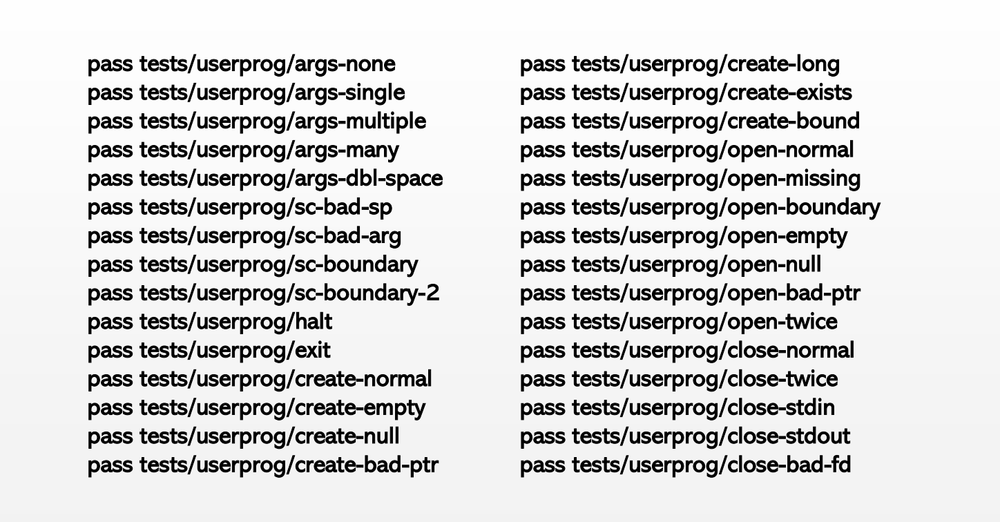
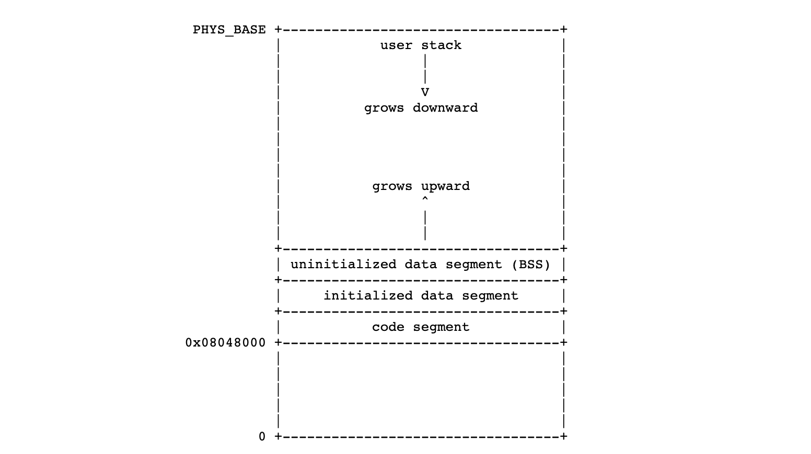
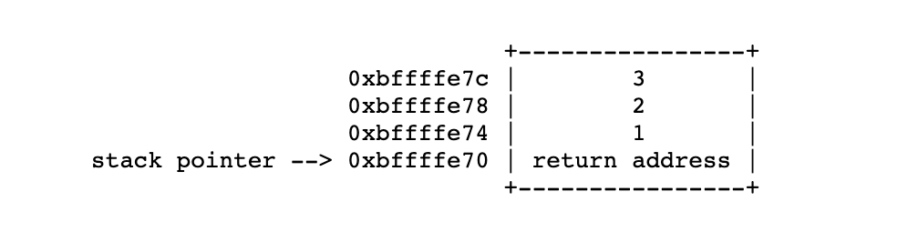
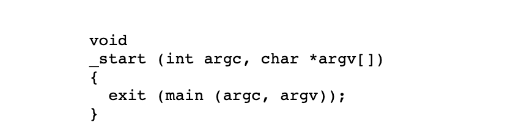
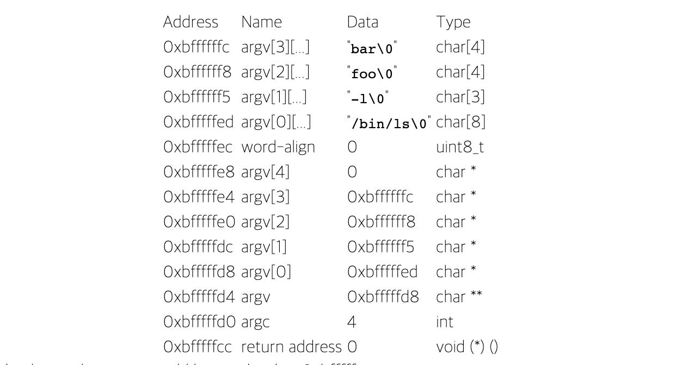
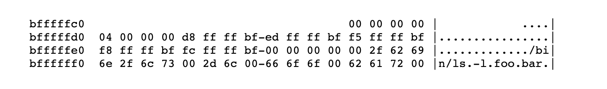

# Project2. User Programs

### TA session1

- **Reading materials**

  [3] Project2: User Programs 이 파트 집중해서 읽기

- **Goal**
  
  1. Argument passing
  
     - Arguments: user input strings when executing a program
     - ex) $/bin/ls -l foo bar 은 총 네 개의 arguments
     - Push arguments in stack: [3.5] 80.86 calling convention 읽기. `lib/string.c`의 `strtok_r()` 참고
     - kernel stack access: `syscall.c`의 `syscall_handler()` 참고
     - uni server는 gcc 4.8 버전이기 때문에, arguments는 3개까지만 고려하기 (4,5,6.. 개수는 고려하지 않아도 됨)
       - 1: arguments is located in esp+1
       - 2: arguments are located in esp+4(arg0), esp+5(arg1)
       - 3: arguments are located in esp+5(arg0), esp+6(arg1), esp+7(arg2)
       - 로컬 작업하는 경우에는 각자의 gcc 버전 꼭 체크하기
     - set return value (if any) to f->eax
  
  2. System call implemention
  
     - `halt()`: to quit system running (shutdown)
  
     -  `exit()`: to quit program running 
  
     -  `create()`: to create a file
     
     -  `open()`: to open a file
     
     - `close()`: to close a file
  
     - User memory access
  
       - system call의 경우, kernel의 user memory access가 요구됨
       - Address valid 1: user memory space 즉, PHYS_BASE보다 below에 있어야 함
       - Address valid 2: page table안에 mapped 되어있어야 함
       - Ways to do 1: Do a full verification, then dereference. `pagedir_get_page()` 참고
       - Ways to do 2: Only check if it is in user memory space. `userprog/exception.c` 참고 및 수정
     
  - File system for pintos (manual 3.1.2)
    
       - No internal synchronizatoin
       - 생성 시기에 file size가 고정됨
       - File data는 single extent로 할당됨
       - No subdirectories
       - File name은 14 characters로 제한됨
       - file system repair tool은 없음
       
       
        file system과 관련된 system call 구현을 위해서 `filesys/filesys.h`, `filesys/file.h`, `lib/syscall-nr.h` 를 참고해야 하지만, `filesys 디렉토리` 아래에 있는 system code들은 전혀 수정할 필요가 없음
  
- **Reference file**

  - `userprog/process.c`, `syscall.c`, `lib/string.c`
  - `pagedir.c`: user memory access 구현시 유용

- **Test case**

  

### TA session2

- **System call implemetation**

  - read, write, exec, wait, remove, filesize, seek, tell
  - 각각에 대한 자세한 설명은 핀토스 메뉴얼 참고

- **How file I/O works**

  - Work flow: User Program(app) > Kernel(OS) > Disk(File system)

    1. User Program이 system call을 통해 OS의 file I/O 기능을 요청
    2. OS의 kernel이 system call에 따라 적절히 Disk에 접근하여 작업 수행

    - fd: struct file을 가리키는 포인터
    - inode: Disk 내 real data의 위치를 가리키는 포인터
    - pos: 
    - 메타 영역: 파일시스템은 메타영역과 데이터영역으로 나뉨. 메타영역은 일반적으로 데이터영역에 기록된 파일의 이름, 위치, 크기, 시간정보, 삭제유무 등이 구조적으로 저장되어 관리됨. 이렇듯 데이터영역에 기록된 모든 파일은 메타영역에 의해 해당 정보를 얻을 수 있으므로 직접 파일 데이터가 필요한 경우가 아니라면 메타영역만의 접근으로 해당 파일 정보를 확인할 수 있음

  - open

    1. Open syscall
    2. Kernel 이 read data location 값을 가진 meta data inode를 가져옴
    3. struct file을 셋업하고 fd 리턴

  - read/write

    1. Read/Write syscall (pass fd, buffer, size)
    2. 받은 fd 값을 통해 struct file의 inode 값을 가져옴
    3. User request를 Disk에 전달
    4. pos의 값을 user requested size 만큼 increase

  - create/remove

    1. Create/Remove syscall (pass file name)

    2. Create: 새로운 meta data 셋업

       Remove: delete meta data

###Overview

 이제, Pintos의 인프라와 thread 패키지에 익숙해져, 작업하는 것이 편해졌을 것입니다. 그러므로 지금은 user program에 대한 작업을 시작할 차례입니다. 기본 코드 (제공되는 코드) 는  user program을 load와 실행 기능을 제공하고 있지만, I/O나 interactivity는 불가능합니다. 이 프로젝트에서는 system call을 통해 프로그램이 OS와 interact할 수 있도록 할 것입니다.

이번 과제에서는 `userprog/` 디렉토리에서 작업을 하게 될 것이지만, 이와 함께 Pintos의 거의 모든 파트들과 상호작용을 하게 될 것입니다. 이것에 대한 부분은 아래에 설명하겠습니다.

프로젝트 2는 프로젝트 1의 내용이 사용되지 않기 때문에, 이전 과제에 제출한 파일에서 시작을 해도 되고, 새로운 핀토스 파일에서 시작을 해도 됩니다.

###Background

지금까지 핀토스에서 실행한 모든 코드는 운영체제 커널의 일부였습니다. 즉, 프로젝트 1의 모든 테스트 코드는 커널의 파트로 실행되어 시스템의 권한이 필요한 모든 부분에서 full access(접근)가 가능했습니다. 하지만, OS에서 (kernel이 아닌) user program을 실행한다면, 이는 더이상 해당되는 이야기가 아닙니다. (**User program이 시스템 접근을 위해서는 system call을 사용합니다.**) 이 프로젝트가 다루는 내용이 바로 이 부분입니다.

Pintos는 한 번에 둘 이상의 process를 실행할 수 있습니다. 그리고 각 process는 한 개의 thread를 가집니다. (**멀티스레드 프로세스를 지원하지 않습니다.**) User program은 entire machine을 가지고 있다고 보여지도록 만들어집니다. 이는 여러 process를 load하고 실행할 때, memory, scheduling, other state를 올바르게 관리해서 이처럼 보여지게 해야함을 의미합니다. 

이전 프로젝트에서는 테스트 코드를 커널에 직접 컴파일했기 때문에, 커널 내에서 특정 기능을 하는 인터페이가 필요했습니다. 하지만 이번 프로젝트부터는, **user program을 실행하는 것을 통해, OS를 테스트** 할 것입니다. 이는 더 많은 자유도를 줄 것입니다. User program interface가 여기 설명된 사양을 충족하는지 확인해야 하지만, 사양만 충족된다면 원하는 대로 자유롭게 재구성하거나 다시 작성할 수 있습니다.

- **Source Files**

프로그램의 개요를 얻는 가장 쉬운 방법은 작업할 부분들을 살펴보는 것입니다. `userprog/` 디렉토리에는 적은 수의 파일들이 있지만, 작업을 해야할 양은 꽤 될 것입니다.

`process.c`, `process.h` 
ELF binaries를 load하고, process를 시작합니다.

`pagedir.c`, `pagedir.h` 
80x86 hardware page table의 simple manager입니다. 이번 과제에서는 이 코드를 수정할 일은 거의 없겠지만, 몇몇 함수는 사용하고 싶을 것입니다. 자세한 안내는 [4.1.2.3 Page Tables]() 를 참고하세요.

`syscall.c`, `syscall.h` 
**User process가 kernel 기능에 access를 하고자 할 때마다, system call을 호출**합니다. 이 파일들은 skeleton system call handler로, 현재는 메시지를 print하고 user process를 종료합니다. 프로젝트 2에서는 system call이 필요로 하는 모든 코드를 적어야합니다. (프로젝트 2에서 가장 작업을 많이 하게 될 파일입니다.)

`exception.c`, `exception.h` 
User process가 privileged(권한이 있는) operation 또는 prohibited(권한이 없는) operation을 수행하면, 'Exception' 또는 'fault'로 커널에 트랩됩니다. 이러한 파일들은 exception을 처리합니다. 현재의 모든 exception은 단순히 메시지를 출력하고, process를 종료합니다. project 2의 일부 솔루션은 이 파일의 `page_fault()` 를 수정하는 것을 요구합니다.

`gdt.c`, `gdt.h` 
80x86은 segmented architecture 입니다. GDT(Global Descriptor Table)는 사용중인 segment를 describe하는 테이블입니다. 위의 파일들은 GDT를 설정합니다. 어떤 프로젝트에서도 이 파일들을 수정할 필요는 없습니다. 만약 GDT가 어떻게 작동하는 지 관심이 있다면, 읽어볼만은 합니다.

`tss.c`, `tss.h` 
TSS(Task-State Segment)는 80x86 architectural task switching 에 사용됩니다. Pintos는 Linux와 마찬가지로, user process가 인터럽트 헨들러에 들어갈 때, stack switching에만 TSS를 사용합니다. 어떤 프로젝트에서는 이 파일들을 수정할 필요는 없습니다. TSS의 작동방식에 관심이 간다면 읽어볼만 합니다.

- **Using the File System**

User program이 파일 시스템에서 load되고, 파일 시스템을 다룰 수 있도록 구현되어야 하는 system call이 많기 때문에, 이번 프로젝트에서는 파일 시스템 코드들을 인터페이스화 하는 것이 필요합니다. (API 로 만들어야 한다는 의미인 듯합니다). 그러나 이 프로젝트의 초점은 파일 시스템이 아니므로, `filesys` 디렉토리에 단순하지만 완전한 파일 시스템을 제공했습니다. `filesys.h` 와 `file.h` 를 살펴봄으로써, 파일 시스템의 사용 방법과 특히, 여러 가지 제한 사항을 이해할 수 있습니다. 

이번 프로젝트에서는 파일 시스템 코드를 수정할 필요가 없기 때문에, **이를 수정하지 않는 것을 권장**합니다. 파일 시스템 부분에서 작업을 하게 되면, 이 프로젝트의 초점이 흐트러질 수 있습니다. 

File system routine들을 적절히 사용하면, 프로젝트 4에서 파일 시스템 구현을 개선할 때, 삶이 편안해질 것입니다.(make life much easier) 그 때까지는 다음과 같은 제한 사항을 참아야합니다.

1. 내부 동기화가 없습니다. 동시 액세스는 서로를 간섭합니다. 동기화를 사용하여, **한 번에 하나의 프로세스만 파일 시스템 코드를 실행**하도록 해야합니다.
2. 파일 **크기는 생성 시 고정**됩니다. Root 디렉토리는 파일로 표시되므로, 생성할 수 있는 파일 수도 제한됩니다.
3. 파일 데이터는 **single extent로 할당**됩니다. 즉, 단일 파일의 데이터는 디스크의 섹터의 연속적인 범위를 차지해야 합니다. External fragmentation이 심각한 문제가 될 수 있습니다.
4. 하위 디렉토리를 생성할 수 없습니다. (**No subdirectories**)
5. **파일 이름은 14 character**로 제한됩니다.
6. 작동 중 시스템 충돌이 나면, 자동으로 복구 할 수 없는 방식으로 디스크를 손상시킬 수 있습니다. 파일 시스템을 복구 할 수 있는 툴이 없습니다.

한 가지 중요한 특징도 포함합니다: Unix 계열의 시스템을 위한 `filesys_remove()` 가 구현되어 있습니다. 즉, 파일을 제거할 때 파일이 열려 있으면 해당 블록은 할당해제(deallocated) 되지 않고, 마지막으로 닫히기 전까지, 파일을 연 thread에 의해 계속 액세스 될 수 있습니다. 자세한 내용은 아래의 FAQ 중 [Removing an Open File]() 을 참고하세요.

 파일 시스템 파티션을 이용하여, simulated disk를 만들수 있어야 합니다. `pintos-mkdisk` 프로그램은 이 기능을 제공합니다. `userprog/build/` 디렉토리에서 `pintos-mkdisk filesys.dsk --filesys-size=2` 를 실행하십시오. 이 명령은 2MB Pintos 파일 시스템 파티션을 포함하는 filesys.dsk라는 시뮬레이트 된 디스크를 생성합니다. 그런 다음 커널 명령 행에 ` pintos -f -q` 를 실행하여 파일 시스템 파티션을 포맷하십시오. (-f 옵션을 사용하면 파일 시스템이 포맷되고, -q를 사용하면 포맷이 완료되는 즉시 Pintos가 종료됩니다.)

 이제 simulated file system 안팎으로 파일을 복사할 수 있는 방법이 필요합니다. `pintos` 의 `-p` ('put'), `-g` ('get') 옵션이 이를 가능하게 합니다. 파일을 Pintos 파일 시스템으로 복사하려면 `pintos -p file -- -q` 명령을 사용하십시오. ('--' 는 '-p' 옵션이 simulated된 커널이 아닌 `pintos` script 용이기 때문에 필요합니다.) 'newname' 이라는 이름으로 Pintos 파일 시스템에 복사해 넣으려면, `-a newname` 을 추가하면 됩니다. 

~~~bash
pintos -p file[파일 시스템에 넣고 싶은 파일] -a newname[파일 시스템에 저장할 이름] -- -q
~~~

 VM(가상 머신) 에서 파일을 복사하는 명령어는 이와 비슷하지만 -p 대신 -g를 사용한다는 차이가 있습니다.  

 이 명령어들은 특별한 명령어인 `extract` 와 `append` 를 kernel의 커맨드 라인에 전달하고 특수하게 simulated된 'scratch' 파티션으로 복사 및 복제하여 작동합니다. 이에 대에 호기심이 생긴다면, `pintos` 스크립트와 함께 `filesys/fsutil.c`를 보고 구현 세부 사항을 배울 수 있습니다.

 다음은 파일 시스템 파티션이 있는 디스크를 만들고, 파일 시스템을 포맷하고, echo 프로그램을 새 디스크에 복사한 다음, 인수 x를 전달하는 echo를 실행하는 방법에 대한 요약입니다. (인수 전달은 아직 구현되지 않았기 때문에, 작동되지 않을 것입니다.) `examples`에서 빌드를 완료한 후, `userprog/build`에서 실행해 주세요.

~~~bash
pintos-mkdisk filesys.dsk --filesys-size=2
pintos -f -q
pintos -p ../../examples/echo -a echo -- -q
pintos -q run 'echo x'
~~~

 뒤의 3 라인은 하나의 명령어로 압축할 수 있습니다.

~~~bash
pintos-mkdisk filesys.dsk --filesys-size=2
pintos -p ../../examples/echo -a echo -- -f -q run 'echo x'
~~~

 나중에 사용하거나 검사하기 위해 파일 시스템 디스크를 보관하지 않으려면 4개의 단계를 하나의 명령으로 통합할 수 있습니다. `--filesys-size=n` 옵션은 Pintos를 실행하는 동안에만 약 nMB 크기의 임시 파일 시스템 파티션을 만듭니다. Pintos 테스트 케이스는 다음 구문을 이용할 것입니다.

~~~bash
pintos --filesys-size=2 -p ../../examples/echo -a echo -- -f -q run 'echo x'
~~~

`pintos -q rm file[파일]` 과 같이 `rm file` 커널 액션을 사용하여 Pintos 파일 시스템에서 파일을 삭제할 수 있습니다. 또한 `ls`는 파일 시스템에 있는 파일을 나열하고, `cat file[파일 이름]`은 파일 내용을 디스플레이에 출력합니다.

- **How User Programs Work**

 Pintos는 메모리에 들어맞고, 이번 프로젝트에서 구현할 system call을 이용하는 프로그램이라면, 일반적인 C 프로그램을 돌릴 수 있습니다. 하지만, 해당되는 system call이 없는 경우에는 핀토스 내에서는 작동하지 않을 것입니다. 몇 가지 예시를 들자면,  `malloc()` 은 구현될 수 없는데, 그 이유는 memory allocation을 허용할 수 있는 system call 이 없기 때문입니다. 또한 Pintos는 thread를 전환할 때, 커널이 프로세서의 floating-point unit을 저장 및 복원하지 않기 때문에, floating point 연산을 하는 프로그램을 실행할 수 없습니다.

`src/examples` 디렉토리에는 몇 가지 샘플 user program이 있습니다. 이 디렉토리의 `Makefile` 은 제공된 예제 프로그램들을 컴파일하는데, 이를 편집해서 직접 만든 프로그램을 컴파일할 수도 있습니다. 예제 프로그램 중 일부는 프로젝트 3 또는 프로젝트 4가 구현된 이후에만 작동합니다.

Pintos는 `userprog/process.c`에서 제공하는 loader를 사용해서 ELF 실행 파일을 로드할 수 있습니다. ELF는 Linux, Solaris 및 기타 운영 체제에서 object 파일, 공유 라이브러리 및 실행 파일에 사용하는 파일 형식입니다. 실제로 80x86 ELF 실행 파일을 출력하는 모든 컴파일러 및 링커를 사용하여 Pintos용 프로그램을 생성할 수 있습니다. (우리는 제대로 작동하는 컴파일러와 링커를 제공했습니다.)

Simulated file system에 테스트 프로그램을 복사하기 전까지는 Pintos가 유용한 작업을 수행할 수 없다는 점을 주의하세요. 프로그램들을 파일 시스템에 복사하기 전까지는 흥미로운 작업을 수행할 수 없습니다. 
*당신은 아마 디버깅을 할 때마다 `filesys.dsk` 파일을 유용한 상태에서 버리게 될텐데, 그 때마다 새로운(초기화된) reference file system disk 를 생성하고, 복사하는 것을 원할 것입니다*.(이상한 문장..)

- **Virtual Memory Layout**

 Pintos의 가상 메모리는 [user 가상 메모리, kernel 가상 메모리] 이렇게 2개의 영역으로 나뉩니다. User 가상 메모리의 범위는 가장 주소 0에서 `PHYS_BASE`까지 이며, 이 주소는 `threads/vaddr.h`에 정의되어 있으며, 기본값은 0xc0000000 (3GB) 입니다. Kernal 가상 메모리는 `PHYS_BASE` 에서 4GB까지로, user 가상 메모리를 제외한 나머지 주소 공간을 차지합니다.

User 가상 메모리는 프로세스 단위(per-percess) 입니다. 커널이 한 프로세스에서 다른 프로세스로 전환할 때, 프로세서의 page directory base register를 변경하여, user 가상 주소 공간도 전환합니다. (`userprog/pagedir.c`의 `pagedir_activate()`를 참조하세요.) `struct thread`는 process의 페이지 테이블에 대한 포인터가 포함되어 있습니다. 

Kernel 가상 메모리는 전역(global) 입니다. 어떤 user process와 kernel thread가 실행 중인지에 관계없이 항상 동일한 방식으로 매핑됩니다. Pintos에서 kernel 가상 메모리는 `PHYS_BASE`에서 시작하여 물리적(Physical) 메모리에 일대일로 매핑됩니다. 즉, 가상 주소 *PHYS_BASE*는 물리적 주소 0에 액세스하고 가상 주소 *PHYS_BASE + 0x1234*  는 물리적 주소 *0x1234* 에 액세스하여 시스템의 물리적 메모리 크기까지 액세스합니다.

User program은 그것의 own user virtual memory에만 액세스할 수 있습니다. kernel 가상 메모리에 액세스하려고 하면, `userprog/exception.c`의 `page_fault()`에 의해 page fault가 발생하고, 프로세스가 종료됩니다.  Kernel thread는 kernel 가상 메모리와 실행 중인 process의 user 가상 메모리에 모두 액세스할 수 있습니다. 그러나 커널에서도 매핑되지 않은 user 가상 주소의 메모리에 액세스하려고 하면 page fault가 발생합니다.

- **Typical Menory Layout**

 각각의 process는 자신의 user virtual memory를 자유롭게 배치할 수 있습니다. 실제 user 가상 메로리는 다음과 같이 배치됩니다.

이번 프로젝트에서는 user stack의 크기가 고정되어 있지만, 프로젝트 3에서는 확장될 수 있습니다. 일반적으로 초기화 되지 않은 data segment의 크기는 system call로 조정할 수 있지만 이를 구현할 필요는 없습니다.

Pintos의 code segment는 주소 공간의 하단에서 약 128MB 위인 user 가상 주소 0x08048000에서 시작됩니다. 이 값은 [SysV-i386]() 에서 정해져 있으며, 특별한 의미는 없습니다.

Linker는 다양한 다양한 program segment의 이름과 위치를 알려주는 'linker script'의 지시에 따라 메모리에 usder program의 레이아웃을 설정하니다. `info ld` 를 통해 액세스 할 수 있는 linker 메뉴얼의 'script' 챕터를 통해 linker script에 자세히 알아볼 수 있습니다.

특정 실행 파일의 레이아웃을 보려면 `-p` 옵션을 사용하여 `objdump`(80x86) 또는 `i386-elf-objdumb`(SPARC) 를 실행하십시오.

- **Accessing User Memory**

 System call의 일부로, 커널은 종종 user program에서 제공하는 포인터를 통해 메모리에 액세스해야 합니다. User가 Null 포인터, 매핑되지 않은 가상 메모리를 가리키는 포인터 또는 커널 가장 주소 공간(PHYS_BASE 위의 주소) 을 가리키는 포인터를 전달할 수 있으므로 커널은 이를 매우 주의해야 합니다. 이러한 모든 유형의 유효하지 않은 포인터는 커널 또는 다른 실행 중인 프로세스에 해를 주지 않고 문제가 되는 프로세스를 종료하고 리소스를 free 하고 reject되어야 합니다.

이를 올바르게 수항하는 데는 두 가지 이상의 합리적인 방법이 있습니다. 첫 번째 방법은 사용자가 제공한 포인터의 유효성을 확인한 다음, 이를 역참조(dereference) 하는 것입니다. 이 방법을 선택한다면, `userprog/pagedir.c` 및 `threads/vaddr.h` 의 함수들을 살펴보면 좋습니다. 이는 user 메모리 액세스를 처리하는 가장 간단한 방법입니다.

두 번째 방법은 user pointer가 PHYS_BASE 아래를 가리키는 지 확인한 후 역참조(dereference) 하는 것입니다. 유효하지 않은 user pointer는 `userprog/exception.c`에서 page_fault()의 코드를 수정함으로써 다룰 수 있는 'page fault'를 발생시킵니다. 이 테크닉은 일반적으로 프로세서의 MMU를 활용하기 때문에 더 빠르므로 실제 커널 (including Linux) 에서 사용되는 경향이 있습니다.

어느 경우든 리소스를 'leak'(유실)하지 않도록 해야합니다. 예를 들어, system call이 lock을 획득하거나 malloc()을 통해 메모리를 할당했다고 가정해봅시다. 나중에 잘못된 user poiter가 생긴다면, lock을 해제하거나 메모리 페이지를 free해야 할 것입니다. 만약 user pointer를 역참조하기 이전에 확인하는 것을 선택한다면, 이는 간단합니다. 하지만 유효하지 않은 포인터가 page fault를 일으킨 이후라면, 메모리 엑세스에서 에러코드를 반환할 방법이 없기 때문에 이를 처리하기 더 어려워집니다. 따라서 후자의 테크닉을 사용하고자 하는 분들을 위해, 우리는 약간의 유용한 코드를 제공하겠습니다.

~~~c
/* Reads a byte at user virtual address UADDR.
   UADDR must be below PHYS_BASE.
   Returns the byte value if successful, -1 if a segfault
   occurred. */
static int
get_user (const uint8_t *uaddr)
{
  int result;
  asm ("movl $1f, %0; movzbl %1, %0; 1:"
       : "=&a" (result) : "m" (*uaddr));
  return result;
}
 
/* Writes BYTE to user address UDST.
   UDST must be below PHYS_BASE.
   Returns true if successful, false if a segfault occurred. */
static bool
put_user (uint8_t *udst, uint8_t byte)
{
  int error_code;
  asm ("movl $1f, %0; movb %b2, %1; 1:"
       : "=&a" (error_code), "=m" (*udst) : "q" (byte));
  return error_code != -1;
}
~~~

이 함수들은 user address가 이미 PHYS_BASE보다 낮은 것으로 확인되었다고 가정합니다.  또한 커널에서 page fault가 eax를 0xffffffff로 설정하고 이전 값을 eip에 복사하도록 page_fault()를 수정했다고 가정합니다.

###Suggested Order of Implementation

 다음 사항을 먼저 구현하는 것이 좋습니다. 각각의 항목은 병렬적으로 작업할 수 있습니다.

*** 인수 전달** ([3.3.3 Argument Passing]()). 인수 전달이 구현되기 전까지 모든 user program은 page fault를 일으킵니다.

지금 당장은 `setup_stack()`에서 아래의 문장으로 수정하는 것으로 일부 테스트 프로그램을 돌릴 수 있게 할 수 있습니다.

~~~c
*esp = PHYS_BASE;					// original
*esp = PHYS_BASE - 12;		// 이렇게 수정하세요!
~~~

이는 이름이 'null'로 출력되지만 인수를 검사하지 않는 모든 테스트 프로그램에서 먹힐 것입니다.

인수 전달을 구현하기 전까지는 command-line argument를 전달하지 않고 프로그램만 실행해야 합니다. 인수를 프로그램에 전달하려고 하면 해당 인수가 프로그램 이름에 포함되어 실패되게 할 것입니다.

*** User Memory Access** ([3.1.5 Accessing User Memory]()). 모든 system call은 user memory를 read 해야 합니다. user memory에 write 하는 system call은 거의 없습니다.

*** System call infrastructure** ([3.3.4 System Calls]()). User stack에서 system call 번호를 읽고 이를 기반으로 handler로 dispatch 할 수 있는 코드를 구현하십시오.

*** Exit system call**. 정상적인 방법으로 끝나는 모든 user program은 exit를 호출합니다. 프로그램이 main()으로 부터 return된다해도 exit를 간접적으로 call합니다. (`lib/user/entry.c`의 `_start()`를 참조하세요)

***** 시스템 콘솔인 fd 1에 writing을 위한 **write system call**. 모든 테스트 프로그램은 콘솔에 write하기 때문에 write 가 구현되지 전까지 이들은 제대로 작동하지 않을 것입니다. (user process 버전의 printf()는 이러한 방식으로 구현됩니다.)

***** 일단은 `process_wait()` 를 무한 루프로 변경하세요. (영원히 기다리게 하십시오) 현재 제공된 implementation은 즉시 return 하게 되어 있기 때문에, 프로세스가 실제로 실행되기 전에 Pintos의 전원이 꺼집니다. 추후에는 이것을 올바르게 구현해야 할 것입니다. 

 위의 내용을 구현했다면, user process는 최소한으로(minimally하게) 작동할 것입니다. 최소한 콘솔에 write하고, 올바르게 종료할 수 있습니다. 그렇기 때문에 위의 내용들을 먼저 구현한 이후에, 다른 파트의 테스트가 통과될 수 있도록 구체화 작업을 하십시오.

### Requirements

- **Process Termination Messages**

 User program이 terminate 될 때마다 **exit** 또는 기타 이유의 호출 때문에, **printf ( "% s : exit (% d) \ n", ... )** 형식의 프로세스 name 및 exit code를 print하십시오. print 된 이름은 **process_execute()**로 전달 된 전체 이름이어야하며 command-line arguments 는 생략합니다. 사용자 프로세스가 아닌 커널 스레드가 종료되거나 **halt** 시스템 호출이 호출 될 때이 메시지를 인쇄하지 마십시오. 프로세스를 로드하는데 실패하면(로드되지 않으면) 메시지는 선택 사항입니다.

 이 외에도 Pintos가 제공하지 않은 다른 메시지는 print하지 마십시오. 디버깅 중에 추가 메시지가 유용 할 수 있지만 채점 스크립트를 혼동하여 점수를 낮춥니다.

- **Argument Passing**

 현재 process_execute ()는 arguments를 새 프로세스로 전달하는 것을 지원하지 않습니다. **process_execute()를 확장**하여 프로그램 파일 이름을 인수로 사용하는 대신 공백으로 단어로 나누도록 이 기능을 구현 하십시오. 첫 번째 단어는 프로그램 이름이고 두 번째 단어는 첫 번째 인수입니다. 즉, process_execute( "grep foo bar") 는 두 개의 인수 foo 및 bar를 전달하여 grep을 실행해야 합니다. 

 명령 행에서 여러 공백은 단일 공백과 동일하므로 process_execute ( "grep foo bar") 는 원래 예제와 동일합니다. 명령 행 인수의 길이에 합리적인 제한을 둘 수 있습니다. 예를 들어, 인수를 단일 페이지(4 kB)에 맞는 인수로 제한 할 수 있습니다. ( 핀토스 유틸리티가 커널에 전달할 수 있는 최대128 바이트 명령 줄 인수에 제한을 두지 마십시오 .)    

 원하는 방식으로 argument strings을 parse 할 수 있습니다.  `lib/string.h`로 프로토 타입을 만들고 `lib/string.c`에 철저한 주석으로 구현 된 **strtok_r()**을 살펴보십시오 . man 페이지를 보면 자세한 내용을 알 수 있습니다 (프롬프트에서 **man strtok_r** 실행).

 스택 설정 방법에 대한 [자세한](https://translate.google.com/translate?hl=ko&prev=_t&sl=auto&tl=ko&u=https://web.stanford.edu/class/cs140/projects/pintos/pintos_3.html%23SEC51#SEC51) 내용은 [3.5.1 프로그램시작정보를](https://translate.google.com/translate?hl=ko&prev=_t&sl=auto&tl=ko&u=https://web.stanford.edu/class/cs140/projects/pintos/pintos_3.html%23SEC51#SEC51) 참조하십시오 . 

- **System Calls**

 `userprog/syscall.c`에 **system call handler를 구현**하십시오. 프로세스를 종료하여 "handle" 시스템 호출을 제공하는게 기본 스켈레톤 코드입니다. system call number를 검색 한 다음 system call arguments를 검색하고 적절한 조치를 수행해야합니다. 

 다음 system calls를 구현하십시오. 나열된 프로토 타입은 `lib/user/ syscall.h` 를 포함하는 사용자 프로그램에서 볼 수 있는 프로토 타입 입니다. (이 헤더 및 `lib/user`의 다른 모든 헤더는 **사용자 프로그램(user program)에서만 사용**됩니다.) 각 system call 에 대한 system call number는 `lib/syscall-nr.h`에 정의되어 있습니다.

*<u>[System Call: void **halt** (void)]</u>*

 **shutdown_power_off()** (`threads / init.h`에 선언)를 호출하여 Pintos를 종료 합니다. deadlocks situation 등에 대한 정보를 잃어 버리기 때문에 거의 사용하지 않아야합니다.   

*<u>[System Call: void **exit** (int status)]</u>*

 현재 사용자 프로그램을 종료하고 커널로 *status*를 리턴합니다. 프로세스의 부모가 프로세스를 **wait** 하는 경우(아래 참조) 이것이 반환 될 status입니다. 일반적으로 *status* 0은 success을 나타내고 0이 아닌 값은 오류를 나타냅니다.

*<u>[System Call:  pid\_t **exec** (const char \* cmd_line )]</u>*

 주어진 인수를 전달하여 이름이 *cmd_line*에 지정된 실행 파일을 실행하고, 새 프로세스의 프로그램ID (pid)를 반환합니다. 어떤 이유로든 프로그램을 로드하거나 실행할 수없는 경우 pid -1을 반환해야 합니다. 그렇지 않으면 유효한 pid가 아니어야 합니다. 따라서 자식 프로세스가 실행 파일을 성공적으로 로드했는지 알기 전까지는 부모 프로세스가 **exec**에서 리턴할 수 없습니다. 이를 위해서는 적절한 동기화를 사용해야합니다.

*<u>[System Call: int **wait** (pid\_t pid)]</u>*

 자식 프로세스 pid를 기다리고 자식의 exit status를 검색합니다.  

 *pid*가 아직 살아있는 경우, terminate 될 때까지 기다립니다. 그런 다음 *pid*가 exit으로 전달한 status를 리턴합니다. *pid*가 아직 exit()을 호출하지 않았지만 커널에 의해 종료되었다면 (e.g killed due to an exception) **wait(pid)**는 꼭 -1을 리턴해야 합니다. 부모 프로세스가 부모 호출 대기 시간 까지 이미 종료된(terminated) 자식 프로세스를 기다리는 것이 합법적이지만, 커널은 여전히 부모가 자식의 exit status를 검색하도록 허용하거나 자식이 커널에 의해 종료되었음을 알 수 있어야 합니다.

 다음 조건 중 하나라도 해당되면 wait에 실패하고 즉시 -1을 리턴해야합니다. 

1. *pid*는 호출 프로세스의 직접적인 자식을 의미하지 않습니다. *pid*는 호출 프로세스가 exec에 대한 성공적인 호출로부터 리턴 값으로 *pid*를 수신 한 경우에만 호출 프로세스의 직접적인 자식입니다.  

    자식들이 상속되지 않습니다: A가 자식 B를 spawn하고, B가 자식 프로세스 C를 spawn 했다면,  비록 B가 죽었다고 하더라도 A는 C를 기다릴 수 없습니다. wait(C)를 프로세스 A가 호출하는 것은 실패해야 합니다. 비슷하게 orphaned processes(고아 프로세스)는 부모 프로세스가 자신이 종료되기 전에 종료되면 새 부모에게 할당되지 않습니다.

2. wait를 호출하는 프로세스는 이미 wait on pid에 호출되었습니다. 즉, 프로세스는 주어진 자식을 최대 한 번 기다릴 수 있습니다.

 프로세스는 많은 수의 자식을 생성하고 순서대로 기다릴 수 있으며 일부 또는 모든 자식을 기다리지 않고 종료 될 수도 있습니다. 디자인은 wait가 발생할 수있는 모든 방식을 고려해야합니다. struct thread를 포함한 프로세스의 모든 자원은 부모가 프로세스를 기다리는 지 여부에 관계없이, 자식이 부모의 앞뒤로 나가는 지 여부에 관계없이 해제되어야합니다.

 초기 프로세스가 종료 될 때까지 Pintos가 종료되지 않도록 해야합니다. 제공된 Pintos 코드는 **main()** (`threads/init.c`) 에서 **process_wait()** (`userprog/process.c`)를 호출하여 이를 시도합니다. 함수 상단의 주석에 따라 **process_wait()를 구현** 한 다음 process_wait ()의 관점에서 wait system call을 구현하는 것이 좋습니다. 이 시스템 호출을 구현하려면 다른 시스템보다 훨씬 많은 작업이 필요합니다.

*<u>[System Call: bool **create** (const char \* file , unsigned initial\_size)]</u>*

 initial_size 크기 바이트를 가진 file 이라는 새 파일을 create 합니다. 성공하면 true를, 그렇지 않으면 false를 반환합니다. Creating a new file은 그것을 open 하지는 않습니다: 새로운 파일을 여는 것은 **open** system call이 요구되는 별도의 작업입니다.

*<u>[System Call: bool **remove** (const char \* file)]</u>*

 file이라는 파일을 삭제합니다. 성공하면 true를, 그렇지 않으면 false를 리턴합니다. 파일은 열려 있거나 닫혀 있는지에 관계 없이 제거 될 수 있으며 열린 파일을 제거해도 닫히지 않습니다. 자세한 내용은 FAQ의 [열린파일 제거](https://translate.google.com/translate?hl=ko&prev=_t&sl=auto&tl=ko&u=https://web.stanford.edu/class/cs140/projects/pintos/pintos_3.html%23Removing%20an%20Open%20File#Removing an Open File)를 참조하십시오.

*<u>[System Call: int **open** (const char\* file)]</u>*

 file이라는 파일을 엽니다. "file descriptor"(fd)라는 nonnegative integer handle을 리턴하거나 파일을 열 수 없는 경우 -1을 리턴합니다. 

 0과1로 numbered 된 파일 디스크립터는 콘솔 용으로 예약되어 있습니다. fd 0 (**STDIN_FILENO**)는 표준 입력이고, fd 1 (**STDOUT_FILENO**)는 표준 출력입니다. **open** system call은 아래에 명시된 system call arguments로 유효한 파일디스크럽터들을 리턴하지 않습니다. (The open system call will never return either of these file descriptors, which are valid as system call arguments only as explicitly described below.)

 각 프로세스에는 독립적인 파일 디스크립터 세트가 있습니다. 파일 디스크립터는 자식 프로세스에서 상속되지 않습니다.

 단일 프로세스 또는 다른 프로세스에 의해 단일 파일을 두 번 이상 열면 각각의 **open**이 새 파일 디스크럽터를 리턴합니다. 하나의 파일에 다른 파일 디스크럽터는 별도의 **close**를 호출하고 하고는 파일 position을 공유하지 않습니다.

*<u>[System Call: int **filesize** (int fd)]</u>*

 fd로 열린 파일의 크기를 바이트 단위로 리턴합니다.

*<u>[System Call: int **read** (int fd , void \* buffer , unsigned size)]</u>*

 fd로 열린 파일에서 size 바이트를 buffer로 읽습니다. 실제로 읽은 바이트 수(파일 끝의 0)를 리턴하거나 파일을 읽을 수없는 경우(파일 끝 이외의 조건으로 인해) -1을 반환합니다. fd 0은 **input_getc()**를 사용하여 키보드에서 읽습니다.

*<u>[System Call: int **write** (int fd , const void \* buffer , unsigned size)]</u>*

 buffer에서 열린 파일 fd에 size 바이트를 write 합니다. 실제로 write 한 바이트 수를 리턴합니다. 일부 바이트를 쓸 수 없는 경우 size 보다 작을 수 있습니다.

 End-of-file을 지나서 쓰면 일반적으로 파일이 확장되지만 basic file system에서는 파일 증가가 구현되지 않습니다. 예상되는 동작은 파일 끝까지 가능한 한 많은 바이트를 쓰고 실제로 쓴 숫자를 반환하거나 바이트를 전혀 쓸 수없는 경우 0을 반환하는 것입니다.

 fd 1은 콘솔에 씁니다. 콘솔에 쓰는 코드는 적어도 size 가 수백 바이트보다 크지 않은 한 **putbuf()** 에 대한 한 번의 호출로 모든 buffer를 작성해야 합니다. (더 큰 버퍼를 분할하는 것이 합리적입니다.) 그렇지 않으면 다른 프로세스에서 출력 된 lines of text가 콘솔에 interleaved 되어 채점자와 그레이딩 스크립트가 혼동 할 수 있습니다.

*<u>[System Call: void **seek** (int fd , unsigned position)]</u>*

 next byte to be read 또는 written in open file *fd* 를 *position*으로 변경합니다. position은 expressed in bytes from the beginning of the file 입니다. (따라서 position 0은 파일의 시작입니다.)     

 파일의 현재 끝을 지나는 seek은 오류가 아닙니다. later read는 파일의 끝을 나타내는 0 바이트를 얻습니다. later write는 파일을 확장하여 unwritten gap이 0으로 채워집니다. (단, 프로젝트 4가 완료 될 때까지 Pintos 파일의 길이는 고정되어 있으므로 파일 끝을 지나서 쓰면 오류가 반환됩니다.) 이러한 semantics은 file system에서 구현되며, system call 구현에 특별한 노력이 필요하지 않습니다.

*<u>[System Call: unsigned **tell** (int fd)]</u>*

 열린 파일 *fd* 에서 읽거나 쓸 다음 바이트의 position을, 파일 처음부터의 바이트 단위로 리턴합니다.

*<u>[System Call: void **close** (int fd)]</u>*

 파일 디스크럽터 fd를 닫습니다. 프로세스를 exit하거나 terminate하면 열려있는 모든 파일 디스크립터가 마치 각각에 대해 이 함수를 호출하는 것처럼 내재적으로 닫힙니다.

 파일은 다른 syscalls을 정의합니다. 지금은 무시하십시오. 프로젝트 3에서 일부를 구현하고 프로젝트 4에서 나머지를 구현하므로 확장성을 염두에 두고 시스템을 설계해야 합니다.

 syscalls을 구현하려면 user virtual address space (사용자 가상 주소 공간)에서 데이터를 읽고 쓰는 방법을 제공해야 합니다. system call number가 사용자의 가상 주소 공간에서 사용자의 스택에 있기 때문에 system call numbe를 얻기 전에 이 기능이 필요합니다. 이것은 약간 까다로울 수 있습니다. 사용자가 유효하지 않은 포인터, 커널 메모리에 대한 포인터 또는 해당 영역 중 하나에 부분적으로 블록을 제공하면 어떻게 될까요? 사용자 프로세스를 terminate 하여 이러한 경우를 처리해야 합니다. 다른 system call 기능을 구현하기 전에 이 코드를 작성하고 테스트하는 것이 좋습니다. 더 자세한 정보는 [3.1.5](https://translate.google.com/translate?hl=ko&prev=_t&sl=auto&tl=ko&u=https://web.stanford.edu/class/cs140/projects/pintos/pintos_3.html%23SEC39#SEC39) 절 을 참조하십시오.

 여러 사용자 프로세스가 한 번에 만들 수 있도록 system call을 동기화해야합니다. 특히, 여러 스레드에서 한 번에 `filesys` 디렉토리에 제공된 파일 시스템 코드를 호출하는 것은 안전하지 않습니다. system call 구현은 파일 시스템 코드를 중요한 섹션으로 취급해야합니다. **process_execute()** 도 파일에 액세스 한다는 것을 잊지 마십시오. 지금은 `filesys` 디렉토리의 코드를 수정하지 않는 것이 좋습니다 .      

 `lib/user/syscall.c`에 각 system call에 대한 사용자 레벨 기능을 제공했습니다. 이는 사용자 프로세스가 C 프로그램에서 각 system call을 호출하는 방법을 제공합니다. 각각은 작은 인라인 어셈블리 코드를 사용하여 system call을 호출하고 (필요한 경우) system call의 리턴 값을 리턴합니다. 

 이 부분을 끝낸 후에도 영원히 Pintos는 방탄(띠용?)해야합니다. use program이 수행 할 수 있는 어떤 것도 OS to crash, panic, fail an assertion 또는 오작동을 유발하지 않아야합니다. 이 점을 강조하는 것이 중요합니다. 테스트는 system call을 여러 가지 방법으로 차단하려고 시도합니다. 모든 코너 케이스를 생각하고 처리해야합니다. **user program이 OS를 정지**시킬 수있는 유일한 방법은 **halt system call**을 호출하는 것입니다.

 system call에 잘못된 인수가 전달되면 허용 가능한 옵션에는 오류 값 반환(값을 반환하는 호출의 경우), 정의되지 않은 값 반환 또는 프로세스 종료가 포함됩니다.

 시스템 호출 작동 방식에 대한 자세한 내용은 [3.5.2 시스템호출세부사항](https://translate.google.com/translate?hl=ko&prev=_t&sl=auto&tl=ko&u=https://web.stanford.edu/class/cs140/projects/pintos/pintos_3.html%23SEC52#SEC52) 섹션을 참조하십시오.

- **Denying Writes to Executables**

 use as executables 중인 파일에 대한 write를 거부하는 코드를 추가하십시오. 프로세스가 디스크에서 변경되는 도중에 코드를 실행하려고 시도한 경우의 예측할 수 없는 결과로 인해, 많은 OS가 이를 수행합니다. 프로젝트 3에서 가상 메모리를 구현 한 후에는 특히 중요하지만 지금도 하더라도 힘들지 않습니다.

 **file_deny_write()** 를 사용하여 열린 파일에 쓰지 못하게 할 수 있습니다. 파일에서 **file_allow_write()** 를 호출하면 파일이 다른 오프너에 의한 쓰기가 거부되지 않는 한 다시 활성화 할 수 있습니다. 파일을 닫으면 쓰기도 다시 활성화됩니다. 따라서 프로세스 실행 파일에 대한 쓰기를 거부하려면 프로세스가 여전히 실행중인 동안 열려 있어야합니다.

### FAQ

- 얼마나 많은 코드를 작성해야합니까?

###80x86 Calling Convention 

 이 절에서는 Unix의 32 비트80 *x* 86 구현 에서 일반 함수 호출에 사용되는 규칙의 중요한 사항을 요약합니다. 간결하게 하기 위해 일부 세부사항은 생략했습니다. 모든 세부 사항을 원하면[ [SysV-i386](https://translate.google.com/translate?hl=ko&prev=_t&sl=auto&tl=ko&u=https://web.stanford.edu/class/cs140/projects/pintos/pintos_13.html%23SysV-i386#SysV-i386) ]을 참조하십시오.

 호출 규칙(calling convention)은 다음과 같이 작동합니다

1. caller는 일반적으로 **PUSH** 어셈블리 언어 명령어를 사용하여 스택에서 각 함수의 arguments를 하나씩 푸시합니다. 인수는 오른쪽에서 왼쪽 순서로 푸시됩니다.  

    스택은 아래로 커집니다. 각 푸시는 스택 포인터를 감소시킨 다음, C expression *--sp = value 와 같이, 현재 가리키는 위치에 저장합니다.

2. caller는 스택에서 다음 명령어의 주소(*return address*)를 푸시하고 수신자의 첫 번째 명령어로 이동합니다. 단일 80 *x* 86 명령어인 **CALL**이 두 가지를 모두 수행합니다.

3. callee(수신자)가 실행됩니다. 제어 할 때 스택 포인터는 return address를 가리키고 첫 번째 argument는 바로 위에 있으며 두 번째 argument는 첫 번째 argument 위에 있습니다.

4. callee가 return value을 가지고 있으면 레지스터 **EAX**에 저장합니다.

5. callee는 스택에서 return address를 pop하고 80 *x* 86 **RET** 명령어를 사용하여 지정된 위치로 점프하여 리턴합니다.

6. caller는 arguments를 스택에서 pop합니다.

 세 개의 int arguments를 취하는 함수 **f()** 를 고려하십시오. 이 다이어그램은 f() 가 f (1, 2, 3)으로 호출되는 것으로 가정하고 위의 3단계 시작 부분에 calle가 볼 수있는 샘플 스택 프레임을 보여줍니다. 초기 스택 주소는 임의적입니다.

- **Program Startup Details**

 User program 용Pintos C 라이브러리는 `lib/user/entry.c` 에서 **_start()** 를 user program의 시작점으로 지정합니다. 이 함수는 **main()** 이 리턴하면 **exit()** 를 호출하는 main() 주위의 래퍼입니다.

 커널은 user program이 실행을 시작하기 전에 스택에 initial function에 대한 arguments를 넣어야합니다. arguments는 normal calling convention과 같은 방식으로 전달됩니다( [3.5 80 ](https://translate.google.com/translate?hl=ko&prev=_t&sl=auto&tl=ko&u=https://web.stanford.edu/class/cs140/projects/pintos/pintos_3.html%23SEC50#SEC50)[*x* ](https://translate.google.com/translate?hl=ko&prev=_t&sl=auto&tl=ko&u=https://web.stanford.edu/class/cs140/projects/pintos/pintos_3.html%23SEC50#SEC50)[86 호출규칙참조](https://translate.google.com/translate?hl=ko&prev=_t&sl=auto&tl=ko&u=https://web.stanford.edu/class/cs140/projects/pintos/pintos_3.html%23SEC50#SEC50) ).

 다음 예제 명령의 인수를 처리하는 방법을 고려하십시오 **"/bin/ls -l foo bar"**. 먼저, 명령을 단어 "/bin/ls", "-l" ,"foo" ,"bar" 로 나누십시오. 스택 맨 위에 단어를 놓습니다. 포인터를 통해 참조되므로 순서는 중요하지 않습니다.

 그런 다음 스택에서 각 문자열의 주소와 null pointer sentinel을 오른쪽에서 왼쪽으로 푸시합니다. 이들은 **argv**의 요소입니다. null pointer sentinel은 C 표준에 따라 **argv[argc]** 가 null 포인터인지 확인합니다. 이 순서는 **argv[0]** 이 가장 낮은 가상 주소에 있도록합니다. Word-aligned accesses 는 정렬되지 않은 액세스보다 빠르므로 최상의 성능을 위해 첫 번째 푸시 전에 스택 포인터를 4의 배수로 내립니다.

 그런 다음 **argv** (**argv[0]** 의 주소) 및 **argc**를 순서대로 푸시합니다. 마지막으로, 가짜 "return address"를 푸시하십시오. entry function는 절대 리턴하지 않지만 스택 프레임은 다른 것과 동일한 구조를 가져야합니다.    

 아래 표는 **PHYS_BASE** 가 0xc0000000 이라고 가정하고 스택의 상태와 user program을 시작하기 직전에 관련 레지스터를 보여줍니다. 이 예제에서 스택 포인터는 0xbfffffcc 로 초기화됩니다 . 

 위에 표시된 것처럼 코드는 가상 주소 PHYS_BASE 바로 아래의 페이지 (`threads/vaddr.h`에 정의 됨)에서, 사용자 가상 주소 공간 맨 위에서 스택을 시작해야합니다.

 `<stdio.h>`에 선언된 비표준 **hex_dump()** 함수는 argument passing code를 디버깅하는 데 유용합니다. 위 예제에서 보여지는 내용은 다음과 같습니다.

- **System Call Details**

 첫 번째 프로젝트는 이미 운영 체제가 user program에서 제어권을 다시 얻을 수 있는 한 가지 방법인 타이머 및 I/O 장치의 인터럽트를 처리했습니다. "external" 인터럽트는 CPU 외부의 엔티티로 인해 발생하기 때문입니다 (섹션 [A.4.3 외부인터럽트처리참조](https://translate.google.com/translate?hl=ko&prev=_t&sl=auto&tl=ko&u=https://web.stanford.edu/class/cs140/projects/pintos/pintos_6.html%23SEC110#SEC110) ). 

 운영 체제는 프로그램 코드에서 발생하는 이벤트인 software exceptions도 처리합니다(섹션 [A.4.2 내부인터럽트처리참조](https://translate.google.com/translate?hl=ko&prev=_t&sl=auto&tl=ko&u=https://web.stanford.edu/class/cs140/projects/pintos/pintos_6.html%23SEC109#SEC109) ). 페이지 오류 또는 0으로 나누기와 같은 오류 일 수 있습니다. user program이 운영 체제에 services ("system calls") 를 요청할 수 있는 수단도 exceptions 입니다. 

 80 *x* 86 아키텍처에서 int 명령어는 system call을 호출하는 데 가장 일반적으로 사용되는 수단입니다. 이 명령어는 다른  software exceptions와 같은 방식으로 처리됩니다. Pintos에서 user program은 int $ 0x30 을 호출하여 system call을 합니다. 인터럽트를 호출하기 전에 system call number 및 추가 arguments가 정상적인 방식으로 스택에 푸시 될 것으로 예상됩니다( [3.5 80 ](https://translate.google.com/translate?hl=ko&prev=_t&sl=auto&tl=ko&u=https://web.stanford.edu/class/cs140/projects/pintos/pintos_3.html%23SEC50#SEC50)[*x* ](https://translate.google.com/translate?hl=ko&prev=_t&sl=auto&tl=ko&u=https://web.stanford.edu/class/cs140/projects/pintos/pintos_3.html%23SEC50#SEC50)[86 호출규칙참조](https://translate.google.com/translate?hl=ko&prev=_t&sl=auto&tl=ko&u=https://web.stanford.edu/class/cs140/projects/pintos/pintos_3.html%23SEC50#SEC50)).     

 따라서 system call handler **syscall_handler()** 가 제어를 받으면  system call number는 caller의 스택 포인터에서 32-bit word에 있고 첫 번째 arguments는 다음 상위 주소에서 32-bit word에 있습니다. caller의 스택 포인터는 **struct intr_frame **의 esp 멤버가 전달 되었으므로, **syscall_handler()**에 액세스 할 수 있습니다. (**struct intr_frame** 은 커널 스택에 있습니다.)        

 함수 return values에 대한 80 *x* 86규칙은 **EAX** 레지스터 에 배치하는 것입니다. 값을 리턴하는 system calls은 **struct intr_frame** 의 eax 멤버를 수정하여 수행 할 수 있습니다.

 system calls을 구현하기 위해 대량의 반복 코드를 작성하지 않도록 해야합니다. 정수이든 포인터 든 각 system calls arguments는 스택에서 4바이트를 차지합니다. 스택에서 각 system calls arguments를 검색하기 위해 거의 동일한 코드를 작성하지 않도록 이 기능을 활용할 수 있어야 합니다.
