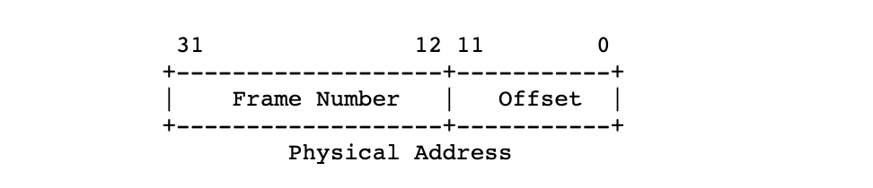
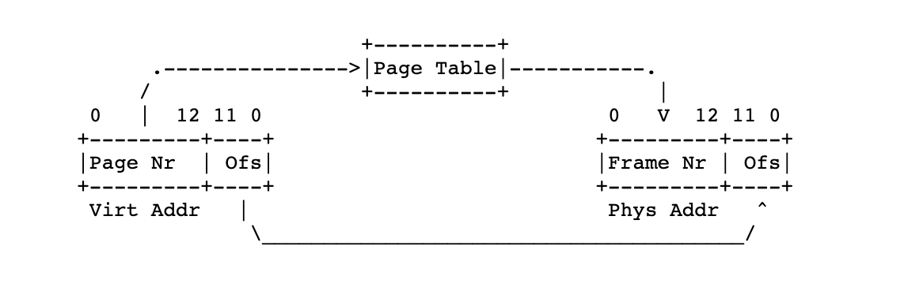
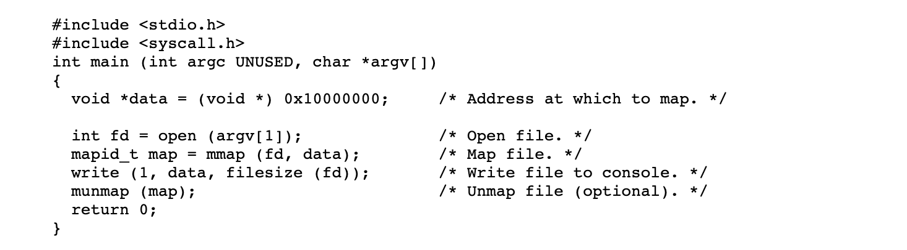

# Project3. Vitual Memory

### TA session

- 프로젝트 목표

  - Page Table Management (Lazy Loading)
  - Stack Growth
  - Memory Mapped files
  - Swap Disk Management

- 구현 순서 제안 (manual 4.2) & TA session 자료 참고하기

  - Implement Frame Table (4.1.5 Managing the Frame Table)
  - Supplemental (4.1.4 Managing Supplemental Page Table)
  - Implement Swapping, Stack Growth, Mapped Files

- 현재 핀토스의 메모리 관리 방식

  - Page size: 4KB, Each process has its own page tables 

  - The page directory is allocated when the process is created 

    *( pagedir_create( ) - userprog/pagedir.c )*

  - Thread pagedir points to the page directory 

    *( load() - userprog/process c )*

  - The (secondary) page tables are dynamically created if necessary 

    *( lookup_page() - userprog/pagedir.c )*

  - For kernel region, processes have the same mapping 

    *(PHYS_BASE ~ 0xffffffff )*

  - No demand paging. When a process is created, all the contents of code and data segments are read into the physical memory 

    *( load_segment() – userprog/process.c )* - 여기부터 코드를 읽어나가는 것 추천

  - Fixed stack size. Only one stack page is allocated to each process 

    *( setup_stack() - userprog/process.c )*

  - No page faults in the user mode
    Everything needed by each process is in the physical memory

  - Pintos의 Pagedir를 참고하여 수정하는 방법보다는, 직접 처음부터 구현하는 것이 더 쉬움


### Background

 이제 Pintos의 내부 작업에 익숙해 져야합니다. OS는 적절한 동기화로 여러 실행 스레드를 올바르게 처리 할 수 있으며 여러 사용자 프로그램을 한 번에로드 할 수 있습니다. 그러나 실행할 수있는 프로그램의 수와 크기는 시스템의 기본 메모리 크기에 의해 제한됩니다. 이 과제에서는 해당 제한을 제거합니다.

 이 과제는 프로젝트 2의 테스트 프로그램도 프로젝트 3과 함께 작동해야합니다. 프로젝트 3에서 작업을 시작하기 전에 프로젝트 2 제출시 버그를 수정해야합니다. 버그는 프로젝트 3에서 동일한 문제를 일으킬 가능성이 높기 때문입니다.

 이전 과제와 동일한 방식으로 Pintos 디스크 및 파일 시스템을 계속 처리합니다 (3.1.2 Using the File System 참조 ).

- 4.1.1 Source Files

 이 프로젝트는 vm 디렉토리 에서 작업합니다. VM의 디렉토리엔 Makefile.s 만이 존재합니다. userprog와 유일한 차이점은 이 새 Makefile이 -DVM 설정을 켠다는 것입니다. 작성하는 모든 코드는 새 파일 또는 이전 프로젝트에서 소개 된 파일에 있습니다. 

 아마도 처음엔 몇 개의 파일 만 보게 될 것입니다: devices/block.h, devices/block.c

 block device에 대한 sector-based read and write access를 제공합니다. 이 인터페이스를 사용하여 swap partition에 block device로 액세스합니다.

- 4.1.2 Memory Terminology

 가상 메모리에 대한 논의가 혼동되지 않도록 주의해서 정의해야합니다. 따라서 메모리와 스토리지에 대한 몇 가지 용어를 제시하는 것으로 시작합니다. 이러한 용어 중 일부는 프로젝트 2 (3.1.4 Virtual Memory Layout 참조)에 익숙해야 하지만 대부분 새로운 용어 입니다.

1. Pages = 가상 메모리를 일정된 한 크기로 나눈 블록

 Page (Virtual page)는 , 가상 메모리 4,096 바이트(page size)의 연속 영역입니다. 페이지는 page-aligned(페이지-정렬) 되어야 합니다. 즉, page size로 divisible한 virtual address에서 시작해야합니다. 따라서 32bit virtual address는 다음과 같이 20bit page number와 12bit page offset (또는 offset) 으로 나눌 수 있습니다.


 각 프로세스에는 가상 주소 PHYS_BASE (typically 0xc0000000 (3 GB)) 아래에 독립적인 user (virtual) page 가 있습니다. 반면 kernel (virtual) page 세트 는 전역적이며 어떤 스레드 또는 프로세스가 활성화되어 있는지에 관계없이 동일하게 유지됩니다. 커널은 사용자와 커널 페이지 모두에 액세스 할 수 있지만 사용자 프로세스는 자신의 사용자 페이지에만 액세스 할 수 있습니다. 자세한 정보는 [3.1.4 가상 메모리 레이아웃](https://translate.google.com/translate?hl=ko&prev=_t&sl=en&tl=ko&u=https://web.stanford.edu/class/cs140/projects/pintos/pintos_3.html%23SEC37#SEC37) 섹션 을 참조하십시오. Pintos는 가상 주소 작업에 유용한 여러 기능을 제공합니다. 자세한 내용은 [A.6 가상 주소](https://translate.google.com/translate?hl=ko&prev=_t&sl=en&tl=ko&u=https://web.stanford.edu/class/cs140/projects/pintos/pintos_6.html%23SEC114#SEC114) 섹션 을 참조하십시오.

2. Frames = 물리 메모리를 일정된 한 크기로 나눈 블록

 Frame (Physical frame)은 물리적인 메모리의 연속 공간입니다. 페이지와 마찬가지로 프레임은 page size와 page-aligned되어야합니다. 따라서 32bit 실제 주소는 다음과 같이 20bit frame number와 12bit frame offset (또는 offset) 으로 나눌 수 있습니다.



 80 *x* 86은 실제 주소에서 메모리에 직접 액세스 할 수 있는 방법을 제공하지 않습니다. Pintos는 커널 가상 메모리를 실제 메모리에 직접 매핑하여 이 문제를 해결합니다. 커널 가상 메모리의 첫 번째 페이지는 실제 메모리의 첫 번째 프레임, 두 번째 페이지는 두 번째 프레임 등으로 매핑됩니다. 따라서 프레임은 커널 가상 메모리를 통해 액세스 할 수 있습니다.

3. Page Tables

 Pintos에서 Page table은 CPU가 가상 주소를 실제 주소, 즉 페이지에서 프레임으로 변환하는 데 사용하는 데이터 구조입니다. 페이지 테이블 형식은 80 *x* 86 아키텍처에 의해 결정됩니다. Pintos는 pagedir.c에 페이지 테이블 관리 코드를 제공합니다 (섹션 [A.7 페이지 테이블](https://translate.google.com/translate?hl=ko&prev=_t&sl=en&tl=ko&u=https://web.stanford.edu/class/cs140/projects/pintos/pintos_6.html%23SEC115#SEC115) 참조 ).   

 아래 다이어그램은 페이지와 프레임 간의 관계를 보여줍니다. 왼쪽의 가상 주소는 페이지 번호와 오프셋으로 구성됩니다. 페이지 테이블은 페이지 번호를 오른쪽에있는 물리적 주소를 얻기 위해 수정되지 않은 오프셋과 결합 된 프레임 번호로 변환합니다.



4. Swap Slots

 Swap slot 스왑 파티션에 있는 디스크 공간의 연속적인 페이지 크기 영역입니다. 슬롯 배치를 지시하는 하드웨어 제한이 페이지 및 프레임보다 느슨하지만, 스왑 슬롯은 downside가 없기 때문에 page-aligned 되어야 합니다.

- 4.1.3 Resource Management Overview

 다음과 같은 데이터 구조를 설계해야합니다.

1. Supplemental page table: 페이지 테이블을 supplement 함으로써 page fault handling를 가능하게 합니다. [4.1.4 보충 페이지 테이블 관리](https://translate.google.com/translate?hl=ko&prev=_t&sl=en&tl=ko&u=https://web.stanford.edu/class/cs140/projects/pintos/pintos_4.html%23SEC62#SEC62) 섹션을 참조하십시오 . 
2. Frame table: eviction policy을 효율적으로 구현할 수 있게합니다. [4.1.5 프레임 테이블 관리](https://translate.google.com/translate?hl=ko&prev=_t&sl=en&tl=ko&u=https://web.stanford.edu/class/cs140/projects/pintos/pintos_4.html%23SEC63#SEC63) 섹션을 참조하십시오 . 
3. Swap table: 스왑 슬롯 사용을 추적합니다. [4.1.6 스왑 테이블 관리](https://translate.google.com/translate?hl=ko&prev=_t&sl=en&tl=ko&u=https://web.stanford.edu/class/cs140/projects/pintos/pintos_4.html%23SEC65#SEC65) 섹션을 참조하십시오 . 
4. Table of file mappings: 프로세스는 파일을 가상 메모리 공간에 매핑 할 수 있습니다. 어떤 파일이 어떤 페이지에 매핑되는지 추적하려면 테이블이 필요합니다.

 네 개의 완전히 다른 데이터 구조를 구현할 필요는 없습니다. 관련 리소스를 전체적으로 또는 부분적으로 통합 된 데이터 구조로 병합하는 것이 편리 할 수 있습니다.

 각 데이터 구조에 대해 각 요소에 포함해야 할 정보를 결정해야합니다. 또한 로컬 (프로세스 당) 또는 전역 (전체 시스템에 적용)과 같은 데이터 구조의 범위와 해당 범위 내에 필요한 인스턴스 수를 결정해야합니다.

디자인을 단순화하기 위해 이러한 데이터 구조를 비 페이징 (non-pageable) 메모리에 저장할 수 있습니다. 즉, 그 사이의 포인터가 유효하게 유지 될 수 있습니다.

 가능한 데이터 구조 선택에는 arrays, lists, bitmaps, and hash tables이 포함됩니다. array는 종종 가장 간단한 방법이지만, sparsely populated(빈 공간이 많은) array는 메모리를 낭비합니다. list도 단순하지만 특정 목록을 찾기 위해 긴 목록을 탐색하면 시간이 낭비됩니다. Array와 list 모두 크기를 조정할 수 있지만 list는 중간에 삽입 및 삭제를보다 효율적으로 지원합니다.

 Pintos는 lib / kernel / bitmap.c 및 lib / kernel / bitmap.h에 bitmap data structure를 포함합니다. 비트 맵은 비트 배열이며 각 비트는 true 또는 false 일 수 있습니다. 비트 맵은 일반적으로 (동일한) 리소스 세트에서 사용량을 추적하는 데 사용됩니다 . 리소스 n 을 사용중인 경우 비트 맵의 비트 n 은 true입니다. 크기 조정을 지원하도록 구현을 확장 할 수 있지만 핀토스 비트 맵의 크기는 고정되어 있습니다.    

 Pintos에는 해시 테이블 데이터 구조도 포함됩니다 (섹션 [A.8 해시 테이블](https://translate.google.com/translate?hl=ko&prev=_t&sl=en&tl=ko&u=https://web.stanford.edu/class/cs140/projects/pintos/pintos_6.html%23SEC123#SEC123) 참조 ). Pintos 해시 테이블은 광범위한 테이블 크기에서 삽입 및 삭제를 효율적으로 지원합니다. 

 더 복잡한 데이터 구조는 성능이나 다른 이점을 얻을 수 있지만 구현을 불필요하게 복잡하게 만들 수도 있습니다. 따라서 디자인의 일부로 고급 데이터 구조 (예 : 균형 이진 트리)를 구현하지 않는 것이 좋습니다.

- 4.1.4 Managing the Supplemental Page Table

 supplemental page table은 각 페이지에 대한 추가 데이터로, 페이지 테이블을 보완합니다. 이것은 페이지 테이블 포맷에 의해 부과 된 제한 때문에 필요합니다. 이러한 데이터 구조는 종종 "페이지 테이블"이라고 불리기도 합니다. 혼동을 줄이기 위해 "supplemental"이라는 단어를 추가합니다. 

 보충 페이지 테이블은 최소한 두 가지 목적으로 사용됩니다. 가장 중요한 것은 page fault에서 커널은 보충 페이지 테이블에서 오류가 발생한 가상 페이지를 찾아 어떤 데이터가 있어야 하는지 찾습니다. 둘째로, 커널은 프로세스가 종료 될 때 보충 페이지 테이블을 참조하여 사용 가능한 자원을 결정합니다.

 보충 페이지 테이블을 원하는대로 구성 할 수 있습니다. organization에 대한 최소한 두 가지 기본 접근 방식이 있습니다: in terms of segments or in terms of pages. 선택적으로, 페이지 테이블 자체를 index로 사용하여 보충 페이지 테이블의 멤버를 추적 할 수 있습니다. pagedir.c 에서 Pintos 페이지 테이블 구현을 수정해야합니다. 이 방법은 고급 학생들에게만 권장합니다. 자세한 내용은 [A.7.4.2 페이지 테이블 입력 형식](https://translate.google.com/translate?hl=ko&prev=_t&sl=en&tl=ko&u=https://web.stanford.edu/class/cs140/projects/pintos/pintos_6.html%23SEC121#SEC121) 섹션 을 참조하십시오.  

 보충 페이지 테이블의 가장 중요한 사용자는 page fault handler입니다. 프로젝트 2에서 page fault는 항상 커널 또는 사용자 프로그램의 버그를 나타냅니다. 프로젝트 3에서는 이를 의미하지 않습니다. 이제 page fault는 페이지가 파일 또는 스왑에서 가져와야 함을 나타냅니다. 이러한 경우를 처리하려면 보다 복잡한 page fault handler를 구현해야합니다. userprog/exception.c의 page_fault()를 수정하여 구현해야 하는 page fault handler는 대략 다음과 같은 작업을 수행해야 합니다.

1. 보충 페이지 테이블에서 결함이있는 페이지를 찾으십시오. 메모리 참조가 유효한 경우, 보충 페이지 테이블 항목을 사용하여 파일 시스템 또는 스왑 슬롯에 있거나 단순히 all-zero 페이지일 수 있는 페이지에 있는 데이터를 찾으십시오. sharing을 구현하면 페이지의 데이터는 이미 페이지 프레임에 있지만 페이지 테이블에는 없을 수 있습니다.

    보충 페이지 테이블에서 사용자 프로세스가 액세스하려는 주소에 어떤 데이터도 예상해서는 안 된다고 표시하거나, 페이지가 커널 가상 메모리 내에 있거나, 액세스 권한이 읽기 전용 페이지에 쓰려는 시도인 경우, 액세스가 무효화됩니다. 잘못된 액세스는 프로세스를 종료하고 그에 따라 모든 리소스를          free합니다.

2. 페이지를 저장할 프레임을 확보하십시오. 자세한 내용은 [4.1.5 프레임 테이블 관리](https://translate.google.com/translate?hl=ko&prev=_t&sl=en&tl=ko&u=https://web.stanford.edu/class/cs140/projects/pintos/pintos_4.html%23SEC63#SEC63) 섹션 을 참조하십시오. sharing을 구현하면 필요한 데이터가 이미 프레임에있을 수 있으며, 이 경우 해당 프레임을 찾을 수 있어야합니다

3. 파일 시스템에서 데이터를 읽거나 스왑하거나 제로화하여 프레임으로 데이터를 가져옵니다. sharing을 구현하는 경우 필요한 페이지가 이미 프레임에 있을 수 있으므로, 이 단계에서 별도의 조치가 필요하지 않습니다.

4. 결함이있는 가상 주소의 페이지 테이블 entry를 실제 페이지로 지정하십시오. userprog/pagedir.c의 기능을 사용할 수 있습니다.

- 4.1.5 Managing the Frame Table

 Frame table은 사용자 (user) 페이지를 포함 각 프레임에 대해 하나의 항목(entry)이 포함되어 있습니다. 프레임 테이블의 각 항목에는 현재 해당 페이지를 차지하는 페이지에 대한 포인터와 선택한 다른 데이터가 포함됩니다. 프레임 테이블을 사용하면 빈 프레임이 없을 때 제거할 페이지를 선택하여 Pintos가 제거 정책을 효율적으로 구현할 수 있습니다. 

 사용자 페이지에 사용되는 프레임은 palloc_get_page (PAL_USER)를 호출하여 "user pool "에서 가져와야합니다. "kernel pool"에서 할당을 피하려면 PAL_USER 를 사용해야합니다. 이 경우 일부 테스트 케이스가 예기치 않게 실패 할 수 있습니다 ( [PAL_USER?를](https://translate.google.com/translate?hl=ko&prev=_t&sl=en&tl=ko&u=https://web.stanford.edu/class/cs140/projects/pintos/pintos_4.html%23Why%20PAL_USER%3F#Why PAL_USER?) 참조하십시오 ). 프레임 테이블 구현의 일부로 palloc.c를 수정하는 경우 두 풀 사이의 구별을 유지하십시오.   

 프레임 테이블에서 가장 중요한 작업은 사용하지 않는 프레임을 얻는 것입니다. 프레임이 free 일때는 쉽습니다. none is free 일때는 프레임에서 일부 페이지를 제거하여 프레임을 free 해야합니다.

 스왑 슬롯을 할당하지 않고 프레임을 제거할 수 없지만 스왑이 가득 찬 경우 커널을 패닉 상태로 만드십시오. 실제 OS는 이러한 상황에서 복구하거나 예방하기 위해 광범위한 정책을 적용하지만, 이러한 정책은 본 프로젝트의 범위를 벗어난다.

 eviction(제거) 과정은 대략 다음 단계로 구성됩니다.

1. 페이지 교체 알고리즘을 사용하여 제거 할 프레임을 선택하십시오. 아래 설명 된 페이지 테이블의  "accessed" and "dirty" 비트가 유용합니다.

2. 프레임을 참조하는 페이지 테이블에서 프레임에 대한 참조(reference)를 제거하십시오. sharing를 구현하지 않은 경우 한 번에 하나의 페이지 만 프레임을 참조해야합니다.

3. 필요한 경우 페이지를 파일 시스템에 쓰거나 교체하십시오. 제거 된 프레임은 다른 페이지를 저장하는 데 사용될 수 있습니다.

* Accessed and Dirty Bits

 80x86 하드웨어는 각 페이지의 페이지 테이블 엔트리(PTE)의 한 쌍의 비트를 통해 페이지 교체 알고리즘 구현하기 위한 일부 지원을 제공합니다. 페이지 읽기 또는 쓰기에서 CPU는 페이지의 PTE에서 accessed bit를 1로 설정하고 모든 쓰기에서 dirty bit를 1로 설정합니다 . CPU는 이러한 비트를 0으로 재설정하지 않지만 OS는 이를 수행 할 수 있습니다

 당신은 aliases, 즉 동일한 프레임을 참조하는 두 개 이상의 페이지를 알고 있어야 합니다. 앨리어싱 된 프레임에 액세스하면 accessed bit와 dirty bit는 하나의 페이지 테이블 항목 (액세스에 사용 된 페이지에 대한 항목)에서만 업데이트됩니다. 다른  aliases의  accessed 및 dirty bit는 업데이트되지 않습니다. 

 Pintos에서 모든 사용자(user) 가상 페이지는 커널 가상 페이지에 별칭이 지정됩니다(= aliased 됩니다). 어떻게든이 별칭을 관리해야합니다. 예를 들어, 코드는 두 주소 모두에 대해 accessed 및 dirty bit를 확인하고 업데이트 할 수 있습니다. 또는 커널은 사용자 가상 주소를 통해서만 사용자 데이터에 액세스함으로써 문제를 피할 수 있습니다. 다른 별칭은 추가 크레딧 공유를 구현 하거나 ( [VM 추가 크레딧](https://translate.google.com/translate?hl=ko&prev=_t&sl=en&tl=ko&u=https://web.stanford.edu/class/cs140/projects/pintos/pintos_4.html%23VM%20Extra%20Credit#VM Extra Credit) 참조 ) 코드에 버그가 있는 경우에만 발생합니다. 

 accessed 및 dirty bit트로 작동하는 기능에 대한 자세한 내용은 [A.7.3 액세스 및 더티 비트](https://translate.google.com/translate?hl=ko&prev=_t&sl=en&tl=ko&u=https://web.stanford.edu/class/cs140/projects/pintos/pintos_6.html%23SEC118#SEC118) 섹션을 참조하십시오.

- 4.1.6 Managing the Swap Table

 스왑 테이블은 사용 중 및 사용 가능한 스왑 슬롯을 추적합니다. 프레임에서 스왑 파티션으로 페이지를 제거하기 위해 사용되지 않는 스왑 슬롯을 선택할 수 있어야합니다. 페이지를 다시 읽거나 스왑 된 프로세스가 종료되면 스왑 슬롯을 비울 수 있어야합니다.

 BLOCK_SWAP를 block device for swapping에 사용할 수 있으며 block_get_role () 을 호출하여 이를 나타내는 struct block 을 얻을 수 있습니다. vm/build 디렉토리로 부터 *pintos-mkdisk swap.dsk --swap-size=n* 커맨드를 사용하여 n-MB 스왑 파티션이 포함된 swap.dsk라는 디스크를 생성 합니다. 그런 다음 pintos 를 실행하면 swap.dsk가 자동으로 추가 디스크로써 연결됩니다. 또는 *--swap-size=n* 단일 실행으로 임시 *n-* MB 스왑 디스크 를 사용하도록 핀토스에게 지시할 수 있습니다.         

 스왑 슬롯은 lazy 하게 할당해야 합니다. 즉, 실제로 제거에 필요한 경우에만 가능합니다. 실행 파일에서 데이터 페이지를 읽고 프로세스 시작시  즉시 스왑하도록 작성하는 것은 not lazy 합니다. 스왑 슬롯은 특정 페이지를 저장하기 위해 예약되어서는 안됩니다.

 내용을 프레임으로 다시 읽을 때 스왑 슬롯을 free합니다.

- 4.1.7 Managing Memory Mapped Files

 파일 시스템은 가장 일반적으로 읽기 및 쓰기 system call로 액세스됩니다. 보조 인터페이스는 mmap system call을 사용하여 파일을 가상 페이지에 "매핑"하는 것 입니다. 그런 다음 프로그램은 파일 데이터에서 직접 메모리 명령어를 사용할 수 있습니다.

 파일 foo의 길이 가 0x1000 바이트 (4kB 또는 한 페이지) 라고 가정합니다. foo 가 주소 0x5000 에서 시작하는 메모리에 매핑 되면 0x5000 ... 0x5fff 위치에 대한 모든 메모리 액세스는 해당하는 foo의 바이트에 액세스합니다. 

 아래는 mmap을 사용하여 파일을 콘솔에 출력하는 프로그램입니다. 커맨드 라인에서 지정된 파일을 열고 가상 주소 0x10000000 에 맵핑하고 맵핑 된 데이터를 콘솔에 기록하고 ( fd 1) 파일을 맵핑 해제 합니다.



 full error handling과 유사한 프로그램이 examples directory의 mcat.c 으로서 포함되어 있으며, 이는 또한 mmap의 두 번째 예로서 mcp.c를 포함하고 있습니다. 

 과제 결과물은 메모리 매핑된 파일이 사용하는 메모리르 추적할 수 있어야 합니다. 매핑된 영역에서 page fault를 올바르게 처리하고, 매핑된 파일이 프로세스 내의 다른 세그먼트와 겹치지 않도록 해야합니다. 

###Suggested Order of Implementation

 다음과 같은 순서로 구현을 시작하는 것을 권장합니다:

1. Frame Table을 구현하십시오.([4.1.5 Managing the Fram Table]() 참고) 여러분 만든 frame table allocator를 사용하도록 `process.c` 를 변경하십시오.
   아직 swapping을 구현하지 마십시오. 만일 프레임 없이 실행한다면, allocator가 실패하거나 kernel pannice이 일어날 것입니다.
   이 작업을 마친 후에도 kernel은 여전히 project 2의 모든 테스트 케이스를 통과해야 합니다.
2. Supplemental page table과 page fault handler를 구현하십시오.([4.1.4 Managing the Supplemental Page Table]() 참고) 실행 파일을 로드하고 해당 스택을 설정할 때 필요한 정보를 supplemental page table에 기록하도록 process.c를 변경하십시오. 지금은 valid access 만을 고려하십시오.
   이 단계를 마친 후 kernel은 project 2의 모든 테스트와, robustness test의 일부가 통과되어야 합니다.

 여기에서는 프로세스 종료 시의 stack growth, mapped files 및  page reclamation(페이지 교정) 을 병렬적으로 구현할 수 있습니다.

 그 다음 단계는 eviction(제거)를 구현하는 것입니다.([4.1.5 Managing the Frame Table]() 참고) 처음에는 무작위로 제거할 페이지를 선택할 수 있습니다. 이 때, accessed and dirty bit를 관리하고, user 및 kernel 페이지를 aliasing하는 방법을 고려해야합니다. 동기화(Synchronization) 역시 고려 대상입니다. 프레임 프로세스 B가 evicting을 수행중인 페이지에서 프로세스 A가 fault를 일으킨 경우, 어떻게 처리할 것입니까? 마지막으로, clock 알고리즘과 같은 eviction 전략을 구현하십시오.

###Requirements

 이번 과제는 open-ended로 설계된 과제입니다. 가이드에서는 어떻게 해야하는 지에 대해서는 최대한 적게 말할 것입니다. 대신 OS에서 지원해야 하는 기능에 초점을 맞추어 설명하겠습니다. 알맞는(make sense 하는) 디자인을 고안할 수 있기를 기대합니다. Page fault를 처리하는 방법, swap partition을 구성하는 방법, paging을 구현하는 방법 등등은 자유롭게 선택해도 됩니다.

- 4.3.1 Design Document

 과제에 시작하기에 앞서, design document template를 프로젝트 폴더에 옮기십시오. (이하 생략)

- 4.3.2. Paging

 실행 파일(executables)에서 로드된 세그먼트에 대한 pagin을 구현하십시오. 이 모든 페이지들은 lazy하게 로드 되어야 하는데, 이는 kernel이 page fault를 가로채는 경우만을 가르킵니다. (All of these pages should be loaded lazily, that is, only as the kernel intercepts page faults for them. -> 해석 못하겠음..) Eviction 시, 로드 이후에 수정된 페이지(예: 'dirty bit'로 표시된 페이지) 는 should be written to swap(swap으로 읽혀야합니다? 스왑할 수 있도록 작성되어야 합니다?). Read-only 페이지를 포함한 수정되지 않은 페이지들은 결코 written to swap 되어서는 안되는데, 이는 그들이 항상 실행 파일(executable)에서 다시 읽을 수 있기 때문입니다.

 LRU와 비슷한 global page replacement 알고리즘을 구현하십시오. 여러분이 작성한 알고리즘은 최소한 'second chance' 또는 'clock' 알고리즘 만큼은 작동해야합니다.

 여러분의 디자인은 parallelism을 허용할 수 있어야합니다. 한 page fault가 I/O를 require할 때, 그 동안 fault가 일어나지 않는 다른 프로세스는 계속 실행되어야 하며, I/O를 require하지 않는 다른 page fault들은 complete할 수 있어야 합니다.

 ` userprog/process.c/`의 `load_segment()`안에 있는 loop인 program loader의 core를 수정해야 합니다. 매 loop 마다, `page_read_bytes`는 실행 파일에서 읽을 바이트 수를 받고, `page_zero_bytes`는 읽은 바이트들 뒤에 0으로 초기화 될 바이트 수를 받습니다. 이 둘의 합은 항상 PGSIZE(4,096)가 됩니다. Handling of page는 아래의 변수들의 값에 따라 달라집니다. (아래 똥글뱅이들 해석이 약간 이해 안감..)

1. `page_read_bytes`가 PGSIZE인 경우, 페이지는 첫 번째 액세스 시, 기본 파일에서 페이징 되어야 합니다. (the page should be demand paged from the underlying file on tis first access -> 해석 안 됨..)

2. `page_zero_bytes`가 PGSIZE인 경우, 이 페이지는 모두 0이므로 디스크에서 페이지를 읽을 필요가 전혀 없습니다. 이러한 페이지들은 첫 page fault에서 모두 0으로만 구성된 새 페이지를 생성하는 것으로 처리해야 합니다.

3. 이 외의 경우, 즉 `page_read_bytes`와 `page_zero_bytes` 모두 PGSIZE가 아닌 경우, 페이지의 initial part(앞 부분?)은 underlying 파일에서 읽히고, 나머지 부분들은 0이 됩니다.

- 4.3.3. Stack Growth

 Stack growth를 구현하십시오. 프로젝트 2에서 stack은 user virtual address space의 맨 위에 있는 단일 페이지였고, 프로그램은 그 만큼의 스택으로 제한되었습니다. 이제 스택이 현재 크기보다 커지면, 필요에 따라 추가 페이지를 할당하도록 하십시오.

 Additional 페이지가 stack access로 나타난 경우에만 additional 페이지를 할당하십시오. Stack access를 다른 access와 구별하는 heuristic을 고안하십시오(작성하십시오).

 일반적인 실제 OS는 스택의 데이터를 푸시하는 "신호"를 제공하기 위해 언제든지 프로세스를 중단시킬 수 있기 때문에 사용자 프로그램이 스택 포인터 아래의 스택에 쓸 경우 버그가 생길 수 있습니다. 그러나 80x86 `PUSH` 명령은 스택 포인터를 조정하기 전에 액세스 권한을 검사하므로 스택 포인터의 4 바이트 아래에 page fault를 발생시킬 수 있습니다. (그렇지 않으면 `PUSH`는 간단한 방식으로 다시 시작할 수 없습니다.) 마찬가지로 `PUSHA` 명령은 한 번에 32 바이트를 푸시하므로 스택 포인터의 32 바이트 아래에서 page fault 할 수 있습니다.

 User program 스택 포인터의 현재 값을 얻을 수 있어야합니다. System call 또는 user 프로그램에 의해 생성된 page fault 안에서,  `struct intr_frame`의 `esp` 멤버로부터 이를 찾을 수 있습니다. (`struct intr_fram`은 `syscall_handler()`과 `page_fault()` 에 전달되는 그 친구입니다.) User pointer를 확인 먼저 하고 access 하는 경우라면([3.1.5 Accessing User Memory]() 참조, 참고로 우린 이 방법으로 했음), 위의 것들만 처리하면 됩니다. 
반면, 잘못된 메모리 액세스를 감지하기 위해 page fault에 의존하는 경우 커널에서 page fault가 발생하는 다른 경우를 처리해야합니다. Exception으로 인해 user에서 kernel 모드로 전환 될 때 프로세서는 스택 포인터만 저장하므로 `page_fault()`로 전달 된 구조체 `intr_frame`에서 `esp`를 읽으면 user 스택 포인터가 아닌 정의되지 않은 값이 생성됩니다. user에서 kernel 모드로 초기 전환 할 때 `esp`를 struct `thread`에 저장하는 것과 같은 방법을 필요합니다.

 대부분의 OS와 마찬가지로 stack size에 대한 절대적인 limit를 설정 해야합니다. 일부 OS는 user가 limit을 조정할 수 있도록 합니다. 예를 들면, 많은 Unix 시스템에서는 `ulimit` 명령으로 합니다. 많은 GNU / Linux 시스템의 default limit은 8MB 입니다.

 첫 번째 stack page는 lazy하게 할당할 필요가 없습니다. 로드 시 command line argument를 사용하여 이를 할당하고 초기화 할 수 있으며, fault가 발생할 때까지 기다릴 필요가 없습니다.

모든 stack 페이지는 eviction 대상이어야 합니다. 제거된 스택 페이지는 스왑할 수 있도록 작성되어야 합니다.

- 4.3.4. Memory Mapped Files

 다음의 system call들을 포함하는 memory mapped files를 구현하십시오.

[System call: mapid_t mmap (int fd, void * addr)]

 `fd`로 열린 파일을 프로세스의 가상 주소 공간에 매핑합니다. 파일 전체는 `addr`에서 시작하는 연속된 가상 페이지에 매핑됩니다.

 VM 시스템은 `mmap` 영역에 페이지를 lazy하게 load하고, `mmap`ed 된 파일 자체를 매핑을 위한 백업 저장소로 사용해야 합니다. 즉, `mmap`에 의해 매핑된 페이지를 제거하면 매핑된 파일에 다시 write 합니다.(?) 

 파일의 길이가 PGSIZE의 배수가 아닌 경우, 최종 매핑된 페이지의 일부 바이트가 파일 끝을 넘어 "stick out"됩니다. 이 바이트들을 파일 시스템에서 page fault가 발생한다면 0으로 설정하고, 페이지가 disk로 written back될 때는 무시하십시오.

 성공하면, 이 함수는 프로세스 내에서 매핑을 고유하게 식별하는 "mapping ID"를 반환합니다. 실패하면 -1을 반환해야 합니다. 즉, 유효한 mapping id가 아니어야 하고, 프로세스의 매핑들은 바뀌어서는 안됩니다.

 `fd`로 **열린 파일의 길이가 0바이트**인 경우 `mmap`에 대한 호출이 실패할 수 있습니다. `addr`이 **page-aligned 이지 않거나**(페이지가 정렬되어 있지 않거나) 매핑된 페이지 범위가 스택 또는 load time 시 실행 파일에 매핑된 페이지를 포함하는 **기존에 매핑된 페이지 세트의 어느 하나와도 겹친다**면 fail 되어야 합니다. 또한 핀토스 코드의 일부는 virtual page 0는 매핑되지 않았다고 가정하기 때문에, **`addr`이 0인 경우에도 실패해야 합니다**. 끝으로, **`fd`가 0 또는 1**인 경우에도 매핑될 수 없습니다. 

[System call: void munmap (mapid_t mapping)]

 `mapping`이 가리키는 매핑을 해제합니다. 이 때, `mapping`은 아직 unmapped 되지 않은 프로세스가 이전에 호출한 `mmap` 에 의해 반환되는 mapping ID를 뜻합니다.  

 `exit` 시스템 콜이나 다른 어떤 방법으로든 프로세스가 종료된 때, 모든 매핑들은 내재적으로 매핑 해제됩니다. 내재적이든 명시적이든 매핑이 해제되면, 프로세스에서 written된 모든 페이지들은 파일로 written back 되어야 하며, written 되지 않았던 page들은 파일에 written 되어서는 안됩니다. 그런 다음 페이지들은 프로세스의 프로세스의 가상 페이지 목록에서 제거됩니다.

 파일을 close나 remove하는 것은 매핑을 해제하지 않습니다. 일단 creat되면, Unix 규약에 따라 `munmap`이 호출되거나 프로세스가 종료될 때까지 매핑이 유효합니다. 자세한 내용은 [Removing an Open File]()을 참고하십시오. 각 매핑에 대해 파일의 별도의 독립적인 reference를 얻기 위해서는 `file_reopen`함수를 사용해야 할 것입니다.

 만일 둘 이상의 프로세스가 동일한 파일을 매핑하는 경우, 이들이 consistent data를 보는 것을 요구하지는 않겠습니다. Unix는 두 매핑이 동일한 physical page를 공유하도록 하여 이를 처리하지만, `mmap` system call은 client가 페이지가 shared인지 private인지를 구분할 수 있게 하는 argument를 가지고 있습니다. (i.e. copy-on-write)

- 4.3.5. Accessing User Memory

 System call을 처리하는 동안 user 메모리에 액세스하려면 코드를 조정해야 합니다. ([3.1.5 Accessing User Memory]() 참조) User 프로세스가 현재 파일 또는 스왑 공간에 있는 페이지에 액세스할 수 있는 것처럼, 이러한 non-resident 페이지를 참조하는 주소를 system call에 전달할 수 있습니다. 또한 커널이 이를 방지하기 위한 조치를 취하지 않으면, 커널 코드로 페이지를 액세스하는 중에도 페이지가 프레임에서 제거 될 수 있습니다. 커널 코드가 이러한 non-resident user 페이지에 액세스하는 경우, page fault가 발생합니다.

 User 메모리에 액세스하는 동안 커널은 이러한 page fault를 처리할 준비가 되어 있거나 발생을 방지해야 합니다. 커널은 이러한 fualt를 처리하기 위해 필요한 자원을 보유하고 있는 동안에도 page fault가 발생하는 것을 방지해야 합니다. (핀토스에서는) 이러한 리소스에는 파일 시스템과 swap 공간은 포함하는 device를 제어하는 device driver에 의해 획득되는 lock이 포함됩니다. 구체적인 예로, 장치 드라이버가 `file_read`에 전달되는 user 버퍼에 액세스하는 동안 page fault가 발생하지 않도록 해야합니다. 이러한 fault를 처리하는 동안에는 드라이버를 호출 할 수 없기 때문입니다.

 이러한 page fault를 방지하려면 코드 내 access가 발생하는 코드와 page eviction code간의 협력이 필요합니다. 예를 들어, 프레임 테이블을 확장하여 프렘임에 포함된 페이지가 제거되지 않아야 하는 시기를 기록할 수 있습니다. (이를 프레임에서 페이지를  "pinning" 또는 "locking"한다라고도 합니다.)  피닝은 제거할 페이지를 찾을 때 페이지 교체 알고리즘의 선택을 제한하므로 페이지 고정은 필요 이상으로 하지 말고, 필요하지 않은 경우에는 피닝을 하지 마십시오.

###FAQ

- Q) How much code will I need to write?


 이 Summary는 Project 2에서 변경한 코드의 양까지 포함되어 있습니다.

- Q) What extra dredit is available?

 Sharing을 구현해도 좋습니다. 동일한 실행 파일을 사용하는 여러 프로세스가 작성되면 각 프로세스마다 별도의 읽기 전용 세그먼트 사본을 작성하는 대신 해당 프로세스간에 읽기 전용 페이지를 공유하십시오. 데이터 구조를 신중하게 설계 한 경우 읽기 전용 페이지를 공유하면이 부분이 크게 어려워지지 않아야합니다.

- Q) How do we resume a process after we have handled a page fault?

 `page_fault()`에서 retrun을 하면 current user 프로세스가 재개됩니다. ([A.4-2 Internal Interrupt Handling]()을 참조하세요) 그런 다음 instruction pointer가 가리키는 instruction을 다시 시도할 것입니다.

- Q) Why do user processes sometimes fault above the stack pointer?

 Stack growth test에서, PUSH 및 PUSHA 명령으로 인해 현재 스택 포인터 아래의 4 및 32바이트 지점에서 fault가 발생하더라도 user program의 현재 스택 포인터 위에 있는 주소에서 user program fault가 발생하는 것을 발견할 수 있을 것입니다.

 이는 드문 케이스가 아닙니다. PUSH 및 PUSHA 명령어는 사용자 스택 증가를 일으킬 수 있는 유일한 명령어는 아닙니다. 예를 들어, user program은 `SUB $n, %esp`명령을 사용하여 스택 포인터를 내려서 스택 공간을 할당한 다음 `MOV ..., m(%esp)`명령을 싸용하여 현재 스택 포인터 위에 있는 할당된 공간(현재 스택 포인터 위의 m byte) 내의 스택 위치에 write할 수 있습니다. 이러한 액세스는 완벽하게 유효하며 커널이 사용자 프로그램의 스택을 확장해야 이러한 액세스가 성공할 수 있습니다.

- Q) Does the virtual memory system need to support data segment growth?

 아니요. 데이터 세그먼트의 크기는 linker에 의해 결정됩니다. Pintos는 동적 할당을 할 수 없습니다. (memory-mapped file을 이용해 user level에서 '하는 것처럼' 보일 수는 있어도 말입니다.) 데이터 세그먼트의 확장의 지원은 추가적으로 잘 짜여진 시스템의 복잡성을 더해야만 가능한 일입니다.

- Q) Why should I use PAL_USER for allocating page frames?

 PAL_USER를 `palloc_get_page()`로 전달하면 PAL_USER이 main kernel pool 대신 user pool에서 메모리를 할당합니다. User pool의 페이지가 부족하면 user program이 단지 페이지를 벗어나기만 해도 되지만, kernel pool의 페이지가 부족하면 많은 커널 기능이 메모리를 필요로하기 때문에 많은 failure가 발생합니다. 원한다면, `palloc_get_page()` 위에 다른 다른 alloctator를 계층화 할 수 있지만 이는 underlying mechanism이어야 합니다.

 또한 `-ul` 커널 명령줄 옵션을 사용하여 user pool의 크기를 제한 할 수 있으므로 다양한 사용자 메모리 크기로 VM 구현을 쉽게 테스트할 수 있습니다.

### A.5 Memory Allocation

 핀토스는 두 개의 memory allocator를 가지고 있는데, 하나는 페이지의 단위로 메모리를 할당하고 다른 하나는 어떤 크기의 블록이던 할당할 수 있습니다.

- A.5.1 Page Allocator

 thread/palloc.h로 선언된 페이지 할당자는 페이지 단위로 메모리를 할당합니다. 한 번에 한 페이지씩 메모리를 할당하는 데 가장 많이 쓰이지만, 여러 개의 연속 페이지를 한꺼번에 할당할 수도 있습니다.

 페이지 할당자는 할당하는 메모리를 kernel pool과 user pool이라고 불리는 두 개의 pool(풀)로 나눕니다. 기본적으로 각 풀은 시스템 메모리의 절반을 1MB 이상 얻지만 -ul 커널 명령줄 옵션으로 분할을 변경할 수 있습니다(Why PAL_USER? 참조). 할당 요청은 한 풀 또는 다른 풀에서 끌어옵니다. 한 풀이 비어있어도 다른 풀은 여전히 free 페이지를 가질 수 있습니다. user pool은 사용자 프로세스의 메모리를 할당하고, 커널 풀은 이 외의 모든 할당에 사용해야 합니다. 이것은 프로젝트 3부터 중요해집니다. 그전까지 모든 allocation은 커널 풀에서 이루어져야 합니다.

 각 풀의 용도는 풀의 페이지당 1비트인 비트맵으로 추적됩니다. n 페이지 할당 요청은 false로 설정된 n개의 연속 비트에 대한 비트맵을 스캔하여 해당 페이지가 free임을 표시한 다음 해당 비트를 true로 설정하여 used로 표시합니다. 이것은 "first fit" 할당 전략입니다(Wilson 참조).

 페이지 할당자는 fragmentation 될 수 있습니다. free 페이지는 used 페이지로 구분되기 때문에 n개 이상의 페이지가 free 이더라도 n contiguous pages는 할당하지 못할 수 있습니다. 사실, pathological case에서 풀의 페이지의 절반이 free임에도 불구하고 2 contiguous pages를 할당하는 것이 불가능할 수 있습니다. Single-page 요청은 fragmentation 때문에 실패할 수 없기 때문에 multiple contiguous pages에 대한 요청은 가능한 한 제한되어야 합니다.

 페이지는 인터럽트 컨텍스트에서 할당되지 않을 수 있지만, 해제될 수 있습니다.

 페이지가 해제되면 디버깅 보조 장치로 모든 바이트가 0xcc로 지워집니다(섹션 E.8 팁 참조).

*[Function: void ***palloc_get_page** (enum palloc_flags flags)]*

*[Function: void ***palloc_get_multiple** (enum palloc_flags flags, size_t page_cnt)]*

 Obtains and returns one page, or page_cnt contiguous pages, respectively. Returns a null pointer if the pages cannot be allocated.The flags argument may be any combination of the following flags:Page Allocator Flag: **`PAL_ASSERT`**If the pages cannot be allocated, panic the kernel. This is only appropriate during kernel initialization. User processes should never be permitted to panic the kernel.Page Allocator Flag: **`PAL_ZERO`**Zero all the bytes in the allocated pages before returning them. If not set, the contents of newly allocated pages are unpredictable.Page Allocator Flag: **`PAL_USER`**Obtain the pages from the user pool. If not set, pages are allocated from the kernel pool.

*[Function: void **palloc_free_page** (void \*page)]*

*[Function: void **palloc_free_multiple** (void \*pages, size_t page_cnt)]*

 Frees one page, or page_cnt contiguous pages, respectively, starting at pages. All of the pages must have been obtained using `palloc_get_page()` or `palloc_get_multiple()`.

- A.5.2 Block Allocator

 thread/malloc.h로 선언된 bloack allocator는 모든 크기의 블록을 할당할 수 있습니다. 이 계층은 이전 섹션에서 설명한 페이지 할당자 위에 계층화됩니다. 블록 할당자에 의해 반환되는 블록은 커널 풀에서 얻습니다.

 블록 할당자는 메모리를 할당하기 위해 두 가지 다른 전략을 사용합니다. 첫 번째 전략은 1 kB 이하(페이지 크기의 4분의 1)인 블록에서 적용됩니다. 이러한 할당량은 2바이트 또는 16바이트 중 더 큰 것으로 반올림된다. 그런 다음, 해당 크기의 할당에만 사용되는 페이지로 그룹화됩니다.

 두 번째 전략은 1 kB보다 큰 블록에서 적용됩니다. 이러한 할당(및 적은 양의 오버헤드 포함)은 가장 가까운 페이지까지 반올림한 다음, 블록 할당자는 페이지 할당자에서 해당 number of contiguous pages를 요청합니다.

 어느 경우든 요청된 할당 규모와 실제 블록 크기의 차이는 낭비가 됩니다. 실제 운영 체제는 이러한 낭비를 최소화하기 위해 할당자를 세심하게 조정하겠지만, 이것은 핀토스와 같은 교육 시스템에서는 중요하지 않습니다.

 페이지 할당자에서 페이지를 얻을 수 있는 한, 작은 할당은 항상 성공합니다. 대부분의 소규모 할당은 이미 할당된 페이지의 일부를 사용하여 만족하기 때문에 페이지 할당의 새 페이지를 전혀 필요로 하지 않습니다. 그러나 '대규모 할당은 항상 페이지 할당자로 호출'해야 하며, 이전 섹션에서 이미 설명한 것처럼 두 개 이상의 연속된 페이지가 필요한 모든 할당은 fragmentation 때문에 실패할 수 있습니다. 따라서, 당신은 당신의 코드의 큰 할당량, 특히 각각 약 4 kB 이상의 할당량을 최소화해야 합니다.

 블록이 해제되면 디버깅 보조 장치로 모든 바이트가 0xcc로 지워집니다(섹션 E.8 팁 참조).

 블록 할당자는 인터럽트 컨텍스트에서 호출할 수 없습니다.

 블록 할당기 기능은 아래에 설명되어 있으며, 이들의 인터페이스는 동일한 이름의 표준 C 라이브러리 기능과 동일합니다.

*[Function: void ***malloc** (size_t size)]*

Obtains and returns a new block, from the kernel pool, at least size bytes long. Returns a null pointer if size is zero or if memory is not available.

*[Function: void ***calloc** (size_t a, size_t b)]*

Obtains a returns a new block, from the kernel pool, at least `a * b` bytes long. The block's contents will be cleared to zeros. Returns a null pointer if a or b is zero or if insufficient memory is available.

*[Function: void ***realloc** (void \*block, size_t new_size)]*

Attempts to resize block to new_size bytes, possibly moving it in the process. If successful, returns the new block, in which case the old block must no longer be accessed. On failure, returns a null pointer, and the old block remains valid.A call with block null is equivalent to `malloc()`. A call with new_size zero is equivalent to `free()`.

*[Function: void **free** (void \*block)]*

Frees block, which must have been previously returned by `malloc()`, `calloc()`, or `realloc()` (and not yet freed).

### A.6 Virtual Addresses

 32비트 가상 주소는 다음과 같이 20비트 페이지 번호와 12비트 페이지 오프셋(또는 그냥 오프셋)으로 나눌 수 있습니다.


Header `threads/vaddr.h` defines these functions and macros for working with virtual addresses:

[Macro: **PGSHIFT**]

[Macro: **PGBITS**]

The bit index (0) and number of bits (12) of the offset part of a virtual address, respectively.

[Macro: **PGMASK**]

A bit mask with the bits in the page offset set to 1, the rest set to 0 (`0xfff`).

[Macro: **PGSIZE**]

The page size in bytes (4,096).

[Function: unsigned **pg_ofs** (const void *va)]

Extracts and returns the page offset in virtual address va.

[Function: uintptr_t **pg_no** (const void *va)]

Extracts and returns the page number in virtual address va.

[Function: void ***pg_round_down** (const void *va)]

Returns the start of the virtual page that va points within, that is, va with the page offset set to 0.

[Function: void ***pg_round_up** (const void *va)]

Returns va rounded up to the nearest page boundary.

Virtual memory in Pintos is divided into two regions: user virtual memory and kernel virtual memory (see section [3.1.4 Virtual Memory Layout](https://web.stanford.edu/class/cs140/projects/pintos/pintos_3.html#SEC37)). The boundary between them is `PHYS_BASE`:

[Macro: **PHYS_BASE**]

Base address of kernel virtual memory. It defaults to `0xc0000000` (3 GB), but it may be changed to any multiple of `0x10000000` from `0x80000000` to `0xf0000000`.User virtual memory ranges from virtual address 0 up to `PHYS_BASE`. Kernel virtual memory occupies the rest of the virtual address space, from `PHYS_BASE` up to 4 GB.

[Function: bool **is_user_vaddr** (const void *va)]

[Function: bool **is_kernel_vaddr** (const void *va)]

Returns true if va is a user or kernel virtual address, respectively, false otherwise.

The 80x86 doesn't provide any way to directly access memory given a physical address. This ability is often necessary in an operating system kernel, so Pintos works around it by mapping kernel virtual memory one-to-one to physical memory. That is, virtual address `PHYS_BASE` accesses physical address 0, virtual address `PHYS_BASE` + `0x1234` accesses physical address `0x1234`, and so on up to the size of the machine's physical memory. Thus, adding `PHYS_BASE` to a physical address obtains a kernel virtual address that accesses that address; conversely, subtracting `PHYS_BASE` from a kernel virtual address obtains the corresponding physical address. Header `threads/vaddr.h` provides a pair of functions to do these translations:

[Function: void ***ptov** (uintptr_t pa)]

Returns the kernel virtual address corresponding to physical address pa, which should be between 0 and the number of bytes of physical memory.

[Function: uintptr_t **vtop** (void *va)]

Returns the physical address corresponding to va, which must be a kernel virtual address.

###A.7 Page Table

`pagedir.c`의 코드는 80x86 하드웨어 페이지 테이블에 대한 추상 인터페이스이며  Intel 프로세서 도큐먼트에서는 "page directory"라고도 합니다. 페이지 테이블 인터페이스는 페이지 테이블을 나타내기 위해 `uint32_t *`를 사용합니다. 이 테이블은 내부 구조에 액세스하는 데 편리합니다.

- A.7.1 Creation, Destruction, and Activation

아래의 함수들은 페이지 테이블을 작성, 제거 및 활성화합니다. 기본 Pintos 코드에서 필요한 경우 이 함수들을 이미 호출하므로 직접 호출할 필요는 없습니다.

[uint32_t * **pagedir_create** (void)]

새 페이지 테이블을 생성하고 반환합니다. 새 페이지 테이블에는 Pintos의 normal kernel virtual page mapping이 포함되어 있지만 user virtual mapping은 없습니다.

memory에 공간이 없으면 null 포인터를 반환합니다.

[void **pagedir_destroy** (uint32_t * pd)]

페이지 테이블 자체와 맵핑된 프레임을 포함하는 `pd`가 가리키는 페이지 테이블이 보유한 모든 자원을 해제합니다.

[void **pagedir_activate** (uint32_t)]

pd가 가리키는 페이지 테이블을 활성화합니다. Active 페이지 테이블은 CPU가 memory reference를 translate하는 데 사용하는 테이블입니다.

- A.7.2 Inspection and Updates

아래의 함수들은 페이지에서 페이지 테이블에 의해 캡슐화된 프레임으로의 매핑을 검사하거나 업데이트합니다. 이 함수들은 active와 inactive 테이블 모두 (즉, 실행중인 프로세스와 일시 중단된 프로세스 모두에서) 작동하며, 필요한 경우 TLB를 flush합니다.

[bool **pagedir_set_page** (uint32_t * pd, void * upage, void * kpage, bool writable)]

User page `upage`에서 `kpage`로 식별되는 kernel virtual address로의 매핑을 `pd`가 가리키는 페이지 테이블에 추가합니다. `writable`이 true라면 'read/write' 로 매핑되고, false라면 'read-only'로 매핑됩니다.

`upage`는 `pd`에 이미 매핑되어 있으면 안됩니다.

`kpage`는 `palloc_get_page (PAL_USER)`를 사용하여 user pool에서 얻은 커널 가상 주소이어야합니다. (see [Why PAL_USER?]() -> project 3 가이드의 마지막 질문)

성공하면 true를, 실패하면 false를 반환합니다. 페이지 테이블에 필요한 추가 메모리를 얻을 수 없는 경우 실패합니다.

[void * **pagedir_get_page** (uint32_t * pd, const void * uaddr)]

`pd`에서 `uaddr`에 매핑된 프레임을 찾습니다. `uaddr`이 매핑된 경우 해당 프레임의 커널 가상 주소를 리턴하고, 그렇지 않은 경우 null 포인터를 리턴합니다.

[void **pagedir_clear_page** (uint32_t * pd, void * page)]

`pd`에 `page`를 "not present"로 표시합니다 . 이후에 해당 페이지로 액세스하면 fault가 일어납니다.

`page`에 대한 페이지 테이블의 다른 비트들은 보존되므로 accessed and dirty bit를 체크할 수 있습니다.

`page`가 매핑되어 있지 않았다면 이 함수는 아무런 영향을 주지 않습니다.

- A.7.3 Accessed and Dirty Bits

80x86 하드웨어는 각 페이지에 대한 PTE(page table entry)의 한 쌍의 비트를 통해 페이지 교체 알고리즘을 구현하는 데 편의를 제공합니다. 페이지에 대한 모든 읽기 또는 쓰기 작업에서 CPU는 페이지의 PTE에서 accessed bit를 1로 설정하고, 모든 쓰기 작업에서 CPU는 dirty bit를 1로 설정합니다. CPU는 이러한 비트를 0으로 재설정하지 않지만 OS는 재설정할 수 있습니다.

이러한 비트를 제대로 해석하려면 같은 프레임을 참조하는 두 개 이상의 페이지, 즉 "aliases"를 이해해야 합니다. 앨리어스된(aliased) 프레임에 액세스하면 accessed bit와 dirty bit는 access에 사용된 페이지를 가지고 있는 하나의 Page Table Entry에서만 업데이트됩니다. 다른 aliases의 accessed bit와 dirty bit는 업데이트되지 않습니다.

페이지 교체 알고리즘 구현에서 이 비트들을 적용하는 방법은 [Section 4.1.5.1 Accessed and Dirty Bits]()를 참조하십시오.

[bool **pagedir_is_dirty** (uint32_t * pd, const void *page)]
[bool **pagedir_is_accessed** (uint32_t * pd, const void *page)]

페이지 테이블 `pd`가 dirty[or accessed] 로 마크된 `page`에 해당하는 page table entry를 가지고 있으면 true를, 아니면 false를 return합니다.

[void **pagedir_set_dirty** (uint32_t *pd, const void * page, bool value)]
[void **pagedir_set_accessed** (uint32_t * pd, const void * page, bool value)]

페이지 테이블 `pd`가 `page`에 해당하는 page table entry를 가지고 있으면, 해당 페이지의 dirty[accessed] bit를 `value`값으로 설정합니다.

- A.7.4 Page Table Details

Pintos가 제공하는 함수들은 프로젝트를 구현하는 데 충분합니다. 그러나 hardware page table format을 이해하는 것은 여전히 가치가 있기 때문에 이 섹션에서 자세히 설명하겠습니다.

- 7.4.1 Structure

Top-level paging data structure는 'page directory'(PD)라는 이름의 페이지로, 1024개의 32-bit page directory entry(PDE)를 가지고 있는 배열로, 각각의 entry는 4MB의 virtual memory를 나타냅니다. (여기서 PD는 수업자료의 outer page table에 해당되는 개념인 것 같음) 각각의 PDE는 마찬가지로 1024개의 32-bit page table entry(PTE)를 갖는 배열인 'page table(PT)'라는 이름의 또다른 페이지의 physical address를 가리킵니다. 각각의 PTE는 4KB virtual page를 physical page로 translate합니다. 

가상 주소를 실제 주소로 변환하는 과정은 아래 다이어그램에 설명된 3단계 프로세스를 따릅니다.

1. 가상주소의 최상위 10개의 비트 (22~31)는 page directory를 가리킵니다. 만일 PDE가 'present'로 마크되어 있다면, PDE로부터 얻어지는 page table의 physical adress를 읽습니다. PDE가 'not present'로 마크되어 있다면, page fault가 일어납니다.
2. 그 다음 10 비트 (12~21)는 page table을 가리킵니다. 'present'로 마크된 PTE는 해당 page를 읽을 수 있고, 'not present'로 마크된 PTE는 page fault를 일으킵니다.
3. 마지막 12비트 (0~11)를 data page의 physical base address에 더하면, 최종 physical address가 됩니다.

아래 내용은 핀토스가 제공하는 raw page table을 가지고 작업하는 데 유용한 매크로와 함수들입니다.

###### Macros

**PTSHIFT**
**PTBITS**

각각 Page table index의 starting bit index(12) 와 bit의 개수 (10) 입니다.

**PTMASK**

Page table index에 해당되는 부분만 1이고, 나머지는 0으로 된 mask (0x3ff000). `0..01..10..0 (0 10개 + 1 10개 + 0 12개)`

**PTSPAN**

페이지 테이블의 하나의 페이지가 커버하는 virtual address space에 있는 byte의 수 (4MB)

**PDSHIFT**
**PDBITS**

각각 Page directory index의 starting bit index(22) 와 bit의 개수 (10) 입니다.

**PDMASK**

Page directory index에 해당되는 부분만 1이고, 나머지는 0으로 된 mask (0xffc00000). `1..10..0 (1 10개 + 0 22개)` 

###### Functions

uintptr_t **pd_no** (const void *va)
uintptr_t **pt_no** (const void *va)

Virtual address `va`에 대하여 각각 page directory index와 page table index를 반환합니다. 이 함수들은 `treads/pte.h`에 정의되어 있습니다.

unsigned **pg_ofs** (const void *va)

`va`의 page offset을 반환합니다. 이 함수는 `threads/addr.h`에 정의되어 있습니다.

- 7.4.2 Page Table Entry Format

Page table을 spplemental page table에 통합하지 않으려는 경우를 제외하고는 Pintos 프로젝트를 하는 데 PTE 형식을 이해할 필요는 없습니다. ([4.1.4 Managing the Supplemental Page Table]() 참조).

각 비트에 대한 추가 정보가 아래에 제공됩니다. `threads/pte.h`에 정의되어 있는 매크로입니다.

**PTE_P**

0번 bit로, **'present' bit**입니다. 이 비트 값이 1이면 다른 비트들이 아래 설명하는 의미를 가질 수 있게 되고, **0이면 해당 페이지로의 모든 access 시도는 page fault를 일으키게 됩니다.** 그리고 PTE_P를 제외한 나머지 bit들은 CPU에 의해 사용되지 않고, OS에 의해서 어떤 특정한 목적으로 사용될 수 있습니다.

**PTE_W**

1번 bit로, **'read/write' bit**입니다. 이 비트 값이 1이면 해당 page는 writable이고, 0일 때 write를 시도하면 page fault가 일어납니다.

**PTE_U**

2번 bit로, **'user/supervisor' bit**입니다. 이 비트 값이 1이면 user process가 해당 페이지에 access할 수 있고, 0이면 kernel이 access할 수 있습니다. (0일 때 user가 access하면 page fault가 생깁니다.)

**PTE_A**

5번 bit로, **'accessed' bit**입니다.

**PTE_D**

6번 bit로, **'dirty' bit**입니다.

**PTE_AVL**

9~11번 bit로, 운영체제가 사용하는 비트입니다. 하지만 Pintos는 이를 이용하지 않고 0으로 설정합니다.

**PTE_ADDR**

12~31번(20개) bit로, frame의 physical address의 상위 20 bit입니다. frame의 낮은 12bit는 항상 0입니다.

Other bits are either reserved or uninteresting in a Pintos context and should be set to@tie{}0.

헤더파일 `threrads/pte.h`에는 page table entry를 작업할 때 사용할 수 있는 3개의 함수가 정의되어 있습니다.

[uint32_t **pte_create_kernel** (uint32_t *page, bool writable)]

Kernel virtual address인 `page`를 가리키는 page table entry를 반환합니다. 해당 PTE의 present bit는 설정될 것입니다. 또한 kernel-only access로 마크됩니다. `writable`이 true라면 PTE는 read/write로, 0이면 read-only로 마크됩니다.

[uint 32_t **pte_create_user** (uint32_t *page, bool writable)]

User pool에 있는 frame의 kernel virtual address인 `page`를 사리키는 page table entry를 반환합니다. PTE의 present bit는 설정되고, user-mode access를 허용하도록 마크됩니다. `writable`은 위와 같은 방식으로 적용됩니다.

[void * **pte_get_page** (uint32_t pte)]

`pte`가 가리키는 frame에 대한 kernel virtual address를 반환합니다. `pte`는 'present' 일 수도, 'not-present' 일 수도 있습니다. 'not-present'라면 PTE의 주소 비트가 실제로 physical address를 나타내는 경우에만 반환되는 포인터가 의미가 있습니다.

- 7.4.3 Page Directory Entry Format

Page directory entry는 physical address가 frame 대신 page table의 page를 가리키는 점을 제외하고 PTE와 형식이 동일합니다. 헤더 파일 `threads/pte.h`는 page directory entry 작업을 위한 두 가지 함수를 정의합니다.

[uint32_t **pde_create** (uint32_t * pt)]

Page table의 페이지의 kernel virtual address인 `pt`를 가리키는 page directory를 반환합니다. PDE의 present bit는 설정되고, user-mode access를 허용하도록 마크되며, read/write로 마크됩니다.

[uint32_t * **pde_get_pt** (uint32_t pde)]

`pde`(which must be marked present) 가 가리키는 page table의 page에 대한 kernel virtual address를 반환합니다.

### A.8 Hash Table

 Pintos는 lib/kernel/hash.c의 해시 테이블 데이터 구조체를 제공합니다. 이를 사용하려면 헤더 파일인 lib/kernel/hash.h를 #include <hash.h>와 함께 포함해야 합니다. 핀토스와 함께 제공된 어떤 코드도 해시 테이블을 사용하지 않는데, 이것은 당신이 그것을 있는 그대로 사용하거나, 당신 자신의 목적을 위해 그것의 구현을 수정하거나, 당신이 원하는 대로 무시해도 된다는 것을 의미합니다.

 프로젝트3의 대부분의 구현은 페이지를 프레임으로 변환하기 위해 해시 테이블을 사용합니다. 해시 테이블의 다른 용도도 찾을 수 있습니다.

-  A.8.1 Data Types

A hash table is represented by `struct hash`.

[Type: **struct hash**]

 Represents an entire hash table. The actual members of `struct hash` are "opaque." That is, code that uses a hash table should not access `struct hash` members directly, nor should it need to. Instead, use hash table functions and macros.

 The hash table operates on elements of type `struct hash_elem`.

[Type: **struct hash_elem**]

 Embed a `struct hash_elem` member in the structure you want to include in a hash table. Like `struct hash`, `struct hash_elem` is opaque. All functions for operating on hash table elements actually take and return pointers to `struct hash_elem`, not pointers to your hash table's real element type.

 You will often need to obtain a `struct hash_elem` given a real element of the hash table, and vice versa. Given a real element of the hash table, you may use the & operator to obtain a pointer to its `struct hash_elem`. Use the `hash_entry()` macro to go the other direction.

[Macro: type ***hash_entry** (struct hash_elem *elem, type, member)]

 Returns a pointer to the structure that elem, a pointer to a `struct hash_elem`, is embedded within. You must provide type, the name of the structure that elem is inside, and member, the name of the member in type that elem points to.For example, suppose `h` is a `struct hash_elem *` variable that points to a `struct thread` member (of type `struct hash_elem`) named `h_elem`. Then, `hash_entry@tie{`(h, struct thread, h_elem)} yields the address of the `struct thread` that `h` points within.

 See section [A.8.5 Hash Table Example](https://web.stanford.edu/class/cs140/projects/pintos/pintos_6.html#SEC128), for an example.

 Each hash table element must contain a key, that is, data that identifies and distinguishes elements, which must be unique among elements in the hash table. (Elements may also contain non-key data that need not be unique.) While an element is in a hash table, its key data must not be changed. Instead, if need be, remove the element from the hash table, modify its key, then reinsert the element.

 For each hash table, you must write two functions that act on keys: a hash function and a comparison function. These functions must match the following prototypes:

[Type: **unsigned hash_hash_func (const struct hash_elem \*element, void \*aux)**]

 Returns a hash of element's data, as a value anywhere in the range of `unsigned int`. The hash of an element should be a pseudo-random function of the element's key. It must not depend on non-key data in the element or on any non-constant data other than the key. Pintos provides the following functions as a suitable basis for hash functions.Function: unsigned **hash_bytes** (const void *buf, size_t *size)Returns a hash of the size bytes starting at buf. The implementation is the general-purpose [Fowler-Noll-Vo hash](http://en.wikipedia.org/wiki/Fowler_Noll_Vo_hash) for 32-bit words.Function: unsigned **hash_string** (const char *s)Returns a hash of null-terminated string s.Function: unsigned **hash_int** (int i)Returns a hash of integer i.If your key is a single piece of data of an appropriate type, it is sensible for your hash function to directly return the output of one of these functions. For multiple pieces of data, you may wish to combine the output of more than one call to them using, e.g., the ^ (exclusive or) operator. Finally, you may entirely ignore these functions and write your own hash function from scratch, but remember that your goal is to build an operating system kernel, not to design a hash function.See section [A.8.6 Auxiliary Data](https://web.stanford.edu/class/cs140/projects/pintos/pintos_6.html#SEC129), for an explanation of aux.

[Type: **bool hash_less_func (const struct hash_elem \*a, const struct hash_elem \*b, void \*aux)**]

 Compares the keys stored in elements a and b. Returns true if a is less than b, false if a is greater than or equal to b.If two elements compare equal, then they must hash to equal values.See section [A.8.6 Auxiliary Data](https://web.stanford.edu/class/cs140/projects/pintos/pintos_6.html#SEC129), for an explanation of aux.

 See section [A.8.5 Hash Table Example](https://web.stanford.edu/class/cs140/projects/pintos/pintos_6.html#SEC128), for hash and comparison function examples.

 A few functions accept a pointer to a third kind of function as an argument:

[Type: **void hash_action_func (struct hash_elem \*element, void \*aux)**]

 Performs some kind of action, chosen by the caller, on element.See section [A.8.6 Auxiliary Data](https://web.stanford.edu/class/cs140/projects/pintos/pintos_6.html#SEC129), for an explanation of aux.

- A.8.2 Basic functions

[Function: bool **hash_init** (struct hash *hash, hash_hash_func *hash_func, hash_less_func *less_func, void *aux)]

Initializes hash as a hash table with hash_func as hash function, less_func as comparison function, and aux as auxiliary data. Returns true if successful, false on failure. `hash_init()` calls `malloc()` and fails if memory cannot be allocated.See section [A.8.6 Auxiliary Data](https://web.stanford.edu/class/cs140/projects/pintos/pintos_6.html#SEC129), for an explanation of aux, which is most often a null pointer.

[Function: void **hash_clear** (struct hash *hash, hash_action_func *action)]

Removes all the elements from hash, which must have been previously initialized with `hash_init()`.If action is non-null, then it is called once for each element in the hash table, which gives the caller an opportunity to deallocate any memory or other resources used by the element. For example, if the hash table elements are dynamically allocated using `malloc()`, then action could `free()` the element. This is safe because `hash_clear()` will not access the memory in a given hash element after calling action on it. However, action must not call any function that may modify the hash table, such as `hash_insert()` or `hash_delete()`.

[Function: void **hash_destroy** (struct hash *hash, hash_action_func *action)]

If action is non-null, calls it for each element in the hash, with the same semantics as a call to `hash_clear()`. Then, frees the memory held by hash. Afterward, hash must not be passed to any hash table function, absent an intervening call to `hash_init()`.

[Function: size_t **hash_size** (struct hash *hash)]

Returns the number of elements currently stored in hash.

[Function: bool **hash_empty** (struct hash *hash)]

Returns true if hash currently contains no elements, false if hash contains at least one element.

- A.8.3 Search functions

Each of these functions searches a hash table for an element that compares equal to one provided. Based on the success of the search, they perform some action, such as inserting a new element into the hash table, or simply return the result of the search.

[Function: struct hash_elem ***hash_insert** (struct hash *hash, struct hash_elem *element)]

Searches hash for an element equal to element. If none is found, inserts element into hash and returns a null pointer. If the table already contains an element equal to element, it is returned without modifying hash.

[Function: struct hash_elem ***hash_replace** (struct hash *hash, struct hash_elem *element)]

Inserts element into hash. Any element equal to element already in hash is removed. Returns the element removed, or a null pointer if hash did not contain an element equal to element.The caller is responsible for deallocating any resources associated with the returned element, as appropriate. For example, if the hash table elements are dynamically allocated using `malloc()`, then the caller must `free()` the element after it is no longer needed.

The element passed to the following functions is only used for hashing and comparison purposes. It is never actually inserted into the hash table. Thus, only key data in the element needs to be initialized, and other data in the element will not be used. It often makes sense to declare an instance of the element type as a local variable, initialize the key data, and then pass the address of its `struct hash_elem` to `hash_find()` or `hash_delete()`. See section [A.8.5 Hash Table Example](https://web.stanford.edu/class/cs140/projects/pintos/pintos_6.html#SEC128), for an example. (Large structures should not be allocated as local variables. See section [A.2.1 `struct thread`](https://web.stanford.edu/class/cs140/projects/pintos/pintos_6.html#SEC97), for more information.)

[Function: struct hash_elem ***hash_find** (struct hash *hash, struct hash_elem *element)]

Searches hash for an element equal to element. Returns the element found, if any, or a null pointer otherwise.

[Function: struct hash_elem ***hash_delete** (struct hash *hash, struct hash_elem *element)]

Searches hash for an element equal to element. If one is found, it is removed from hash and returned. Otherwise, a null pointer is returned and hash is unchanged.The caller is responsible for deallocating any resources associated with the returned element, as appropriate. For example, if the hash table elements are dynamically allocated using `malloc()`, then the caller must `free()` the element after it is no longer needed.

- A.8.4 Iteration functions

[Function: void **hash_apply** (struct hash *hash, hash_action_func *action)]

Calls action once for each element in hash, in arbitrary order. action must not call any function that may modify the hash table, such as `hash_insert()` or `hash_delete()`. action must not modify key data in elements, although it may modify any other data.

The second interface is based on an "iterator" data type. Idiomatically, iterators are used as follows:

```
struct hash_iterator i;

hash_first (&i, h);
while (hash_next (&i))
  {
    struct foo *f = hash_entry (hash_cur (&i), struct foo, elem);
    ...do something with f...
  }
```

[Type: **struct hash_iterator**]

Represents a position within a hash table. Calling any function that may modify a hash table, such as `hash_insert()` or `hash_delete()`, invalidates all iterators within that hash table.Like `struct hash` and `struct hash_elem`, `struct hash_elem` is opaque.

[Function: void **hash_first** (struct hash_iterator *iterator, struct hash *hash)]

Initializes iterator to just before the first element in hash.

[Function: struct hash_elem ***hash_next** (struct hash_iterator *iterator)]

Advances iterator to the next element in hash, and returns that element. Returns a null pointer if no elements remain. After `hash_next()` returns null for iterator, calling it again yields undefined behavior.

[Function: struct hash_elem ***hash_cur** (struct hash_iterator *iterator)]

Returns the value most recently returned by `hash_next()` for iterator. Yields undefined behavior after `hash_first()` has been called on iterator but before `hash_next()` has been called for the first time.

- A.8.5 Hash table example

 Suppose you have a structure, called `struct page`, that you want to put into a hash table. First, define `struct page` to include a `struct hash_elem` member:

```
struct page
  {
    struct hash_elem hash_elem; /* Hash table element. */
    void *addr;                 /* Virtual address. */
    /* ...other members... */
  };
```

 We write a hash function and a comparison function using addr as the key. A pointer can be hashed based on its bytes, and the < operator works fine for comparing pointers:

```
/* Returns a hash value for page p. */
unsigned
page_hash (const struct hash_elem *p_, void *aux UNUSED)
{
  const struct page *p = hash_entry (p_, struct page, hash_elem);
  return hash_bytes (&p->addr, sizeof p->addr);
}

/* Returns true if page a precedes page b. */
bool
page_less (const struct hash_elem *a_, const struct hash_elem *b_,
           void *aux UNUSED)
{
  const struct page *a = hash_entry (a_, struct page, hash_elem);
  const struct page *b = hash_entry (b_, struct page, hash_elem);

  return a->addr < b->addr;
}
```

 (The use of `UNUSED` in these functions' prototypes suppresses a warning that aux is unused. See section [E.3 Function and Parameter Attributes](https://web.stanford.edu/class/cs140/projects/pintos/pintos_10.html#SEC148), for information about `UNUSED`. See section [A.8.6 Auxiliary Data](https://web.stanford.edu/class/cs140/projects/pintos/pintos_6.html#SEC129), for an explanation of aux.)

 Then, we can create a hash table like this:

`struct hash pages;`

`hash_init (&pages, page_hash, page_less, NULL); `

 Now we can manipulate the hash table we've created. If `p` is a pointer to a `struct page`, we can insert it into the hash table with:

`hash_insert (&pages, &p->hash_elem); `

 If there's a chance that pages might already contain a page with the same addr, then we should check `hash_insert()`'s return value.

 To search for an element in the hash table, use `hash_find()`. This takes a little setup, because `hash_find()` takes an element to compare against. Here's a function that will find and return a page based on a virtual address, assuming that pages is defined at file scope:

```
/* Returns the page containing the given virtual address,
   or a null pointer if no such page exists. */
struct page *
page_lookup (const void *address)
{
  struct page p;
  struct hash_elem *e;

  p.addr = address;
  e = hash_find (&pages, &p.hash_elem);
  return e != NULL ? hash_entry (e, struct page, hash_elem) : NULL;
}
```

 `struct page` is allocated as a local variable here on the assumption that it is fairly small. Large structures should not be allocated as local variables. See section [A.2.1 `struct thread`](https://web.stanford.edu/class/cs140/projects/pintos/pintos_6.html#SEC97), for more information.

 A similar function could delete a page by address using `hash_delete()`.

- A.8.6 Auxiliary Data

 위의 예와 같은 간단한 경우에는 보조 매개변수가 필요하지 않습니다. 이 경우 aux에 대해 null 포인터를 hash_init()에 전달하고 해시함수와 비교함수에 전달된 값을 무시하면 됩니다.(Aux 파라미터를 사용하지 않으면 컴파일러 경고를 받지만, 예와 같이 UNUSED 매크로에서는 해당 기능을 끄거나 그냥 무시할 수 있습니다.)

 aux는 해시 테이블의 데이터 속성이 일정하고 해시 또는 비교에 필요하지만 데이터 항목 자체에 저장되지 않을 때 유용합니다. 예를 들어 해시 테이블의 항목이 고정 길이의 문자열이지만 항목 자체가 그 고정 길이를 나타내지 않는 경우, 그 길이를 aux 매개변수로 전달할 수 있습니다.

- A.8.7 Synchronization

 해시 테이블은 internal synchronization를 하지 않습니다. 해시테이블 함수를 호출해서 동기화하는 것은 caller의 책임입니다. 일반적으로 hash\_find() 또는 hash_next()와 같이 해시 테이블을 검사하지만 수정하지 않는 함수는 동시에 실행할 수 있습니다. 단, 이러한 함수는 hash_insert() 또는 hash_delete()와 같이 주어진 해시 테이블을 수정할 수 있는 함수와 동시에 안전하게 실행할 수 없으며, 주어진 해시 테이블 실행을 안전하게 수정할 수 있는 함수는 둘 이상일 수 없습니다.

 또한 해시 테이블 요소의 데이터에 대한 액세스를 동기화하는 것도 caller의 책임입니다. 이 데이터에 대한 액세스를 동기화하는 방법은 다른 데이터 구조와 마찬가지로 설계 및 구성 방법에 따라 달라집니다.